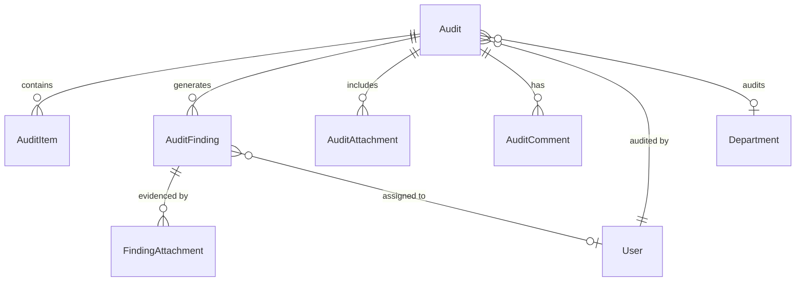

# Audit Management System Implementation Plan

## Executive Summary

This document outlines the comprehensive implementation plan for the Audit Management System in the Harmoni360 HSSE (Health, Safety, Security, Environment) platform. The system will follow established Domain-Driven Design (DDD) patterns, CQRS command/query patterns, and UI/UX standards consistent with existing modules like Work Permits and Inspections.

**Objective**: Deliver a feature-complete Audit Management System that integrates seamlessly with the existing Harmoni360 architecture, providing robust audit capabilities for safety, environmental, equipment, and compliance audits in HSE operations.

**Technology Stack**: .NET 8 backend with Entity Framework Core, React 18 + TypeScript frontend, following established architectural patterns and design systems.

## System Architecture

### 1. Domain Layer Architecture

The Audit Management System follows the established DDD patterns observed in Work Permits and Inspections modules:

#### Domain Entities (`src/Harmoni360.Domain/Entities/Audits/`)

**Core Entity: `Audit.cs`**
```csharp
public class Audit : BaseEntity, IAuditableEntity
{
    private readonly List<AuditItem> _items = new();
    private readonly List<AuditAttachment> _attachments = new();
    private readonly List<AuditFinding> _findings = new();
    private readonly List<AuditComment> _comments = new();

    // Core Properties
    public string AuditNumber { get; private set; } = string.Empty;
    public string Title { get; private set; } = string.Empty;
    public string Description { get; private set; } = string.Empty;
    public AuditType Type { get; private set; }
    public AuditCategory Category { get; private set; }
    public AuditStatus Status { get; private set; }
    public AuditPriority Priority { get; private set; }
    
    // Schedule & Execution
    public DateTime ScheduledDate { get; private set; }
    public DateTime? StartedDate { get; private set; }
    public DateTime? CompletedDate { get; private set; }
    public int AuditorId { get; private set; }
    public int? LocationId { get; private set; }
    public int? DepartmentId { get; private set; }
    public int? FacilityId { get; private set; }
    
    // Assessment Results
    public RiskLevel RiskLevel { get; private set; }
    public string? Summary { get; private set; }
    public string? Recommendations { get; private set; }
    public AuditScore? OverallScore { get; private set; }
    public int? EstimatedDurationMinutes { get; private set; }
    public int? ActualDurationMinutes { get; private set; }
    
    // Compliance & Standards
    public string? StandardsApplied { get; private set; }
    public bool IsRegulatory { get; private set; }
    public string? RegulatoryReference { get; private set; }
    
    // Navigation Properties
    public virtual User Auditor { get; private set; } = null!;
    public virtual Department? Department { get; private set; }
    public virtual IReadOnlyCollection<AuditItem> Items => _items.AsReadOnly();
    public virtual IReadOnlyCollection<AuditAttachment> Attachments => _attachments.AsReadOnly();
    public virtual IReadOnlyCollection<AuditFinding> Findings => _findings.AsReadOnly();
    public virtual IReadOnlyCollection<AuditComment> Comments => _comments.AsReadOnly();
    
    // Domain Methods
    public static Audit Create(string title, string description, AuditType type, ...);
    public void Schedule(DateTime scheduledDate);
    public void StartAudit();
    public void CompleteAudit(string? summary = null, string? recommendations = null);
    public void Cancel(string reason);
    public void AddFinding(AuditFinding finding);
    public void AddItem(AuditItem item);
    // ... other domain methods
}
```

**Supporting Entities:**

- **`AuditFinding.cs`**: Individual findings/non-conformances
- **`AuditItem.cs`**: Checklist items and assessment criteria
- **`AuditAttachment.cs`**: Supporting documents and evidence
- **`AuditComment.cs`**: Comments and notes during audit process
- **`FindingAttachment.cs`**: Evidence files for specific findings

#### Enums (`src/Harmoni360.Domain/Enums/AuditEnums.cs`)

```csharp
public enum AuditType
{
    Safety = 1,
    Environmental = 2,
    Equipment = 3,
    Compliance = 4,
    Fire = 5,
    Chemical = 6,
    Ergonomic = 7,
    Emergency = 8,
    Management = 9,
    Process = 10
}

public enum AuditStatus
{
    Draft = 1,
    Scheduled = 2,
    InProgress = 3,
    Completed = 4,
    Overdue = 5,
    Cancelled = 6,
    Archived = 7,
    UnderReview = 8
}

public enum AuditPriority
{
    Low = 1,
    Medium = 2,
    High = 3,
    Critical = 4
}

public enum AuditCategory
{
    Routine = 1,
    Planned = 2,
    Unplanned = 3,
    Regulatory = 4,
    Internal = 5,
    External = 6,
    Incident = 7,
    Maintenance = 8
}

public enum AuditScore
{
    Excellent = 1,    // 90-100%
    Good = 2,         // 80-89%
    Satisfactory = 3, // 70-79%
    NeedsImprovement = 4, // 60-69%
    Unsatisfactory = 5    // Below 60%
}

public enum FindingType
{
    NonConformance = 1,
    Observation = 2,
    OpportunityForImprovement = 3,
    PositiveFinding = 4,
    CriticalNonConformance = 5
}

public enum FindingSeverity
{
    Minor = 1,
    Moderate = 2,
    Major = 3,
    Critical = 4
}

public enum FindingStatus
{
    Open = 1,
    InProgress = 2,
    Resolved = 3,
    Verified = 4,
    Closed = 5
}
```

### 2. Application Layer Architecture

Following CQRS patterns established in Work Permits and Inspections:

#### Commands (`src/Harmoni360.Application/Features/Audits/Commands/`)

**Create Operations:**
- `CreateAuditCommand` / `CreateAuditCommandHandler`
- `CreateAuditFromTemplateCommand` / `CreateAuditFromTemplateCommandHandler`
- `CreateAuditFindingCommand` / `CreateAuditFindingCommandHandler`

**Update Operations:**
- `UpdateAuditCommand` / `UpdateAuditCommandHandler`
- `UpdateAuditFindingCommand` / `UpdateAuditFindingCommandHandler`
- `ScheduleAuditCommand` / `ScheduleAuditCommandHandler`

**State Transition Operations:**
- `StartAuditCommand` / `StartAuditCommandHandler`
- `CompleteAuditCommand` / `CompleteAuditCommandHandler`
- `CancelAuditCommand` / `CancelAuditCommandHandler`
- `SubmitForReviewCommand` / `SubmitForReviewCommandHandler`

**Attachment Operations:**
- `UploadAuditAttachmentCommand` / `UploadAuditAttachmentCommandHandler`
- `DeleteAuditAttachmentCommand` / `DeleteAuditAttachmentCommandHandler`

#### Queries (`src/Harmoni360.Application/Features/Audits/Queries/`)

**Listing Queries:**
- `GetAuditsQuery` / `GetAuditsQueryHandler`
- `GetMyAuditsQuery` / `GetMyAuditsQueryHandler`
- `GetScheduledAuditsQuery` / `GetScheduledAuditsQueryHandler`
- `GetOverdueAuditsQuery` / `GetOverdueAuditsQueryHandler`

**Detail Queries:**
- `GetAuditByIdQuery` / `GetAuditByIdQueryHandler`
- `GetAuditFindingsQuery` / `GetAuditFindingsQueryHandler`
- `GetAuditAttachmentQuery` / `GetAuditAttachmentQueryHandler`

**Dashboard Queries:**
- `GetAuditDashboardQuery` / `GetAuditDashboardQueryHandler`
- `GetAuditStatisticsQuery` / `GetAuditStatisticsQueryHandler`

#### DTOs (`src/Harmoni360.Application/Features/Audits/DTOs/`)

**Core DTOs:**
- `AuditDto` - Main audit data transfer object
- `AuditSummaryDto` - Lightweight audit overview
- `AuditFindingDto` - Finding details
- `AuditAttachmentDto` - Attachment metadata
- `AuditDashboardDto` - Dashboard metrics and statistics

### 3. Infrastructure Layer

#### Entity Framework Configuration (`src/Harmoni360.Infrastructure/Persistence/Configurations/`)

Following established patterns from Work Permit and Inspection configurations:

**`AuditConfiguration.cs`**
```csharp
public class AuditConfiguration : IEntityTypeConfiguration<Audit>
{
    public void Configure(EntityTypeBuilder<Audit> builder)
    {
        builder.ToTable("Audits");
        
        // Primary Key
        builder.HasKey(e => e.Id);
        
        // Properties
        builder.Property(e => e.AuditNumber)
            .HasMaxLength(50)
            .IsRequired();
            
        builder.HasIndex(e => e.AuditNumber)
            .IsUnique();
            
        // Enum conversions following Inspection pattern
        builder.Property(e => e.Type)
            .HasConversion<int>()
            .IsRequired();
            
        // Relationships
        builder.HasMany(e => e.Items)
            .WithOne(i => i.Audit)
            .HasForeignKey(i => i.AuditId)
            .OnDelete(DeleteBehavior.Cascade);
            
        // Indexes for performance
        builder.HasIndex(e => e.Status);
        builder.HasIndex(e => e.Type);
        builder.HasIndex(e => e.ScheduledDate);
        builder.HasIndex(e => new { e.Status, e.ScheduledDate });
    }
}
```

#### Data Seeding (`src/Harmoni360.Infrastructure/Services/DataSeeders/`)

**`AuditDataSeeder.cs`** - Following established seeding patterns for sample data and configuration data.

### 4. Web API Controller

#### Controller (`src/Harmoni360.Web/Controllers/AuditController.cs`)

Following the exact patterns established in `WorkPermitController.cs`:

```csharp
[ApiController]
[Route("api/audits")]
[Authorize]
public class AuditController : ControllerBase
{
    private readonly IMediator _mediator;
    private readonly ILogger<AuditController> _logger;

    // CRUD Operations
    [HttpPost]
    [RequireModulePermission(ModuleType.AuditManagement, PermissionType.Create)]
    public async Task<IActionResult> CreateAudit([FromBody] CreateAuditCommand command);

    [HttpGet]
    [RequireModulePermission(ModuleType.AuditManagement, PermissionType.Read)]
    public async Task<IActionResult> GetAudits([FromQuery] GetAuditsQuery query);

    [HttpGet("{id}")]
    [RequireModulePermission(ModuleType.AuditManagement, PermissionType.Read)]
    public async Task<IActionResult> GetAudit(int id);

    // State Transitions
    [HttpPost("{id}/start")]
    [RequireModulePermission(ModuleType.AuditManagement, PermissionType.Update)]
    public async Task<IActionResult> StartAudit(int id);

    [HttpPost("{id}/complete")]
    [RequireModulePermission(ModuleType.AuditManagement, PermissionType.Update)]
    public async Task<IActionResult> CompleteAudit(int id, [FromBody] CompleteAuditCommand command);

    // Dashboard and Analytics
    [HttpGet("dashboard")]
    [RequireModulePermission(ModuleType.AuditManagement, PermissionType.Read)]
    public async Task<IActionResult> GetDashboard();

    // ... other endpoints following WorkPermit patterns
}
```

## Feature Breakdown

### 1. Submit Audit Feature

**Reference Pattern**: Work Permit submission workflow

**Implementation Details:**
- Multi-step accordion form design identical to `CreateWorkPermit.tsx`
- Real-time validation using React Hook Form + Yup
- Draft save functionality with progress persistence
- File upload integration with progress indicators

**Form Sections:**
1. **Basic Information** - Title, type, category, priority, scheduled date
2. **Audit Scope** - Description, standards applied, regulatory requirements
3. **Audit Team** - Lead auditor, team members, contact information
4. **Checklist Items** - Assessment criteria and checkpoints
5. **Supporting Documents** - Attachment upload with categorization
6. **Review & Submit** - Summary view with validation

**Component Structure:**
```
src/Harmoni360.Web/ClientApp/src/pages/audits/
├── CreateAudit.tsx           # Main form component
├── EditAudit.tsx            # Edit existing audit
└── components/
    ├── AuditFormSections.tsx    # Form section components
    ├── AuditItemManager.tsx     # Checklist item management
    └── AuditAttachmentManager.tsx # File upload component
```

### 2. View Audits List Feature

**Reference Pattern**: `WorkPermitList.tsx` functionality and UI

**Key Features:**
- Paginated data grid with server-side filtering and sorting
- Advanced search with debounced input
- Multi-column filtering (status, type, priority, auditor, department)
- Bulk operations with permission-based visibility
- Export functionality (Excel/PDF)
- Responsive design for mobile/tablet

**Filter Options:**
- Search: Title, description, audit number
- Status: Draft, Scheduled, In Progress, Completed, Overdue
- Type: Safety, Environmental, Equipment, Compliance, etc.
- Priority: Low, Medium, High, Critical
- Date Range: Scheduled date, completion date
- Auditor: Assigned auditor selection
- Department: Department filter

**Action Buttons:**
- View Details (Eye icon)
- Edit (Pencil icon) - Only for Draft/Scheduled
- Start Audit (Play icon) - Only for Scheduled
- Complete (Check icon) - Only for In Progress
- Cancel (X icon) - Conditional based on status
- Delete (Trash icon) - Only for Draft with permissions

### 3. Audit Detail Page

**Reference Pattern**: `WorkPermitDetail.tsx` tabbed interface

**Tab Structure:**
1. **Overview** - Basic information, status, key metrics
2. **Audit Details** - Scope, standards, methodology
3. **Checklist Items** - Assessment criteria and results
4. **Findings** - Non-conformances and observations
5. **Evidence** - Photos, documents, attachments
6. **Activity History** - Complete audit trail

**Key Components:**
- Status badges and progress indicators
- Action buttons with state-based visibility
- Print/Export functionality
- Permission-based edit access
- Related audits and recommendations

### 4. Edit Audit Page

**Reference Pattern**: `EditWorkPermit.tsx` with pre-populated data

**Features:**
- Pre-populated form sections from existing audit data
- Change tracking with visual indicators
- Permission-based field restrictions
- Save draft and submit workflow
- File management (add/remove attachments)

### 5. My Audits Page

**Reference Pattern**: `MyWorkPermits.tsx` user-specific view

**Features:**
- User-specific audit list filtered by current user
- Quick status overview cards
- Recent activity summary
- Personal audit metrics dashboard
- Quick actions (Edit, View, Duplicate)

### 6. Audit Dashboard

**Reference Pattern**: Work Permit and Incident dashboard patterns

**Dashboard Components:**
- **Status Overview Widgets**: Pending, In Progress, Completed, Overdue counts
- **Audit Metrics**: Completion rates, average scores, trend analysis
- **Charts and Graphs**: Monthly audit trends, type distribution, score analysis
- **KPI Cards**: Compliance rates, finding resolution times, audit efficiency
- **Recent Activity Feed**: Latest audits, findings, completions
- **Quick Access**: Common actions and frequently used filters

## Database Design

### Entity Relationships



### Database Schema

**Core Tables:**
- `Audits` - Main audit records
- `AuditItems` - Individual checklist items and assessment criteria
- `AuditFindings` - Non-conformances and observations
- `AuditAttachments` - Supporting documents and evidence
- `AuditComments` - Comments and notes
- `FindingAttachments` - Finding-specific evidence files

**Key Indexes:**
- Unique index on `AuditNumber`
- Composite indexes on status and date fields
- Performance indexes on foreign keys and frequently queried fields

### Migration Strategy

```csharp
// 20250613_AddAuditEntities.cs
public partial class AddAuditEntities : Migration
{
    protected override void Up(MigrationBuilder migrationBuilder)
    {
        // Create Audits table with all relationships
        // Add indexes for performance
        // Seed initial configuration data
    }
}
```

## API Specification

### RESTful Endpoints

**Base URL**: `/api/audits`

#### CRUD Operations
```
POST   /api/audits                    # Create new audit
GET    /api/audits                    # List audits with filtering
GET    /api/audits/{id}               # Get audit details
PUT    /api/audits/{id}               # Update audit
DELETE /api/audits/{id}               # Delete audit
```

#### State Transitions
```
POST   /api/audits/{id}/schedule      # Schedule audit
POST   /api/audits/{id}/start         # Start audit execution
POST   /api/audits/{id}/complete      # Complete audit
POST   /api/audits/{id}/cancel        # Cancel audit
POST   /api/audits/{id}/submit-review # Submit for review
```

#### Findings Management
```
POST   /api/audits/{id}/findings      # Add finding
PUT    /api/audits/{id}/findings/{findingId} # Update finding
DELETE /api/audits/{id}/findings/{findingId} # Remove finding
```

#### Attachments
```
POST   /api/audits/{id}/attachments   # Upload attachment
GET    /api/audits/{id}/attachments/{attachmentId}/download # Download
DELETE /api/audits/{id}/attachments/{attachmentId} # Delete
```

#### Specialized Queries
```
GET    /api/audits/my-audits          # Current user's audits
GET    /api/audits/dashboard          # Dashboard metrics
GET    /api/audits/overdue            # Overdue audits
GET    /api/audits/statistics         # Audit statistics
```

### API Contracts

**Create Audit Request:**
```json
{
  "title": "Monthly Safety Audit - Production Floor",
  "description": "Comprehensive safety assessment of production areas",
  "type": "Safety",
  "category": "Routine",
  "priority": "Medium",
  "scheduledDate": "2024-02-15T09:00:00Z",
  "estimatedDurationMinutes": 240,
  "locationId": 1,
  "departmentId": 2,
  "standardsApplied": "ISO 45001, OSHA Standards",
  "isRegulatory": true,
  "regulatoryReference": "OSHA 1926.95",
  "items": [
    {
      "description": "PPE compliance check",
      "category": "Safety",
      "isRequired": true,
      "expectedResult": "100% compliance"
    }
  ]
}
```

**Audit Response DTO:**
```json
{
  "id": 1,
  "auditNumber": "AUD-20240215-001",
  "title": "Monthly Safety Audit - Production Floor",
  "status": "Scheduled",
  "type": "Safety",
  "priority": "Medium",
  "scheduledDate": "2024-02-15T09:00:00Z",
  "auditorName": "John Smith",
  "overallScore": null,
  "riskLevel": "Medium",
  "findingsCount": 0,
  "itemsCount": 25,
  "completionPercentage": 0,
  "isOverdue": false,
  "canEdit": true,
  "canStart": true,
  "createdAt": "2024-02-01T10:00:00Z",
  "createdBy": "Jane Admin"
}
```

## UI/UX Specifications

### Design System Consistency

**Color Scheme** (Following Harmoni360 standards):
- Primary: Blue variants for main actions
- Success: Green for completed/positive states
- Warning: Orange/yellow for pending/caution states
- Danger: Red for critical/negative states
- Info: Light blue for informational content

**Icon Standards** (FontAwesome):
- Audit: `faClipboardCheck`
- Findings: `faExclamationTriangle`
- Schedule: `faCalendarAlt`
- Progress: `faSpinner`
- Complete: `faCheckCircle`
- Evidence: `faCamera`

### Component Patterns

**Status Badges:**
```tsx
const getAuditStatusBadge = (status: string) => {
  const config = {
    'Draft': { color: 'secondary', icon: faEdit },
    'Scheduled': { color: 'info', icon: faCalendarAlt },
    'InProgress': { color: 'warning', icon: faSpinner },
    'Completed': { color: 'success', icon: faCheckCircle },
    'Overdue': { color: 'danger', icon: faExclamationTriangle }
  };
  return <CBadge color={config[status]?.color}>{status}</CBadge>;
};
```

**Data Grid Pattern:**
Following the exact table structure from `WorkPermitList.tsx` with:
- Sortable columns with visual indicators
- Responsive breakpoints
- Action button groups
- Selection checkboxes
- Pagination with page size options

### Responsive Design

**Breakpoints:**
- Mobile: < 768px - Stacked layout, collapsible filters
- Tablet: 768px - 1199px - Condensed columns, scrollable tables
- Desktop: ≥ 1200px - Full layout with all columns visible

**Mobile Optimizations:**
- Card-based layout for audit items
- Bottom sheet for filters
- Swipe actions for quick operations
- Touch-friendly button sizes (44px minimum)

## Implementation Phases

### Phase 1: Foundation (Weeks 1-2)
**Deliverables:**
- Domain entities and enums
- Database schema and migrations
- Basic CQRS commands and queries
- Entity Framework configurations
- Initial API controller structure

**Acceptance Criteria:**
- All domain entities properly modeled
- Database created with proper relationships
- Basic CRUD operations functional
- API endpoints returning mock data

### Phase 2: Core Features (Weeks 3-4)
**Deliverables:**
- Submit Audit feature (Create form)
- View Audits List with filtering
- Basic Audit Detail page
- File attachment system
- Authorization integration

**Acceptance Criteria:**
- Users can create new audits
- Audit list displays with filtering
- Basic audit details viewable
- File uploads working
- Permissions properly enforced

### Phase 3: Advanced Features (Weeks 5-6)
**Deliverables:**
- Edit Audit functionality
- Findings management system
- Advanced search and filtering
- Audit dashboard with metrics
- Activity history and audit trail

**Acceptance Criteria:**
- Complete audit lifecycle supported
- Findings can be added and managed
- Dashboard shows meaningful metrics
- All user interactions logged

### Phase 4: Integration & Polish (Weeks 7-8)
**Deliverables:**
- My Audits personal view
- Export functionality
- Performance optimizations
- Complete test coverage
- Documentation updates

**Acceptance Criteria:**
- All features fully integrated
- Performance meets standards
- Tests cover all critical paths
- Documentation complete

## Testing Strategy

### Unit Testing
**Target Coverage**: 80%

**Focus Areas:**
- Domain entity business logic
- Command and query handlers
- Validation rules
- API controller endpoints

**Tools**: xUnit, Moq, FluentAssertions

### Integration Testing
**Scenarios:**
- Database operations and EF configurations
- API endpoint integration
- File upload/download workflows
- Authorization and permission checks

**Tools**: ASP.NET Core Test Host, In-Memory databases

### Frontend Testing
**Component Testing:**
- Form validation and submission
- Data grid filtering and sorting
- Modal interactions
- File upload components

**Tools**: Jest, React Testing Library, MSW for API mocking

### User Acceptance Testing
**Test Scenarios:**
- Complete audit lifecycle workflows
- Multi-user collaboration scenarios
- Permission and role-based access
- Cross-browser compatibility
- Mobile responsiveness

**Test Data**: Representative audit scenarios across all types and categories

### Performance Testing
**Targets:**
- Page load times < 2 seconds
- API response times < 500ms
- File upload for files up to 10MB
- Data grid performance with 1000+ records

## Deployment Plan

### Database Deployment
1. **Schema Migration**
   - Run Entity Framework migrations
   - Verify all tables and relationships created
   - Execute data seeding scripts

2. **Configuration Data**
   - Seed audit types and categories
   - Initialize default templates
   - Configure system settings

### Application Deployment
1. **Backend Deployment**
   - Deploy updated API with new controllers
   - Update dependency injection configuration
   - Verify all endpoints accessible

2. **Frontend Deployment**
   - Build and deploy React application
   - Update routing configuration
   - Verify all pages load correctly

### Release Strategy
**Blue-Green Deployment:**
- Deploy to staging environment first
- Run full test suite on staging
- Switch production traffic after validation
- Maintain rollback capability

**Feature Flags:**
- Audit Management module can be enabled/disabled
- Gradual rollout to user groups
- A/B testing for UI improvements

## Success Metrics

### Key Performance Indicators (KPIs)

**User Adoption:**
- Number of audits created per month
- User engagement with audit features
- Time spent in audit workflows

**Operational Efficiency:**
- Average time to complete audit
- Reduction in paper-based audits
- Improvement in audit scheduling

**Quality Metrics:**
- Audit completion rates
- Finding resolution times
- User satisfaction scores

**Technical Metrics:**
- System uptime and reliability
- Page load performance
- API response times
- Error rates

### Acceptance Criteria

**Functional Requirements:**
- ✅ Users can create, edit, and manage audits
- ✅ Complete audit lifecycle supported (Draft → Scheduled → In Progress → Completed)
- ✅ Findings can be added, tracked, and resolved
- ✅ File attachments supported with categorization
- ✅ Dashboard provides meaningful insights
- ✅ All actions properly audited and logged
- ✅ Permissions enforced throughout system

**Non-Functional Requirements:**
- ✅ System supports 100+ concurrent users
- ✅ 99.9% uptime requirement met
- ✅ Mobile responsive design
- ✅ WCAG 2.1 AA accessibility compliance
- ✅ Data encrypted in transit and at rest

**Integration Requirements:**
- ✅ Seamless integration with existing authentication
- ✅ Consistent UI/UX with other modules
- ✅ Proper integration with notification system
- ✅ Role-based access control working

## Risk Management

### Technical Risks

**Risk**: Complex domain modeling requirements
- **Mitigation**: Follow established patterns from Work Permits and Inspections
- **Contingency**: Simplify initial implementation, add complexity iteratively

**Risk**: Performance issues with large datasets
- **Mitigation**: Implement proper indexing and pagination from start
- **Contingency**: Add caching layers and query optimization

**Risk**: File upload/storage limitations
- **Mitigation**: Implement file size limits and validation
- **Contingency**: Use cloud storage for scalability

### Business Risks

**Risk**: User adoption challenges
- **Mitigation**: Involve users in design process, provide training
- **Contingency**: Phased rollout with feedback incorporation

**Risk**: Integration complexity with existing systems
- **Mitigation**: Follow established integration patterns
- **Contingency**: Create adapter layers for problematic integrations

### Timeline Risks

**Risk**: Development delays due to complexity
- **Mitigation**: Break down into smaller, deliverable phases
- **Contingency**: Prioritize core features, defer nice-to-have items

## Conclusion

The Audit Management System implementation follows proven architectural patterns and design principles established in the Harmoni360 platform. By leveraging existing infrastructure and maintaining consistency with current modules, this implementation will deliver a robust, scalable, and user-friendly audit management solution.

The phased approach ensures early delivery of core functionality while allowing for iterative improvements based on user feedback. The comprehensive testing strategy and deployment plan minimize risks and ensure a smooth rollout to production.

This system will significantly enhance the HSE audit capabilities of organizations using Harmoni360, providing them with the tools needed to maintain compliance, improve safety standards, and achieve operational excellence.

---

**Document Version**: 1.0  
**Created**: December 13, 2024  
**Authors**: Harmoni360 Development Team  
**Reviewed By**: Architecture Review Board  
**Approved By**: Product Management