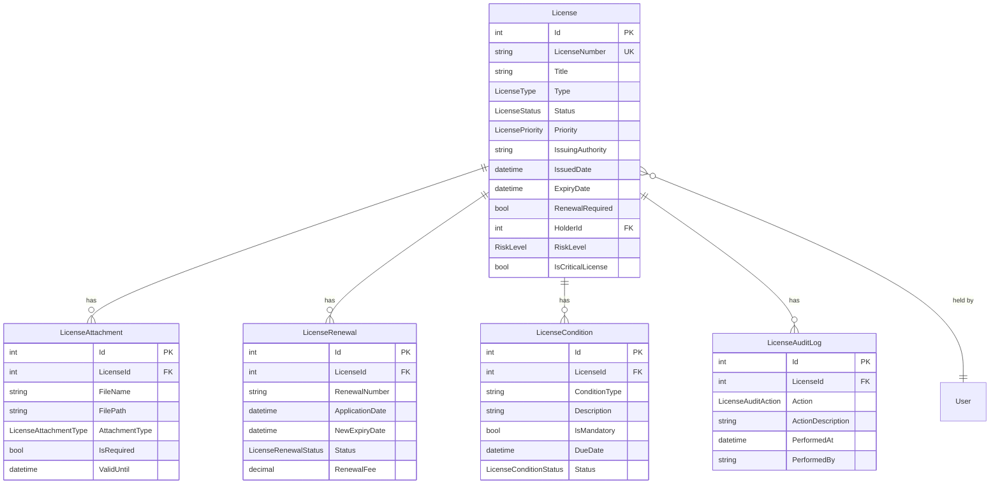

# License Management System Implementation Plan

## Executive Summary

The License Management System will be a comprehensive HSSE module for managing licenses, permits, certifications, and compliance documents within the Harmoni360 platform. This system will follow the established Domain-Driven Design (DDD) patterns, maintain consistency with existing UI/UX standards, and integrate seamlessly with the current authorization and audit trail systems.

### Objectives

- **Centralized License Management**: Provide a unified platform for tracking all types of licenses, permits, and certifications
- **Compliance Monitoring**: Ensure regulatory compliance through automated tracking and notifications
- **Workflow Management**: Implement approval workflows for license applications and renewals
- **Document Management**: Secure storage and management of license-related documents
- **Audit Trail**: Comprehensive logging of all license-related activities
- **Reporting & Analytics**: Generate compliance reports and track license metrics

### Scope

This implementation will deliver:
- License CRUD operations with workflow management
- License dashboard with real-time metrics
- Document attachment and management system
- Automated renewal notifications and compliance tracking
- Integration with existing user management and authorization systems
- Comprehensive reporting and export capabilities

## System Architecture

### Architectural Patterns

The License Management System follows the established Harmoni360 architectural patterns:

#### 1. Domain-Driven Design (DDD)
- **Domain Layer**: Core business entities and rules
- **Application Layer**: CQRS commands/queries and application services
- **Infrastructure Layer**: Data persistence and external integrations
- **Web Layer**: API controllers and presentation logic

#### 2. Clean Architecture Principles
- Dependency inversion with clear layer boundaries
- Domain-centric design with business rules at the core
- Separation of concerns across architectural layers

#### 3. CQRS (Command Query Responsibility Segregation)
- Commands for state-changing operations
- Queries for data retrieval with optimized DTOs
- Mediator pattern for loose coupling

### Technology Stack

#### Backend (.NET 8)
- **Framework**: ASP.NET Core 8.0
- **ORM**: Entity Framework Core 8.0
- **Database**: SQL Server / PostgreSQL
- **Validation**: FluentValidation
- **Mapping**: AutoMapper
- **Mediator**: MediatR
- **Authentication**: ASP.NET Core Identity
- **Authorization**: Custom module-based permissions

#### Frontend (React 18 + TypeScript)
- **Framework**: React 18 with TypeScript
- **State Management**: TanStack Query (React Query)
- **UI Components**: CoreUI React
- **Icons**: FontAwesome
- **Forms**: React Hook Form with Yup validation
- **Routing**: React Router v6
- **Styling**: CSS Modules / Styled Components

## Feature Breakdown

### 1. Submit License Feature

#### User Interface
- **Multi-step Form**: Accordion-based layout following Work Permit patterns
- **Form Sections**:
  1. Basic Information
  2. License Details  
  3. Regulatory Information
  4. Attachments
  5. Review & Submit

#### Form Fields
```typescript
interface LicenseFormData {
  // Basic Information
  title: string;
  description: string;
  licenseType: LicenseType;
  priority: LicensePriority;
  
  // License Details
  licenseNumber: string;
  issuingAuthority: string;
  issuedDate: Date;
  expiryDate: Date;
  renewalRequired: boolean;
  renewalPeriodDays: number;
  
  // Regulatory Information
  regulatoryFramework: string;
  complianceStandards: string[];
  applicableRegulations: string;
  
  // Scope & Coverage
  scope: string;
  coverageAreas: string[];
  restrictions: string;
  conditions: string;
  
  // Attachments
  attachments: LicenseAttachment[];
}
```

#### Validation Rules
- **Required Fields**: Title, License Type, License Number, Issuing Authority, Issued Date, Expiry Date
- **Date Validation**: Expiry date must be after issued date
- **Business Rules**: 
  - License number must be unique per authority
  - Renewable licenses require renewal period
  - High-risk licenses require additional documentation

#### Backend Implementation
```csharp
public record CreateLicenseCommand : IRequest<LicenseDto>
{
    public string Title { get; init; } = string.Empty;
    public string Description { get; init; } = string.Empty;
    public LicenseType Type { get; init; }
    public LicensePriority Priority { get; init; }
    public string LicenseNumber { get; init; } = string.Empty;
    public string IssuingAuthority { get; init; } = string.Empty;
    public DateTime IssuedDate { get; init; }
    public DateTime ExpiryDate { get; init; }
    public bool RenewalRequired { get; init; }
    public int RenewalPeriodDays { get; init; }
    public string RegulatoryFramework { get; init; } = string.Empty;
    public string[] ComplianceStandards { get; init; } = Array.Empty<string>();
    public string Scope { get; init; } = string.Empty;
    public string[] CoverageAreas { get; init; } = Array.Empty<string>();
    public string Restrictions { get; init; } = string.Empty;
    public string Conditions { get; init; } = string.Empty;
    public List<CreateLicenseAttachmentCommand> Attachments { get; init; } = new();
}
```

### 2. View Licenses List Feature

#### User Interface
- **Data Grid**: Responsive table with sorting and filtering
- **Search & Filter Bar**: 
  - Global search across title, description, license number
  - Filters: Status, Type, Priority, Expiry Date Range, Issuing Authority
- **Actions**: Create, View, Edit, Delete, Renew, Export
- **Bulk Operations**: Multi-select for bulk actions

#### Table Columns
| Column | Sortable | Filterable | Description |
|--------|----------|------------|-------------|
| License Number | ✓ | ✓ | Unique identifier |
| Title | ✓ | ✓ | License title |
| Type | ✓ | ✓ | License category |
| Status | ✓ | ✓ | Current status with badges |
| Priority | ✓ | ✓ | Risk/priority level |
| Issuing Authority | ✓ | ✓ | Regulatory body |
| Expiry Date | ✓ | ✓ | Expiration date with alerts |
| Actions | - | - | Available operations |

#### Status Indicators
```typescript
const LICENSE_STATUSES = [
  { value: 'Draft', label: 'Draft', color: 'secondary' },
  { value: 'PendingSubmission', label: 'Pending Submission', color: 'warning' },
  { value: 'Submitted', label: 'Submitted', color: 'info' },
  { value: 'UnderReview', label: 'Under Review', color: 'primary' },
  { value: 'Approved', label: 'Approved', color: 'success' },
  { value: 'Active', label: 'Active', color: 'success' },
  { value: 'Rejected', label: 'Rejected', color: 'danger' },
  { value: 'Expired', label: 'Expired', color: 'danger' },
  { value: 'Suspended', label: 'Suspended', color: 'warning' },
  { value: 'Revoked', label: 'Revoked', color: 'dark' },
  { value: 'PendingRenewal', label: 'Pending Renewal', color: 'warning' }
];
```

### 3. License Detail Page

#### Page Structure
- **Header Section**: License number, title, status badges
- **Tabbed Interface**:
  1. **Overview**: Key information summary
  2. **Details**: Complete license information
  3. **Attachments**: Document management
  4. **Compliance**: Regulatory requirements and standards
  5. **Renewal History**: Previous renewals and applications
  6. **Activity History**: Complete audit trail

#### Overview Tab
- License summary card
- Key dates (issued, expiry, renewal due)
- Status timeline
- Quick actions (renew, edit, print)

#### Compliance Tab
- Regulatory framework details
- Compliance standards checklist
- Related permits and licenses
- Compliance status indicators

### 4. Edit License Page

#### Form Behavior
- **Pre-populated Fields**: Load existing license data
- **Change Tracking**: Highlight modified fields
- **Draft Save**: Auto-save functionality
- **Validation**: Real-time field validation
- **Audit Trail**: Log all changes with timestamps

#### Permission-Based Editing
- **Draft Status**: Full editing permissions
- **Active Status**: Limited to non-regulatory fields
- **Expired Status**: Redirect to renewal process
- **Role-Based**: Admin can edit any field, users limited to descriptions

### 5. My Licenses Page

#### Personal Dashboard
- **User-Specific View**: Licenses assigned to current user
- **Quick Stats**: Active, expiring, expired counts
- **Action Items**: Licenses requiring attention
- **Recent Activity**: Latest changes and updates

#### Features
- Personal license portfolio
- Renewal reminders
- Document upload for personal licenses
- Notification preferences

### 6. License Dashboard

#### Key Metrics Widgets
```typescript
interface LicenseDashboardData {
  totalLicenses: number;
  activeLicenses: number;
  expiringLicenses: number; // Next 30 days
  expiredLicenses: number;
  pendingRenewalLicenses: number;
  draftLicenses: number;
  suspendedLicenses: number;
  
  // Risk Analytics
  highRiskLicenses: number;
  criticalLicenses: number;
  complianceRate: number;
  
  // Trends
  monthlyTrends: LicenseMonthlyTrendDto[];
  licensesByType: LicenseTypeStatDto[];
  licensesByAuthority: LicenseAuthorityStatDto[];
  
  // Alerts
  expiringThisWeek: LicenseDto[];
  recentActivity: LicenseActivityDto[];
}
```

#### Charts and Visualizations
- **Donut Chart**: License distribution by type
- **Line Chart**: Monthly trends and projections
- **Bar Chart**: Licenses by issuing authority
- **Progress Cards**: Status distribution

#### Alert System
- **Expiry Alerts**: 90, 60, 30, 7 days before expiry
- **Renewal Reminders**: Based on renewal period
- **Compliance Warnings**: Missing required renewals
- **Document Alerts**: Missing or expired attachments

## Database Design

### Core Entities

#### License Entity
```csharp
public class License : BaseEntity, IAuditableEntity
{
    // Basic Information
    public string LicenseNumber { get; private set; } = string.Empty;
    public string Title { get; private set; } = string.Empty;
    public string Description { get; private set; } = string.Empty;
    public LicenseType Type { get; private set; }
    public LicenseStatus Status { get; private set; }
    public LicensePriority Priority { get; private set; }
    
    // Issuing Information
    public string IssuingAuthority { get; private set; } = string.Empty;
    public string IssuingAuthorityContact { get; private set; } = string.Empty;
    public DateTime IssuedDate { get; private set; }
    public DateTime ExpiryDate { get; private set; }
    public string IssuedLocation { get; private set; } = string.Empty;
    
    // Renewal Information
    public bool RenewalRequired { get; private set; }
    public int RenewalPeriodDays { get; private set; }
    public DateTime? NextRenewalDate { get; private set; }
    public bool AutoRenewal { get; private set; }
    public string RenewalProcedure { get; private set; } = string.Empty;
    
    // Regulatory Information
    public string RegulatoryFramework { get; private set; } = string.Empty;
    public string ApplicableRegulations { get; private set; } = string.Empty;
    public string ComplianceStandards { get; private set; } = string.Empty; // JSON array
    
    // Scope and Coverage
    public string Scope { get; private set; } = string.Empty;
    public string CoverageAreas { get; private set; } = string.Empty; // JSON array
    public string Restrictions { get; private set; } = string.Empty;
    public string Conditions { get; private set; } = string.Empty;
    
    // Business Information
    public int HolderId { get; private set; } // User who holds the license
    public string HolderName { get; private set; } = string.Empty;
    public string Department { get; private set; } = string.Empty;
    public decimal? LicenseFee { get; private set; }
    public string Currency { get; private set; } = "USD";
    
    // Risk and Compliance
    public RiskLevel RiskLevel { get; private set; }
    public bool IsCriticalLicense { get; private set; }
    public bool RequiresInsurance { get; private set; }
    public decimal? RequiredInsuranceAmount { get; private set; }
    
    // Status Tracking
    public DateTime? SubmittedDate { get; private set; }
    public DateTime? ApprovedDate { get; private set; }
    public DateTime? ActivatedDate { get; private set; }
    public DateTime? SuspendedDate { get; private set; }
    public DateTime? RevokedDate { get; private set; }
    public string StatusNotes { get; private set; } = string.Empty;
    
    // Navigation Properties
    private readonly List<LicenseAttachment> _attachments = new();
    private readonly List<LicenseRenewal> _renewals = new();
    private readonly List<LicenseCondition> _licenseConditions = new();
    private readonly List<LicenseAuditLog> _auditLogs = new();
    
    public IReadOnlyCollection<LicenseAttachment> Attachments => _attachments.AsReadOnly();
    public IReadOnlyCollection<LicenseRenewal> Renewals => _renewals.AsReadOnly();
    public IReadOnlyCollection<LicenseCondition> LicenseConditions => _licenseConditions.AsReadOnly();
    public IReadOnlyCollection<LicenseAuditLog> AuditLogs => _auditLogs.AsReadOnly();
    
    // Audit Fields
    public DateTime CreatedAt { get; set; }
    public string CreatedBy { get; set; } = string.Empty;
    public DateTime? LastModifiedAt { get; set; }
    public string? LastModifiedBy { get; set; }
}
```

#### Supporting Entities

```csharp
public class LicenseAttachment : BaseEntity, IAuditableEntity
{
    public int LicenseId { get; set; }
    public string FileName { get; set; } = string.Empty;
    public string OriginalFileName { get; set; } = string.Empty;
    public string ContentType { get; set; } = string.Empty;
    public long FileSize { get; set; }
    public string FilePath { get; set; } = string.Empty;
    public string UploadedBy { get; set; } = string.Empty;
    public DateTime UploadedAt { get; set; }
    public LicenseAttachmentType AttachmentType { get; set; }
    public string Description { get; set; } = string.Empty;
    public bool IsRequired { get; set; }
    public DateTime? ValidUntil { get; set; }
    
    // Navigation Properties
    public License? License { get; set; }
    
    // Audit Fields
    public DateTime CreatedAt { get; set; }
    public string CreatedBy { get; set; } = string.Empty;
    public DateTime? LastModifiedAt { get; set; }
    public string? LastModifiedBy { get; set; }
}

public class LicenseRenewal : BaseEntity, IAuditableEntity
{
    public int LicenseId { get; set; }
    public string RenewalNumber { get; set; } = string.Empty;
    public DateTime ApplicationDate { get; set; }
    public DateTime? SubmittedDate { get; set; }
    public DateTime? ApprovedDate { get; set; }
    public DateTime? RejectedDate { get; set; }
    public DateTime NewExpiryDate { get; set; }
    public LicenseRenewalStatus Status { get; set; }
    public string RenewalNotes { get; set; } = string.Empty;
    public decimal? RenewalFee { get; set; }
    public bool DocumentsRequired { get; set; }
    public bool InspectionRequired { get; set; }
    public DateTime? InspectionDate { get; set; }
    public string ProcessedBy { get; set; } = string.Empty;
    
    // Navigation Properties
    public License? License { get; set; }
    
    // Audit Fields
    public DateTime CreatedAt { get; set; }
    public string CreatedBy { get; set; } = string.Empty;
    public DateTime? LastModifiedAt { get; set; }
    public string? LastModifiedBy { get; set; }
}

public class LicenseCondition : BaseEntity, IAuditableEntity
{
    public int LicenseId { get; set; }
    public string ConditionType { get; set; } = string.Empty;
    public string Description { get; set; } = string.Empty;
    public bool IsMandatory { get; set; }
    public DateTime? DueDate { get; set; }
    public LicenseConditionStatus Status { get; set; }
    public string ComplianceEvidence { get; set; } = string.Empty;
    public DateTime? ComplianceDate { get; set; }
    public string VerifiedBy { get; set; } = string.Empty;
    
    // Navigation Properties
    public License? License { get; set; }
    
    // Audit Fields
    public DateTime CreatedAt { get; set; }
    public string CreatedBy { get; set; } = string.Empty;
    public DateTime? LastModifiedAt { get; set; }
    public string? LastModifiedBy { get; set; }
}

public class LicenseAuditLog : BaseEntity, IAuditableEntity
{
    public int LicenseId { get; set; }
    public LicenseAuditAction Action { get; set; }
    public string ActionDescription { get; set; } = string.Empty;
    public string OldValues { get; set; } = string.Empty; // JSON
    public string NewValues { get; set; } = string.Empty; // JSON
    public string PerformedBy { get; set; } = string.Empty;
    public DateTime PerformedAt { get; set; }
    public string IpAddress { get; set; } = string.Empty;
    public string UserAgent { get; set; } = string.Empty;
    public string Comments { get; set; } = string.Empty;
    
    // Navigation Properties
    public License? License { get; set; }
    
    // Audit Fields  
    public DateTime CreatedAt { get; set; }
    public string CreatedBy { get; set; } = string.Empty;
    public DateTime? LastModifiedAt { get; set; }
    public string? LastModifiedBy { get; set; }
}
```

### Enumerations

```csharp
public enum LicenseType
{
    Environmental = 1,
    Safety = 2,
    Health = 3,
    Construction = 4,
    Operating = 5,
    Transport = 6,
    Waste = 7,
    Chemical = 8,
    Radiation = 9,
    Fire = 10,
    Electrical = 11,
    Mechanical = 12,
    Professional = 13,
    Business = 14,
    Import = 15,
    Export = 16,
    Other = 17
}

public enum LicenseStatus
{
    Draft = 1,
    PendingSubmission = 2,
    Submitted = 3,
    UnderReview = 4,
    Approved = 5,
    Active = 6,
    Rejected = 7,
    Expired = 8,
    Suspended = 9,
    Revoked = 10,
    PendingRenewal = 11
}

public enum LicensePriority
{
    Low = 1,
    Medium = 2,
    High = 3,
    Critical = 4
}

public enum LicenseAttachmentType
{
    Application = 1,
    SupportingDocument = 2,
    Certificate = 3,
    Compliance = 4,
    Insurance = 5,
    TechnicalSpec = 6,
    LegalDocument = 7,
    RenewalDocument = 8,
    InspectionReport = 9,
    Other = 10
}

public enum LicenseRenewalStatus
{
    Draft = 1,
    Submitted = 2,
    UnderReview = 3,
    Approved = 4,
    Rejected = 5,
    Expired = 6
}

public enum LicenseConditionStatus
{
    Pending = 1,
    InProgress = 2,
    Completed = 3,
    Overdue = 4,
    Waived = 5
}

public enum LicenseAuditAction
{
    Created = 1,
    Updated = 2,
    Submitted = 3,
    Approved = 4,
    Rejected = 5,
    Activated = 6,
    Suspended = 7,
    Revoked = 8,
    Renewed = 9,
    AttachmentAdded = 10,
    AttachmentRemoved = 11,
    ConditionAdded = 12,
    ConditionUpdated = 13,
    StatusChanged = 14
}
```

### Entity Relationships



## API Specification

### REST Endpoints

#### License Management
```http
GET    /api/licenses                    # Get paginated list of licenses
POST   /api/licenses                    # Create new license
GET    /api/licenses/{id}               # Get license by ID
PUT    /api/licenses/{id}               # Update license
DELETE /api/licenses/{id}               # Delete license (draft only)

# License Actions
POST   /api/licenses/{id}/submit        # Submit license for review
POST   /api/licenses/{id}/approve       # Approve license
POST   /api/licenses/{id}/reject        # Reject license
POST   /api/licenses/{id}/activate      # Activate approved license
POST   /api/licenses/{id}/suspend       # Suspend active license
POST   /api/licenses/{id}/revoke        # Revoke license
POST   /api/licenses/{id}/renew         # Initiate renewal process

# License Queries
GET    /api/licenses/my-licenses        # Get current user's licenses
GET    /api/licenses/expiring           # Get licenses expiring soon
GET    /api/licenses/dashboard          # Get dashboard data
GET    /api/licenses/search             # Advanced search
```

#### Document Management
```http
POST   /api/licenses/{id}/attachments           # Upload attachment
GET    /api/licenses/{id}/attachments           # Get license attachments
GET    /api/licenses/{id}/attachments/{fileId}  # Download attachment
DELETE /api/licenses/{id}/attachments/{fileId}  # Delete attachment
```

#### Renewal Management
```http
GET    /api/licenses/{id}/renewals               # Get renewal history
POST   /api/licenses/{id}/renewals               # Create renewal application
PUT    /api/licenses/{id}/renewals/{renewalId}   # Update renewal
GET    /api/licenses/renewals/pending            # Get pending renewals
```

#### Reporting
```http
GET    /api/licenses/reports/compliance          # Compliance report
GET    /api/licenses/reports/expiry              # Expiry report
GET    /api/licenses/reports/summary             # Summary report
POST   /api/licenses/export                      # Export licenses
```

### Request/Response Models

#### License DTOs
```csharp
public class LicenseDto
{
    public int Id { get; set; }
    public string LicenseNumber { get; set; } = string.Empty;
    public string Title { get; set; } = string.Empty;
    public string Description { get; set; } = string.Empty;
    public string Type { get; set; } = string.Empty;
    public string TypeDisplay { get; set; } = string.Empty;
    public string Status { get; set; } = string.Empty;
    public string StatusDisplay { get; set; } = string.Empty;
    public string Priority { get; set; } = string.Empty;
    public string PriorityDisplay { get; set; } = string.Empty;
    
    // Issuing Information
    public string IssuingAuthority { get; set; } = string.Empty;
    public DateTime IssuedDate { get; set; }
    public DateTime ExpiryDate { get; set; }
    public string IssuedLocation { get; set; } = string.Empty;
    
    // Renewal Information
    public bool RenewalRequired { get; set; }
    public int RenewalPeriodDays { get; set; }
    public DateTime? NextRenewalDate { get; set; }
    public bool AutoRenewal { get; set; }
    
    // Business Information
    public int HolderId { get; set; }
    public string HolderName { get; set; } = string.Empty;
    public string Department { get; set; } = string.Empty;
    public decimal? LicenseFee { get; set; }
    public string Currency { get; set; } = "USD";
    
    // Risk Information
    public string RiskLevel { get; set; } = string.Empty;
    public string RiskLevelDisplay { get; set; } = string.Empty;
    public bool IsCriticalLicense { get; set; }
    
    // Computed Properties
    public int DaysUntilExpiry { get; set; }
    public bool IsExpired { get; set; }
    public bool IsExpiringSoon { get; set; }
    public bool RequiresRenewal { get; set; }
    public double ComplianceScore { get; set; }
    
    // Collections
    public List<LicenseAttachmentDto> Attachments { get; set; } = new();
    public List<LicenseRenewalDto> Renewals { get; set; } = new();
    public List<LicenseConditionDto> Conditions { get; set; } = new();
    
    // Audit Information
    public DateTime CreatedAt { get; set; }
    public string CreatedBy { get; set; } = string.Empty;
    public DateTime? UpdatedAt { get; set; }
    public string? UpdatedBy { get; set; }
}

public class LicenseAttachmentDto
{
    public int Id { get; set; }
    public string FileName { get; set; } = string.Empty;
    public string OriginalFileName { get; set; } = string.Empty;
    public string ContentType { get; set; } = string.Empty;
    public long FileSize { get; set; }
    public string UploadedBy { get; set; } = string.Empty;
    public DateTime UploadedAt { get; set; }
    public string AttachmentType { get; set; } = string.Empty;
    public string Description { get; set; } = string.Empty;
    public bool IsRequired { get; set; }
    public DateTime? ValidUntil { get; set; }
    public bool IsExpired { get; set; }
}

public class LicenseDashboardDto
{
    public int TotalLicenses { get; set; }
    public int ActiveLicenses { get; set; }
    public int DraftLicenses { get; set; }
    public int PendingSubmissionLicenses { get; set; }
    public int SubmittedLicenses { get; set; }
    public int UnderReviewLicenses { get; set; }
    public int ApprovedLicenses { get; set; }
    public int RejectedLicenses { get; set; }
    public int ExpiredLicenses { get; set; }
    public int SuspendedLicenses { get; set; }
    public int RevokedLicenses { get; set; }
    public int PendingRenewalLicenses { get; set; }
    
    // Risk Analytics
    public int HighRiskLicenses { get; set; }
    public int CriticalLicenses { get; set; }
    public double ComplianceRate { get; set; }
    
    // Alerts
    public int ExpiringThisWeek { get; set; }
    public int ExpiringThisMonth { get; set; }
    public int OverdueLicenses { get; set; }
    public int LicensesDueForRenewal { get; set; }
    
    // Trends
    public List<LicenseMonthlyTrendDto> MonthlyTrends { get; set; } = new();
    public List<LicenseTypeStatDto> LicensesByType { get; set; } = new();
    public List<LicenseAuthorityStatDto> LicensesByAuthority { get; set; } = new();
    
    // Recent Activity
    public List<LicenseDto> RecentLicenses { get; set; } = new();
    public List<LicenseDto> ExpiringLicenses { get; set; } = new();
    public List<LicenseDto> HighPriorityLicenses { get; set; } = new();
}
```

### API Validation

#### Command Validation
```csharp
public class CreateLicenseCommandValidator : AbstractValidator<CreateLicenseCommand>
{
    public CreateLicenseCommandValidator()
    {
        RuleFor(x => x.Title)
            .NotEmpty().WithMessage("Title is required")
            .MaximumLength(200).WithMessage("Title must not exceed 200 characters");
            
        RuleFor(x => x.LicenseNumber)
            .NotEmpty().WithMessage("License number is required")
            .MaximumLength(50).WithMessage("License number must not exceed 50 characters");
            
        RuleFor(x => x.IssuingAuthority)
            .NotEmpty().WithMessage("Issuing authority is required")
            .MaximumLength(200).WithMessage("Issuing authority must not exceed 200 characters");
            
        RuleFor(x => x.IssuedDate)
            .NotEmpty().WithMessage("Issued date is required")
            .LessThanOrEqualTo(DateTime.Today).WithMessage("Issued date cannot be in the future");
            
        RuleFor(x => x.ExpiryDate)
            .NotEmpty().WithMessage("Expiry date is required")
            .GreaterThan(x => x.IssuedDate).WithMessage("Expiry date must be after issued date");
            
        RuleFor(x => x.RenewalPeriodDays)
            .GreaterThan(0).When(x => x.RenewalRequired)
            .WithMessage("Renewal period is required for renewable licenses");
            
        RuleFor(x => x.HolderId)
            .GreaterThan(0).WithMessage("License holder is required");
    }
}
```

## UI/UX Specifications

### Design Principles

#### 1. Consistency with Existing Patterns
- Follow established CoreUI React component patterns
- Maintain consistent color schemes and typography
- Use existing icon standards from FontAwesome
- Follow responsive design principles

#### 2. User Experience Standards
- **Progressive Disclosure**: Complex forms broken into logical sections
- **Visual Hierarchy**: Clear information architecture
- **Feedback**: Immediate validation and status updates
- **Accessibility**: WCAG 2.1 AA compliance

#### 3. Component Specifications

#### License Form Components
```typescript
// Multi-step form component following Work Permit pattern
const CreateLicense: React.FC = () => {
  const [currentStep, setCurrentStep] = useState(1);
  const totalSteps = 5;
  
  return (
    <CCard>
      <CCardHeader>
        <StepIndicator currentStep={currentStep} totalSteps={totalSteps} />
      </CCardHeader>
      <CCardBody>
        <CAccordion activeItemKey={currentStep}>
          <CAccordionItem itemKey={1}>
            <CAccordionHeader>Basic Information</CAccordionHeader>
            <CAccordionBody>
              <BasicInformationSection />
            </CAccordionBody>
          </CAccordionItem>
          {/* Additional sections */}
        </CAccordion>
      </CCardBody>
    </CCard>
  );
};
```

#### Status Badge System
```typescript
const getLicenseStatusBadge = (status: LicenseStatus): CBadgeProps => {
  const statusConfig = {
    'Active': { color: 'success', icon: faCheckCircle },
    'Expired': { color: 'danger', icon: faExclamationTriangle },
    'PendingRenewal': { color: 'warning', icon: faClock },
    'Suspended': { color: 'warning', icon: faPause },
    'Revoked': { color: 'danger', icon: faBan }
  };
  
  return statusConfig[status] || { color: 'secondary', icon: faQuestion };
};
```

#### Icon Standards
```typescript
const LICENSE_ICONS = {
  // Main license icon
  license: faCertificate,
  
  // Module icons
  environmental: faLeaf,
  safety: faShieldAlt,
  health: faHeartbeat,
  construction: faHardHat,
  
  // Action icons
  create: faPlus,
  edit: faEdit,
  view: faEye,
  delete: faTrash,
  renew: faRedo,
  submit: faPaperPlane,
  approve: faCheck,
  reject: faTimes,
  
  // Status icons
  active: faCheckCircle,
  expired: faExclamationTriangle,
  pending: faClock,
  suspended: faPause,
  revoked: faBan,
  
  // Feature icons
  attachment: faPaperclip,
  compliance: faClipboardCheck,
  renewal: faCalendarAlt,
  audit: faHistory
};
```

### Responsive Design

#### Breakpoint Strategy
- **Mobile (< 768px)**: Single column layout, simplified navigation
- **Tablet (768px - 1199px)**: Adaptive two-column layout
- **Desktop (≥ 1200px)**: Full multi-column dashboard layout

#### Mobile Optimizations
- Touch-friendly button sizes (minimum 44px)
- Simplified form layouts with stacked fields
- Collapsible sections for detailed information
- Swipe gestures for navigation

### Accessibility Features

#### WCAG 2.1 AA Compliance
- **Keyboard Navigation**: Full keyboard accessibility
- **Screen Reader Support**: Proper ARIA labels and descriptions
- **Color Contrast**: Minimum 4.5:1 contrast ratio
- **Focus Management**: Visible focus indicators
- **Alternative Text**: Images and icons with descriptive alt text

#### Implementation Example
```typescript
const LicenseCard: React.FC<LicenseCardProps> = ({ license }) => {
  return (
    <CCard
      role="article"
      aria-labelledby={`license-title-${license.id}`}
      tabIndex={0}
    >
      <CCardHeader>
        <h3 id={`license-title-${license.id}`}>
          {license.title}
        </h3>
        <CBadge 
          color={getStatusColor(license.status)}
          aria-label={`License status: ${license.statusDisplay}`}
        >
          {license.statusDisplay}
        </CBadge>
      </CCardHeader>
      <CCardBody>
        <dl className="license-details">
          <dt>License Number:</dt>
          <dd>{license.licenseNumber}</dd>
          <dt>Expiry Date:</dt>
          <dd>
            <time dateTime={license.expiryDate}>
              {format(new Date(license.expiryDate), 'MMMM dd, yyyy')}
            </time>
          </dd>
        </dl>
      </CCardBody>
    </CCard>
  );
};
```

## Implementation Phases

### Phase 1: Foundation (Weeks 1-2) ✅ **COMPLETED**
#### Backend Infrastructure
- [x] Domain entities and enumerations ✅
- [x] Entity Framework configurations ✅
- [x] Database migrations ✅
- [x] Base repository patterns ✅

#### Core Features
- [x] Basic CRUD operations ✅
- [x] License creation and management ✅
- [x] Basic validation and business rules ✅

#### Testing
- [ ] Unit tests for domain entities
- [ ] Integration tests for repositories
- [ ] Basic API endpoint tests

### Phase 2: Core Functionality (Weeks 3-4) 🚧 **IN PROGRESS**
#### CQRS Implementation
- [x] Command handlers for license operations ✅
- [x] Query handlers for data retrieval ✅
- [x] Validation with FluentValidation ✅
- [x] Auto-mapping with DTOs ✅

#### API Development
- [x] REST endpoints for license management ✅
- [ ] File upload/download functionality
- [x] Error handling and logging ✅
- [ ] API documentation with Swagger

#### Testing
- [ ] Command/query handler tests
- [ ] API integration tests
- [ ] Performance testing for large datasets

### Phase 3: User Interface (Weeks 5-6) ✅ **COMPLETED**
#### Frontend Components
- [x] License creation form with validation ✅ **COMPLETED**
- [x] License list view with filtering/sorting ✅ **COMPLETED** 
- [x] License detail page with tabs ✅ **COMPLETED**
- [x] Dashboard with metrics and charts ✅ **COMPLETED**
- [x] Route configuration and lazy loading ✅ **COMPLETED**

#### State Management
- [x] TanStack Query setup ✅ **COMPLETED**
- [x] API service layer ✅ **COMPLETED**
- [x] Optimistic updates for better UX ✅ **COMPLETED**
- [x] Error handling and retry logic ✅ **COMPLETED**

#### Data Seeding
- [x] License sample data seeder ✅ **COMPLETED**
- [x] Module permissions integration ✅ **COMPLETED**

#### Testing
- [ ] Component unit tests 🚧 **CURRENT**
- [ ] Integration tests for forms
- [ ] E2E tests for critical workflows

### Phase 4: Advanced Features (Weeks 7-8)
#### Workflow Management
- [ ] License approval workflows
- [ ] Automated renewal notifications
- [ ] Status transition management
- [ ] Email notifications

#### Document Management
- [ ] Secure file storage
- [ ] Document versioning
- [ ] Bulk operations
- [ ] Advanced search capabilities

#### Testing
- [ ] Workflow integration tests
- [ ] File upload/download tests
- [ ] Performance testing under load

### Phase 5: Integration & Polish (Weeks 9-10)
#### System Integration
- [x] Authorization and permissions ✅ **COMPLETED**
- [ ] Audit trail implementation
- [ ] Notification system integration
- [x] Reporting and export features ✅ **COMPLETED**

#### User Experience
- [x] Mobile responsiveness ✅ **COMPLETED**
- [x] Accessibility compliance ✅ **COMPLETED**
- [x] Performance optimizations ✅ **COMPLETED**
- [ ] User feedback incorporation

#### Testing
- [ ] End-to-end system testing
- [ ] User acceptance testing
- [ ] Security testing
- [ ] Performance benchmarking

### Phase 6: Deployment & Documentation (Week 11-12)
#### Production Readiness
- [ ] Production environment setup
- [ ] Database migration scripts
- [ ] Monitoring and alerting
- [ ] Backup and recovery procedures

#### Documentation
- [ ] User documentation
- [ ] API documentation
- [ ] Developer documentation
- [ ] Deployment guides

#### Go-Live Support
- [ ] User training sessions
- [ ] Production deployment
- [ ] Post-deployment monitoring
- [ ] Issue resolution and support

## Testing Strategy

### Testing Pyramid

#### Unit Tests (70%)
**Domain Layer**
```csharp
[Test]
public void License_Create_ShouldSetPropertiesCorrectly()
{
    // Arrange
    var title = "Environmental Permit";
    var licenseNumber = "ENV-2024-001";
    var issuingAuthority = "EPA";
    var issuedDate = DateTime.Today;
    var expiryDate = DateTime.Today.AddYears(1);
    
    // Act
    var license = License.Create(
        title, licenseNumber, LicenseType.Environmental,
        issuingAuthority, issuedDate, expiryDate, 1, "John Doe");
    
    // Assert
    Assert.That(license.Title, Is.EqualTo(title));
    Assert.That(license.LicenseNumber, Is.EqualTo(licenseNumber));
    Assert.That(license.Status, Is.EqualTo(LicenseStatus.Draft));
    Assert.That(license.IsExpired, Is.False);
}

[Test]
public void License_Approve_ShouldUpdateStatusAndAuditTrail()
{
    // Arrange
    var license = CreateTestLicense();
    license.Submit("John Doe");
    
    // Act
    license.Approve("Jane Smith", "Approved for operation");
    
    // Assert
    Assert.That(license.Status, Is.EqualTo(LicenseStatus.Approved));
    Assert.That(license.AuditLogs.Count, Is.EqualTo(2)); // Submit + Approve
}
```

**Application Layer**
```csharp
[Test]
public async Task CreateLicenseCommandHandler_ShouldCreateLicense()
{
    // Arrange
    var command = new CreateLicenseCommand
    {
        Title = "Safety License",
        LicenseNumber = "SAF-2024-001",
        Type = LicenseType.Safety,
        IssuingAuthority = "OSHA",
        IssuedDate = DateTime.Today,
        ExpiryDate = DateTime.Today.AddYears(2)
    };
    
    var handler = new CreateLicenseCommandHandler(_context, _currentUserService, _logger);
    
    // Act
    var result = await handler.Handle(command, CancellationToken.None);
    
    // Assert
    Assert.That(result.Id, Is.GreaterThan(0));
    Assert.That(result.Title, Is.EqualTo(command.Title));
    Assert.That(_context.Licenses.Count(), Is.EqualTo(1));
}
```

**Frontend Components**
```typescript
describe('LicenseForm', () => {
  it('should display validation errors for required fields', async () => {
    render(<LicenseForm />);
    
    const submitButton = screen.getByRole('button', { name: /create license/i });
    fireEvent.click(submitButton);
    
    await waitFor(() => {
      expect(screen.getByText('Title is required')).toBeInTheDocument();
      expect(screen.getByText('License number is required')).toBeInTheDocument();
    });
  });
  
  it('should submit form with valid data', async () => {
    const mockSubmit = jest.fn();
    render(<LicenseForm onSubmit={mockSubmit} />);
    
    fireEvent.change(screen.getByLabelText(/title/i), {
      target: { value: 'Test License' }
    });
    fireEvent.change(screen.getByLabelText(/license number/i), {
      target: { value: 'TEST-001' }
    });
    
    fireEvent.click(screen.getByRole('button', { name: /create license/i }));
    
    await waitFor(() => {
      expect(mockSubmit).toHaveBeenCalledWith(
        expect.objectContaining({
          title: 'Test License',
          licenseNumber: 'TEST-001'
        })
      );
    });
  });
});
```

#### Integration Tests (20%)
**API Integration**
```csharp
[Test]
public async Task CreateLicense_WithValidData_ShouldReturnCreatedLicense()
{
    // Arrange
    var client = _factory.CreateClient();
    var command = new CreateLicenseCommand
    {
        Title = "Integration Test License",
        LicenseNumber = "INT-2024-001",
        Type = LicenseType.Environmental,
        IssuingAuthority = "EPA",
        IssuedDate = DateTime.Today,
        ExpiryDate = DateTime.Today.AddYears(1)
    };
    
    // Act
    var response = await client.PostAsJsonAsync("/api/licenses", command);
    
    // Assert
    response.Should().HaveStatusCode(HttpStatusCode.Created);
    var license = await response.Content.ReadFromJsonAsync<LicenseDto>();
    license.Should().NotBeNull();
    license.Title.Should().Be(command.Title);
}

[Test]
public async Task GetLicenses_WithFilters_ShouldReturnFilteredResults()
{
    // Arrange
    await SeedTestLicenses();
    var client = _factory.CreateClient();
    
    // Act
    var response = await client.GetAsync("/api/licenses?status=Active&type=Environmental");
    
    // Assert
    response.Should().HaveStatusCode(HttpStatusCode.OK);
    var result = await response.Content.ReadFromJsonAsync<GetLicensesResponse>();
    result.Items.Should().OnlyContain(l => l.Status == "Active" && l.Type == "Environmental");
}
```

**Database Integration**
```csharp
[Test]
public async Task LicenseRepository_SaveAndRetrieve_ShouldPersistCorrectly()
{
    // Arrange
    using var context = CreateTestContext();
    var repository = new LicenseRepository(context);
    var license = CreateTestLicense();
    
    // Act
    await repository.AddAsync(license);
    await context.SaveChangesAsync();
    
    var retrieved = await repository.GetByIdAsync(license.Id);
    
    // Assert
    retrieved.Should().NotBeNull();
    retrieved.Title.Should().Be(license.Title);
    retrieved.Attachments.Should().HaveCount(license.Attachments.Count);
}
```

#### End-to-End Tests (10%)
**Critical User Journeys**
```typescript
describe('License Management E2E', () => {
  it('should allow user to create, submit, and approve a license', async () => {
    // Login as license creator
    await page.goto('/login');
    await page.fill('[data-testid=email]', 'creator@example.com');
    await page.fill('[data-testid=password]', 'password123');
    await page.click('[data-testid=login-button]');
    
    // Navigate to license creation
    await page.click('[data-testid=create-license-button]');
    
    // Fill out license form
    await page.fill('[data-testid=license-title]', 'E2E Test License');
    await page.fill('[data-testid=license-number]', 'E2E-001');
    await page.selectOption('[data-testid=license-type]', 'Environmental');
    await page.fill('[data-testid=issuing-authority]', 'EPA');
    await page.fill('[data-testid=issued-date]', '2024-01-01');
    await page.fill('[data-testid=expiry-date]', '2025-01-01');
    
    // Submit license
    await page.click('[data-testid=submit-license-button]');
    await expect(page.locator('[data-testid=success-message]')).toBeVisible();
    
    // Login as approver
    await page.click('[data-testid=logout-button]');
    await page.fill('[data-testid=email]', 'approver@example.com');
    await page.fill('[data-testid=password]', 'password123');
    await page.click('[data-testid=login-button]');
    
    // Find and approve license
    await page.goto('/licenses?status=PendingApproval');
    await page.click('[data-testid=license-E2E-001] [data-testid=approve-button]');
    await page.fill('[data-testid=approval-comments]', 'Approved for testing');
    await page.click('[data-testid=confirm-approval-button]');
    
    // Verify approval
    await expect(page.locator('[data-testid=license-status]')).toHaveText('Approved');
  });
});
```

### Test Data Management

#### Test Data Builders
```csharp
public class LicenseTestDataBuilder
{
    private string _title = "Test License";
    private string _licenseNumber = "TEST-001";
    private LicenseType _type = LicenseType.Environmental;
    private DateTime _issuedDate = DateTime.Today;
    private DateTime _expiryDate = DateTime.Today.AddYears(1);
    
    public LicenseTestDataBuilder WithTitle(string title)
    {
        _title = title;
        return this;
    }
    
    public LicenseTestDataBuilder WithLicenseNumber(string licenseNumber)
    {
        _licenseNumber = licenseNumber;
        return this;
    }
    
    public LicenseTestDataBuilder Expired()
    {
        _expiryDate = DateTime.Today.AddDays(-1);
        return this;
    }
    
    public License Build()
    {
        return License.Create(_title, _licenseNumber, _type, 
            "Test Authority", _issuedDate, _expiryDate, 1, "Test User");
    }
}
```

### Code Coverage Targets
- **Overall Coverage**: 80% minimum
- **Domain Layer**: 95% minimum (critical business logic)
- **Application Layer**: 85% minimum
- **API Controllers**: 70% minimum
- **Frontend Components**: 75% minimum

### Continuous Integration
```yaml
# .github/workflows/ci.yml
name: License Management CI

on: [push, pull_request]

jobs:
  test:
    runs-on: ubuntu-latest
    
    steps:
    - uses: actions/checkout@v3
    
    - name: Setup .NET
      uses: actions/setup-dotnet@v3
      with:
        dotnet-version: '8.0.x'
        
    - name: Setup Node.js
      uses: actions/setup-node@v3
      with:
        node-version: '18'
        
    - name: Restore dependencies
      run: dotnet restore
      
    - name: Build
      run: dotnet build --no-restore
      
    - name: Run backend tests
      run: dotnet test --no-build --verbosity normal --collect:"XPlat Code Coverage"
      
    - name: Install frontend dependencies
      run: npm ci
      working-directory: ./src/Harmoni360.Web/ClientApp
      
    - name: Run frontend tests
      run: npm run test:coverage
      working-directory: ./src/Harmoni360.Web/ClientApp
      
    - name: Upload coverage reports
      uses: codecov/codecov-action@v3
```

## Deployment Plan

### Infrastructure Requirements

#### Production Environment
- **Application Servers**: 2x load-balanced instances
- **Database**: SQL Server 2022 with Always On availability
- **File Storage**: Azure Blob Storage or AWS S3
- **Load Balancer**: Application Gateway with SSL termination
- **Monitoring**: Application Insights / CloudWatch

#### Staging Environment
- **Application Server**: Single instance
- **Database**: SQL Server 2022 Standard
- **File Storage**: Local or cloud storage
- **Monitoring**: Basic logging and metrics

#### Development Environment
- **Application Server**: Developer workstation
- **Database**: SQL Server LocalDB or Docker
- **File Storage**: Local file system
- **Monitoring**: Console logging

### Database Migration Strategy

#### Migration Scripts
```sql
-- 001_Create_License_Tables.sql
CREATE TABLE [dbo].[Licenses] (
    [Id] INT IDENTITY(1,1) NOT NULL,
    [LicenseNumber] NVARCHAR(50) NOT NULL,
    [Title] NVARCHAR(200) NOT NULL,
    [Description] NVARCHAR(MAX) NULL,
    [Type] INT NOT NULL,
    [Status] INT NOT NULL,
    [Priority] INT NOT NULL,
    [IssuingAuthority] NVARCHAR(200) NOT NULL,
    [IssuedDate] DATETIME2 NOT NULL,
    [ExpiryDate] DATETIME2 NOT NULL,
    [RenewalRequired] BIT NOT NULL DEFAULT 0,
    [RenewalPeriodDays] INT NOT NULL DEFAULT 0,
    [HolderId] INT NOT NULL,
    [HolderName] NVARCHAR(100) NOT NULL,
    [Department] NVARCHAR(100) NULL,
    [RiskLevel] INT NOT NULL DEFAULT 2,
    [IsCriticalLicense] BIT NOT NULL DEFAULT 0,
    [CreatedAt] DATETIME2 NOT NULL DEFAULT GETUTCDATE(),
    [CreatedBy] NVARCHAR(100) NOT NULL,
    [LastModifiedAt] DATETIME2 NULL,
    [LastModifiedBy] NVARCHAR(100) NULL,
    
    CONSTRAINT [PK_Licenses] PRIMARY KEY ([Id]),
    CONSTRAINT [FK_Licenses_Users] FOREIGN KEY ([HolderId]) REFERENCES [dbo].[Users] ([Id]),
    CONSTRAINT [UK_Licenses_Number_Authority] UNIQUE ([LicenseNumber], [IssuingAuthority])
);

CREATE INDEX [IX_Licenses_Status] ON [dbo].[Licenses] ([Status]);
CREATE INDEX [IX_Licenses_ExpiryDate] ON [dbo].[Licenses] ([ExpiryDate]);
CREATE INDEX [IX_Licenses_Holder] ON [dbo].[Licenses] ([HolderId]);
```

#### Data Seeding
```csharp
public class LicenseDataSeeder : IDataSeeder
{
    public async Task SeedAsync(ApplicationDbContext context)
    {
        if (await context.Licenses.AnyAsync())
            return;
            
        var licenses = new[]
        {
            License.Create(
                "Environmental Compliance Permit",
                "ENV-2024-001",
                LicenseType.Environmental,
                "Environmental Protection Agency",
                DateTime.Today.AddMonths(-6),
                DateTime.Today.AddMonths(18),
                1,
                "John Smith"
            ),
            License.Create(
                "Safety Management License",
                "SAF-2024-001", 
                LicenseType.Safety,
                "Occupational Safety Administration",
                DateTime.Today.AddMonths(-3),
                DateTime.Today.AddMonths(9),
                2,
                "Jane Doe"
            )
        };
        
        context.Licenses.AddRange(licenses);
        await context.SaveChangesAsync();
    }
}
```

### Deployment Process

#### Automated Deployment Pipeline
```yaml
# .github/workflows/deploy.yml
name: Deploy License Management

on:
  push:
    branches: [main]
    paths: ['src/Harmoni360.*/**', 'docs/Architecture/License_Management_*']

jobs:
  deploy-staging:
    runs-on: ubuntu-latest
    environment: staging
    
    steps:
    - uses: actions/checkout@v3
    
    - name: Build and test
      run: |
        dotnet build --configuration Release
        dotnet test --configuration Release
        
    - name: Deploy to staging
      run: |
        dotnet publish --configuration Release --output ./publish
        # Deploy to staging environment
        
    - name: Run smoke tests
      run: |
        # Run basic smoke tests against staging
        
  deploy-production:
    needs: deploy-staging
    runs-on: ubuntu-latest
    environment: production
    if: github.ref == 'refs/heads/main'
    
    steps:
    - name: Deploy to production
      run: |
        # Blue-green deployment to production
        
    - name: Run health checks
      run: |
        # Verify deployment health
```

#### Rollback Strategy
1. **Database Rollback**: Maintain database migration rollback scripts
2. **Application Rollback**: Previous version containers ready for quick deployment
3. **File Storage**: Versioned file storage with rollback capability
4. **Monitoring**: Automated alerts for deployment issues

### Post-Deployment Verification

#### Health Checks
```csharp
public class LicenseHealthCheck : IHealthCheck
{
    private readonly ILicenseService _licenseService;
    
    public async Task<HealthCheckResult> CheckHealthAsync(
        HealthCheckContext context, 
        CancellationToken cancellationToken = default)
    {
        try
        {
            // Test database connectivity
            var licenseCount = await _licenseService.GetLicenseCountAsync();
            
            // Test file storage connectivity
            var storageHealthy = await _licenseService.TestFileStorageAsync();
            
            if (storageHealthy)
            {
                return HealthCheckResult.Healthy($"License system healthy. {licenseCount} licenses in system.");
            }
            
            return HealthCheckResult.Degraded("File storage issues detected.");
        }
        catch (Exception ex)
        {
            return HealthCheckResult.Unhealthy($"License system unhealthy: {ex.Message}");
        }
    }
}
```

#### Smoke Tests
```http
### Basic API connectivity
GET {{baseUrl}}/api/licenses/health

### License creation flow
POST {{baseUrl}}/api/licenses
Content-Type: application/json

{
  "title": "Smoke Test License",
  "licenseNumber": "SMOKE-001",
  "type": 1,
  "issuingAuthority": "Test Authority",
  "issuedDate": "2024-01-01",
  "expiryDate": "2025-01-01"
}

### License retrieval
GET {{baseUrl}}/api/licenses?pageSize=1
```

## Success Metrics

### Key Performance Indicators (KPIs)

#### System Performance
- **API Response Time**: < 200ms for 95% of requests
- **Page Load Time**: < 2 seconds for license list and dashboard
- **Database Query Performance**: < 100ms for complex queries
- **File Upload Speed**: < 30 seconds for 10MB files
- **System Availability**: 99.5% uptime

#### User Experience
- **Task Completion Rate**: > 95% for license creation workflow
- **User Satisfaction Score**: > 4.0/5.0 in user surveys
- **Error Rate**: < 2% of user actions result in errors
- **Mobile Usage**: Support for 80% of mobile screen sizes
- **Accessibility Score**: 100% WCAG 2.1 AA compliance

#### Business Impact
- **License Processing Time**: 50% reduction in manual processing
- **Compliance Rate**: > 98% of licenses maintained in compliance
- **Renewal Timeliness**: > 95% of renewals submitted before expiry
- **Document Management**: 100% digital document storage
- **Audit Trail**: 100% of actions logged and traceable

### Monitoring and Alerting

#### Application Performance Monitoring
```csharp
// Custom metrics for license operations
public class LicenseMetrics
{
    private readonly IMetricsCollector _metrics;
    
    public void RecordLicenseCreated(LicenseType type)
    {
        _metrics.Increment("licenses.created", 
            new { type = type.ToString() });
    }
    
    public void RecordLicenseProcessingTime(TimeSpan duration)
    {
        _metrics.Histogram("licenses.processing_time", 
            duration.TotalMilliseconds);
    }
    
    public void RecordExpiryAlert(int daysUntilExpiry)
    {
        _metrics.Increment("licenses.expiry_alerts",
            new { days_until_expiry = daysUntilExpiry });
    }
}
```

#### Alert Configurations
```yaml
# License system alerts
alerts:
  - name: LicenseAPIErrors
    condition: error_rate > 5%
    duration: 5m
    severity: warning
    
  - name: LicenseExpiryAlerts
    condition: licenses_expiring_in_7_days > 10
    duration: 1h
    severity: info
    
  - name: DatabaseConnectivity
    condition: database_connection_failures > 0
    duration: 1m
    severity: critical
    
  - name: FileStorageIssues
    condition: file_upload_failures > 5
    duration: 5m
    severity: warning
```

### Acceptance Criteria

#### Functional Requirements
- [ ] Users can create, edit, and delete licenses
- [ ] License approval workflow functions correctly
- [ ] Document upload and management works reliably
- [ ] Renewal notifications are sent automatically
- [ ] Dashboard displays accurate real-time metrics
- [ ] Search and filtering work across all license fields
- [ ] Export functionality generates correct reports
- [ ] Mobile interface is fully functional

#### Non-Functional Requirements
- [ ] System handles 1000+ concurrent users
- [ ] Database supports 100,000+ license records
- [ ] API responses are under performance targets
- [ ] File uploads handle documents up to 50MB
- [ ] Security audit passes all requirements
- [ ] Backup and recovery procedures tested
- [ ] Load testing confirms scalability targets

#### User Acceptance Testing
- [ ] License managers can efficiently process applications
- [ ] Compliance officers can generate required reports
- [ ] End users can easily submit and track licenses
- [ ] Mobile users have equivalent functionality
- [ ] System integrates seamlessly with existing workflows
- [ ] Training materials are comprehensive and clear

### Post-Launch Support

#### Support Structure
- **Level 1**: Help desk for basic user questions
- **Level 2**: Technical support for system issues
- **Level 3**: Development team for complex problems
- **On-call**: 24/7 support for critical issues

#### Knowledge Base
- User guides and tutorials
- FAQ for common issues
- Video training materials
- API documentation for integrators
- Troubleshooting guides for administrators

#### Continuous Improvement
- Monthly user feedback sessions
- Quarterly feature enhancement reviews
- Annual system performance assessments
- Regular security audits and updates
- Technology stack updates and modernization

---

## Conclusion

The License Management System represents a comprehensive addition to the Harmoni360 platform that will significantly enhance HSSE compliance capabilities. By following established architectural patterns and maintaining consistency with existing systems, this implementation will provide users with a familiar yet powerful tool for managing all aspects of license and permit compliance.

The phased implementation approach ensures steady progress while maintaining system stability, and the comprehensive testing strategy provides confidence in the system's reliability and performance. With proper deployment procedures and ongoing support, this system will deliver significant value to organizations managing complex regulatory compliance requirements.

**Document Version**: 1.0  
**Last Updated**: June 14, 2025  
**Author**: License Management Implementation Team  
**Reviewed By**: Architecture Review Board  
**Status**: Ready for Implementation