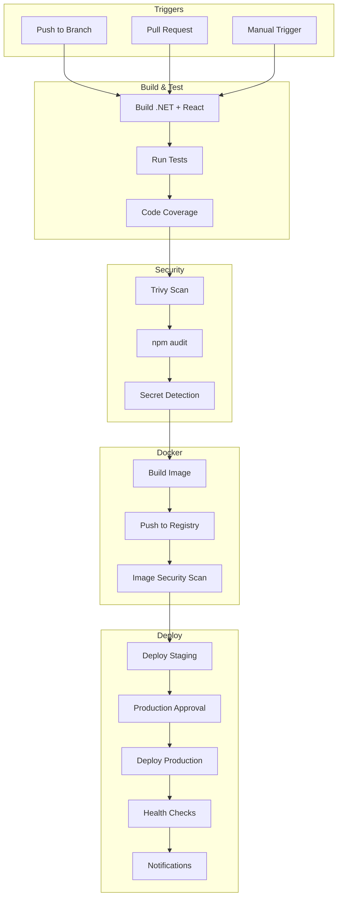

# Automated Deployment Guide for Harmoni360

## 📋 Overview

This guide covers the complete setup and configuration of automated CI/CD pipelines for Harmoni360 using GitHub Actions. The pipeline provides automated testing, security scanning, Docker image building, and deployment to both staging and production environments.

## 🏗️ CI/CD Architecture

### Pipeline Overview



## 🔧 GitHub Actions Configuration

### Main Workflow File (`.github/workflows/deploy.yml`)

<augment_code_snippet path=".github/workflows/deploy.yml" mode="EXCERPT">
````yaml
name: Harmoni360 CI/CD Pipeline

on:
  push:
    branches: [ main, develop ]
  pull_request:
    branches: [ main ]
  workflow_dispatch:
    inputs:
      environment:
        description: 'Environment to deploy to'
        required: true
        default: 'staging'
        type: choice
        options:
          - staging
          - production
````
</augment_code_snippet>

### Environment Configuration

| Environment | Branch | Trigger | URL | Approval Required |
|-------------|--------|---------|-----|-------------------|
| **Staging** | `develop` | Automatic | `harmoni360-staging.fly.dev` | No |
| **Production** | `main` | Automatic | `harmoni360-app.fly.dev` | Yes |

## 🔐 Repository Secrets Setup

### Required GitHub Secrets

Navigate to **Settings > Secrets and variables > Actions** and configure:

| Secret Name | Description | Example Value | Required |
|-------------|-------------|---------------|----------|
| `FLY_API_TOKEN` | Fly.io deploy token (used for both environments) | `FlyV1 fm2_xxx...` | ✅ |
| `SLACK_WEBHOOK_URL` | Slack notifications webhook | `https://hooks.slack.com/...` | ❌ |

### Creating Fly.io API Token

```bash
# Create a deploy token with long expiration
fly tokens create deploy -x 999999h --name "github-actions-deploy"

# Copy the token and add it to GitHub secrets
gh secret set FLY_API_TOKEN --body "FlyV1 fm2_xxx..."
```

### Automated Token Setup Script

<augment_code_snippet path="scripts/setup-flyio-tokens.sh" mode="EXCERPT">
````bash
#!/bin/bash
# Automated token setup for GitHub Actions

echo "🔑 Creating Fly.io deploy token..."
DEPLOY_TOKEN=$(fly tokens create deploy -x 999999h --name "github-actions-$(date +%Y%m%d)" --json | jq -r '.token')

echo "🔒 Setting GitHub repository secret..."
echo "$DEPLOY_TOKEN" | gh secret set FLY_API_TOKEN

echo "✅ GitHub secret configured"
````
</augment_code_snippet>

## 🚀 Pipeline Stages Detailed

### Stage 1: Build and Test

#### .NET Application Build
```yaml
- name: Setup .NET
  uses: actions/setup-dotnet@v4
  with:
    dotnet-version: ${{ env.DOTNET_VERSION }}
    cache: true

- name: Restore .NET dependencies
  run: dotnet restore

- name: Build .NET application
  run: dotnet build --no-restore --configuration Release
```

#### React Frontend Build
```yaml
- name: Setup Node.js
  uses: actions/setup-node@v4
  with:
    node-version: ${{ env.NODE_VERSION }}
    cache: 'npm'
    cache-dependency-path: src/Harmoni360.Web/ClientApp/package-lock.json

- name: Install Node.js dependencies
  working-directory: src/Harmoni360.Web/ClientApp
  run: npm ci

- name: Build React application
  working-directory: src/Harmoni360.Web/ClientApp
  run: npm run build
```

#### Test Execution
```yaml
- name: Run .NET tests
  run: |
    dotnet test --no-build --configuration Release \
      --logger trx --results-directory TestResults \
      --collect:"XPlat Code Coverage" \
      /p:CollectCoverage=true \
      /p:CoverletOutputFormat=cobertura
  env:
    ConnectionStrings__DefaultConnection: "Host=localhost;Port=5432;Database=harmoni360_test;Username=postgres;Password=postgres"
    ConnectionStrings__Redis: "localhost:6379"
    Jwt__Key: "TestJwtKeyThatIsAtLeast32CharactersLongForTesting"

- name: Run Frontend tests
  working-directory: src/Harmoni360.Web/ClientApp
  run: npm test -- --coverage --watchAll=false
```

### Stage 2: Security Scanning

#### Vulnerability Scanning with Trivy
```yaml
- name: Run Trivy vulnerability scanner
  uses: aquasecurity/trivy-action@master
  with:
    scan-type: 'fs'
    scan-ref: '.'
    format: 'sarif'
    output: 'trivy-results.sarif'

- name: Upload Trivy scan results
  uses: github/codeql-action/upload-sarif@v3
  if: always()
  with:
    sarif_file: 'trivy-results.sarif'
```

#### npm Security Audit
```yaml
- name: Install security scan tools
  run: npm install -g audit-ci

- name: Run npm audit
  working-directory: src/Harmoni360.Web/ClientApp
  run: |
    npm audit --audit-level moderate || true
    audit-ci --config audit-ci.json || true
  continue-on-error: true
```

### Stage 3: Docker Build and Push

#### Multi-Platform Docker Build
```yaml
- name: Set up Docker Buildx
  uses: docker/setup-buildx-action@v3

- name: Log in to Container Registry
  uses: docker/login-action@v3
  with:
    registry: ${{ env.REGISTRY }}
    username: ${{ github.actor }}
    password: ${{ secrets.GITHUB_TOKEN }}

- name: Build and push Docker image
  uses: docker/build-push-action@v5
  with:
    context: .
    file: ./Dockerfile.flyio
    push: true
    tags: ${{ steps.meta.outputs.tags }}
    labels: ${{ steps.meta.outputs.labels }}
    cache-from: type=gha
    cache-to: type=gha,mode=max
    platforms: linux/amd64
```

### Stage 4: Deployment

#### Staging Deployment
```yaml
deploy-staging:
  name: Deploy to Staging
  runs-on: ubuntu-latest
  needs: docker-build
  if: github.ref == 'refs/heads/develop'
  environment: staging
  
  steps:
    - name: Setup Fly CLI
      uses: superfly/flyctl-actions/setup-flyctl@master

    - name: Deploy to Fly.io Staging
      run: flyctl deploy --config fly.staging.toml
      env:
        FLY_API_TOKEN: ${{ secrets.FLY_API_TOKEN }}

    - name: Run database migrations
      run: |
        flyctl ssh console --config fly.staging.toml -C "cd /app && dotnet ef database update"
      env:
        FLY_API_TOKEN: ${{ secrets.FLY_API_TOKEN }}

    - name: Health check
      run: |
        sleep 30
        curl -f https://harmoni360-staging.fly.dev/health || exit 1
```

#### Production Deployment
```yaml
deploy-production:
  name: Deploy to Production
  runs-on: ubuntu-latest
  needs: docker-build
  if: github.ref == 'refs/heads/main'
  environment: production  # Requires manual approval
  
  steps:
    - name: Deploy to Fly.io Production
      run: flyctl deploy --config fly.toml
      env:
        FLY_API_TOKEN: ${{ secrets.FLY_API_TOKEN }}

    - name: Run database migrations
      run: |
        flyctl ssh console --config fly.toml -C "cd /app && dotnet ef database update"
      env:
        FLY_API_TOKEN: ${{ secrets.FLY_API_TOKEN }}

    - name: Health check
      run: |
        sleep 30
        curl -f https://harmoni360-app.fly.dev/health || exit 1
```

## 🔄 Deployment Triggers

### Automatic Triggers

1. **Staging Deployment**
   - Triggered on push to `develop` branch
   - Automatic deployment without approval
   - Runs full test suite before deployment

2. **Production Deployment**
   - Triggered on push to `main` branch
   - Requires manual approval via GitHub environments
   - Includes additional safety checks

### Manual Triggers

#### GitHub CLI
```bash
# Trigger staging deployment
gh workflow run deploy.yml --ref develop -f environment=staging

# Trigger production deployment
gh workflow run deploy.yml --ref main -f environment=production
```

#### GitHub Web Interface
1. Navigate to **Actions** tab
2. Select **Harmoni360 CI/CD Pipeline**
3. Click **Run workflow**
4. Select branch and environment
5. Click **Run workflow**

## 🛡️ Environment Protection Rules

### Production Environment Settings

Configure in **Settings > Environments > production**:

1. **Required Reviewers**
   - Add team members who can approve production deployments
   - Minimum 1 reviewer required

2. **Deployment Branches**
   - Restrict to `main` branch only
   - Prevent accidental deployments from feature branches

3. **Environment Secrets**
   - Production-specific secrets (if needed)
   - Override repository-level secrets

### Staging Environment Settings

Configure in **Settings > Environments > staging**:

1. **No Protection Rules**
   - Allow automatic deployments
   - Enable rapid iteration and testing

2. **Deployment Branches**
   - Allow `develop` branch
   - Allow feature branches for testing

## 📊 Monitoring and Notifications

### Slack Integration

#### Setup Slack Webhook
```bash
# Add Slack webhook URL to GitHub secrets
gh secret set SLACK_WEBHOOK_URL --body "https://hooks.slack.com/services/..."
```

#### Notification Configuration
```yaml
- name: Notify deployment success
  uses: 8398a7/action-slack@v3
  if: success()
  with:
    status: success
    text: "🚀 Harmoni360 successfully deployed to production!"
  env:
    SLACK_WEBHOOK_URL: ${{ secrets.SLACK_WEBHOOK_URL }}

- name: Notify deployment failure
  uses: 8398a7/action-slack@v3
  if: failure()
  with:
    status: failure
    text: "❌ Harmoni360 production deployment failed!"
  env:
    SLACK_WEBHOOK_URL: ${{ secrets.SLACK_WEBHOOK_URL }}
```

### GitHub Status Checks

#### Required Status Checks
Configure in **Settings > Branches > main**:

- ✅ Build and Test
- ✅ Security Scan
- ✅ Docker Build
- ✅ All conversations resolved (for PRs)

#### Branch Protection Rules
- Require pull request reviews before merging
- Require status checks to pass before merging
- Require branches to be up to date before merging
- Include administrators in restrictions

## 🔍 Troubleshooting CI/CD Issues

### Common Pipeline Failures

#### 1. Build Failures
```bash
# Check build logs in GitHub Actions
# Common issues:
# - Dependency version conflicts
# - Missing environment variables
# - Test failures
```

#### 2. Deployment Failures
```bash
# Check Fly.io deployment logs
fly logs -a harmoni360-app

# Common issues:
# - Invalid secrets configuration
# - Resource constraints
# - Database migration failures
```

#### 3. Token Issues
```bash
# Verify token validity
fly auth whoami

# Regenerate token if needed
fly tokens create deploy -x 999999h --name "github-actions-new"
gh secret set FLY_API_TOKEN --body "new-token-value"
```

### Pipeline Debugging

#### Enable Debug Logging
```yaml
env:
  ACTIONS_STEP_DEBUG: true
  ACTIONS_RUNNER_DEBUG: true
```

#### Manual Pipeline Testing
```bash
# Test workflow locally with act
act -j build-and-test

# Test specific steps
act -j deploy-staging --dry-run
```

## 📈 Performance Optimization

### Build Performance

1. **Caching Strategy**
   - .NET package caching
   - npm package caching
   - Docker layer caching

2. **Parallel Execution**
   - Run tests in parallel
   - Parallel Docker builds
   - Concurrent security scans

### Deployment Performance

1. **Zero-Downtime Deployment**
   - Blue-green deployment strategy
   - Health check validation
   - Automatic rollback on failure

2. **Resource Optimization**
   - Optimized Docker images
   - Efficient build contexts
   - Minimal runtime dependencies

---

**Document Version:** 1.0.0  
**Last Updated:** December 2024  
**Next Review:** March 2025
