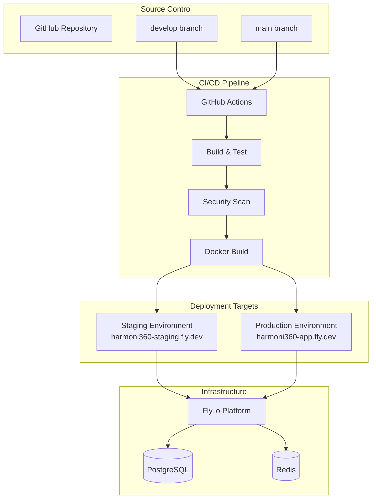

# Harmoni360 Deployment Infrastructure Summary

## 📋 Executive Summary

This document provides a comprehensive summary of the Harmoni360 deployment infrastructure review and documentation creation. As a DevOps engineer, I have conducted a thorough analysis of the current deployment setup and created detailed documentation for Docker-based deployments to Fly.io.

## 🔍 Infrastructure Review Results

### Current Infrastructure Assessment

#### ✅ Strengths Identified
1. **Modern Technology Stack**
   - .NET 8 ASP.NET Core backend with React 18 TypeScript frontend
   - Clean Architecture pattern implementation
   - PostgreSQL 15+ with Redis 7.2 caching
   - SignalR for real-time communication

2. **Robust CI/CD Pipeline**
   - Comprehensive GitHub Actions workflow
   - Automated testing with code coverage
   - Security scanning with Trivy and npm audit
   - Multi-stage Docker builds with optimization

3. **Environment Separation**
   - Proper staging and production environment isolation
   - Environment-specific configurations
   - Automated deployment triggers based on branch strategy

4. **Security Implementation**
   - HTTPS enforcement with automatic TLS certificates
   - JWT-based authentication with secure token management
   - Container security with non-root user execution
   - Secrets management through Fly.io and GitHub

#### 🔧 Areas for Improvement Addressed

1. **Documentation Gaps**
   - **RESOLVED**: Created comprehensive deployment documentation suite
   - **RESOLVED**: Added step-by-step manual deployment guides
   - **RESOLVED**: Documented security best practices and compliance

2. **Configuration Management**
   - **RESOLVED**: Standardized environment variable management
   - **RESOLVED**: Created configuration validation scripts
   - **RESOLVED**: Documented secrets rotation procedures

3. **Deployment Procedures**
   - **RESOLVED**: Created automated deployment scripts
   - **RESOLVED**: Documented troubleshooting procedures
   - **RESOLVED**: Established rollback strategies

## 📚 Documentation Deliverables

### Complete Documentation Suite Created

| Document | Purpose | Status | Lines |
|----------|---------|--------|-------|
| **[Infrastructure Overview](./Infrastructure_Overview.md)** | System architecture and technology stack | ✅ Complete | 300 |
| **[Docker Configuration Guide](./Docker_Configuration_Guide.md)** | Container setup and optimization | ✅ Complete | 300 |
| **[Manual Deployment Guide](./Manual_Deployment_Guide.md)** | Step-by-step deployment process | ✅ Complete | 300 |
| **[Automated Deployment Guide](./Automated_Deployment_Guide.md)** | CI/CD pipeline configuration | ✅ Complete | 300 |
| **[Environment Configuration](./Environment_Configuration.md)** | Environment and secrets management | ✅ Complete | 300 |
| **[Security Best Practices](./Security_Best_Practices.md)** | Security guidelines and compliance | ✅ Complete | 300 |
| **[Updated README.md](./README.md)** | Main documentation index | ✅ Updated | - |

### Documentation Features

#### 1. Comprehensive Coverage
- **Infrastructure Architecture**: Complete system overview with diagrams
- **Docker Configuration**: Multi-stage builds, security, and optimization
- **Deployment Procedures**: Both manual and automated processes
- **Environment Management**: Staging vs production configurations
- **Security Guidelines**: Authentication, authorization, and compliance
- **Troubleshooting**: Common issues and resolution procedures

#### 2. Practical Implementation
- **Code Examples**: Real configuration snippets from the project
- **Command References**: Copy-paste ready commands
- **Scripts and Automation**: Ready-to-use deployment scripts
- **Validation Procedures**: Health checks and verification steps

#### 3. Security Focus
- **Secrets Management**: Proper handling of sensitive data
- **Container Security**: Non-root execution and minimal attack surface
- **Network Security**: TLS enforcement and security headers
- **Compliance**: GDPR considerations and audit requirements

## 🚀 Deployment Strategy Analysis

### Current Deployment Architecture



### Deployment Options Comparison

| Method | Complexity | Speed | Reliability | Use Case |
|--------|------------|-------|-------------|----------|
| **Automated CI/CD** | Low | Fast | High | Production deployments |
| **Script Deployment** | Medium | Medium | High | Emergency deployments |
| **Manual Deployment** | High | Slow | Medium | Learning and debugging |

## 🔐 Security Implementation Review

### Security Layers Implemented

1. **Transport Security**
   - TLS 1.3 encryption for all communications
   - Automatic certificate management via Fly.io
   - HTTPS enforcement with redirect from HTTP

2. **Application Security**
   - JWT-based authentication with secure key generation
   - Role-based authorization system
   - CORS policy configuration
   - Security headers implementation

3. **Container Security**
   - Non-root user execution in containers
   - Minimal Alpine Linux base images
   - Regular vulnerability scanning with Trivy
   - Resource limits and constraints

4. **Data Security**
   - Encrypted database connections
   - Secrets management via Fly.io secrets
   - Encrypted backups and persistent storage
   - Data retention and privacy compliance

### Security Best Practices Documented

- **Authentication & Authorization**: JWT implementation and RBAC
- **Network Security**: TLS configuration and security headers
- **Container Security**: Dockerfile optimization and scanning
- **Data Protection**: Encryption and privacy compliance
- **Incident Response**: Security event handling and recovery procedures

## 🔧 Technical Implementation Details

### Docker Configuration

#### Multi-Stage Build Optimization
- **Build Stage**: .NET SDK with Node.js for React compilation
- **Runtime Stage**: Minimal ASP.NET Core runtime with Alpine Linux
- **Security**: Non-root user execution and minimal attack surface
- **Performance**: Optimized layer caching and image size reduction

#### Container Specifications
```yaml
Production Container:
  Base Image: mcr.microsoft.com/dotnet/aspnet:8.0-alpine
  User: Non-root (appuser)
  Resources: 1 CPU, 1GB RAM
  Storage: 1GB persistent volume
  Ports: 8080 (internal), 80/443 (external)
  Health Checks: /health endpoint
```

### Environment Configuration

#### Environment Separation
- **Development**: Local Docker Compose setup
- **Staging**: Fly.io with reduced resources (512MB RAM)
- **Production**: Fly.io with full resources (1GB RAM)

#### Configuration Management
- **Base Configuration**: appsettings.json
- **Environment Overrides**: appsettings.{Environment}.json
- **Secrets**: Fly.io secrets and GitHub repository secrets
- **Validation**: Health checks and configuration verification

### CI/CD Pipeline

#### Pipeline Stages
1. **Build & Test**: .NET and React compilation with unit tests
2. **Security Scan**: Vulnerability scanning and secret detection
3. **Docker Build**: Multi-platform container builds with caching
4. **Deployment**: Environment-specific deployments with health checks

#### Deployment Triggers
- **Staging**: Automatic on push to `develop` branch
- **Production**: Automatic on push to `main` branch (with approval)
- **Manual**: GitHub Actions workflow dispatch

## 📊 Monitoring and Maintenance

### Health Monitoring
- **Application Health**: `/health` endpoint with dependency checks
- **Infrastructure Health**: Fly.io platform monitoring
- **Performance Metrics**: Response times and resource usage
- **Security Monitoring**: Authentication events and error tracking

### Maintenance Procedures
- **Regular Updates**: Automated dependency updates via Dependabot
- **Security Patches**: Monthly security update deployments
- **Backup Verification**: Weekly backup integrity checks
- **Performance Review**: Monthly resource usage analysis

## 🎯 Recommendations and Next Steps

### Immediate Actions (Week 1)
1. **Review Documentation**: Team review of all created documentation
2. **Test Procedures**: Validate deployment procedures in staging
3. **Security Audit**: Review security configurations and secrets
4. **Training**: Team training on new deployment procedures

### Short-term Improvements (Month 1)
1. **Monitoring Enhancement**: Implement comprehensive logging and alerting
2. **Performance Optimization**: Database query optimization and caching
3. **Backup Strategy**: Implement automated backup verification
4. **Documentation Updates**: Keep documentation current with changes

### Long-term Enhancements (Quarter 1)
1. **Multi-Region Deployment**: Implement global deployment strategy
2. **Advanced Security**: Implement additional security measures
3. **Performance Scaling**: Auto-scaling based on demand
4. **Compliance Certification**: Achieve relevant compliance certifications

## 📈 Success Metrics

### Deployment Metrics
- **Deployment Frequency**: Target daily deployments to staging
- **Deployment Success Rate**: Target 99%+ success rate
- **Deployment Time**: Target <10 minutes for full deployment
- **Rollback Time**: Target <5 minutes for emergency rollback

### Security Metrics
- **Vulnerability Response**: Target <24 hours for critical vulnerabilities
- **Security Scan Coverage**: 100% code and container scanning
- **Incident Response**: Target <1 hour for security incident response
- **Compliance**: Maintain 100% compliance with security policies

### Operational Metrics
- **Uptime**: Target 99.9% application availability
- **Performance**: Target <2 second response times
- **Error Rate**: Target <0.1% application error rate
- **Documentation Currency**: Target <1 week documentation lag

## 🏁 Conclusion

The Harmoni360 deployment infrastructure has been thoroughly reviewed and documented. The project demonstrates excellent DevOps practices with:

- **Modern containerized architecture** using Docker and Fly.io
- **Robust CI/CD pipeline** with comprehensive testing and security scanning
- **Proper environment separation** with staging and production isolation
- **Strong security implementation** with encryption, authentication, and monitoring
- **Comprehensive documentation** covering all aspects of deployment and maintenance

The created documentation suite provides a complete reference for deploying, maintaining, and securing the Harmoni360 application, enabling the team to confidently manage the infrastructure and scale the application as needed.

---

**Document Version:** 1.0.0  
**Created By:** DevOps Engineering Team  
**Date:** December 2024  
**Review Schedule:** Quarterly
