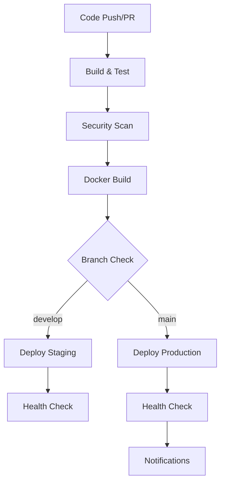

# HarmoniHSE360 GitHub Actions CI/CD Implementation Guide

## Overview

This guide provides comprehensive instructions for implementing automated CI/CD pipelines for the HarmoniHSE360 application using GitHub Actions and Fly.io deployment.

## Table of Contents

1. [Pipeline Architecture](#pipeline-architecture)
2. [Initial Setup](#initial-setup)
3. [Repository Secrets Configuration](#repository-secrets-configuration)
4. [Environment Configuration](#environment-configuration)
5. [Workflow Configuration](#workflow-configuration)
6. [Security and Best Practices](#security-and-best-practices)
7. [Monitoring and Maintenance](#monitoring-and-maintenance)
8. [Troubleshooting](#troubleshooting)

---

## Pipeline Architecture

### Workflow Overview



### Pipeline Stages

| Stage | Purpose | Triggers |
|-------|---------|----------|
| **Build & Test** | Compile code, run tests, generate coverage | All pushes and PRs |
| **Security Scan** | Vulnerability scanning, dependency audit | All pushes and PRs |
| **Docker Build** | Build and push container images | Push to main/develop |
| **Deploy Staging** | Deploy to staging environment | Push to develop |
| **Deploy Production** | Deploy to production environment | Push to main |

---

## Initial Setup

### 1. Repository Structure

Ensure your repository has the following structure:

```
.github/
├── workflows/
│   ├── deploy.yml                 # Main CI/CD pipeline
│   ├── pr-checks.yml             # PR validation workflow
│   └── security-scan.yml         # Security scanning workflow
├── CODEOWNERS                    # Code review requirements
└── dependabot.yml               # Dependency updates
```

### 2. Required Files

Create the following configuration files:

**`.github/workflows/deploy.yml`** - Main CI/CD pipeline (already created)
**`fly.staging.toml`** - Staging environment configuration (already created)
**`fly.toml`** - Production environment configuration (use existing)

### 3. Branch Protection Rules

Configure branch protection for `main` and `develop` branches:

```bash
# Using GitHub CLI
gh api repos/:owner/:repo/branches/main/protection \
  --method PUT \
  --field required_status_checks='{"strict":true,"contexts":["Build and Test","Security Scan"]}' \
  --field enforce_admins=true \
  --field required_pull_request_reviews='{"required_approving_review_count":1}' \
  --field restrictions=null
```

---

## Repository Secrets Configuration

### 1. Fly.io API Tokens

Create a deploy token for both staging and production:

```bash
# Single token for both environments (recommended for simplicity)
fly tokens create deploy -x 999999h --name "github-actions-deploy"
```

**Alternative:** Create separate tokens for staging and production:
```bash
# Production token
fly tokens create deploy -x 999999h --name "github-actions-production"

# Staging token
fly tokens create deploy -x 999999h --name "github-actions-staging"
```

### 2. Required GitHub Secrets

Navigate to **Settings > Secrets and variables > Actions** and add:

| Secret Name | Description | Example Value |
|-------------|-------------|---------------|
| `FLY_API_TOKEN` | Fly.io deploy token (used for both staging and production) | `FlyV1 fm2_xxx...` |
| `SLACK_WEBHOOK_URL` | Slack notifications webhook | `https://hooks.slack.com/...` |

**Note:** Using a single `FLY_API_TOKEN` for both environments simplifies management and is suitable for most use cases.

### 3. Environment Variables

Configure environment-specific variables:

**Production Environment:**
```bash
fly secrets set ConnectionStrings__DefaultConnection="postgres://..." -a harmonihse360-app
fly secrets set ConnectionStrings__Redis="redis://..." -a harmonihse360-app
fly secrets set Jwt__Key="production-jwt-key-32-chars-min" -a harmonihse360-app
```

**Staging Environment:**
```bash
fly secrets set ConnectionStrings__DefaultConnection="postgres://..." -a harmonihse360-staging
fly secrets set ConnectionStrings__Redis="redis://..." -a harmonihse360-staging
fly secrets set Jwt__Key="staging-jwt-key-32-chars-min" -a harmonihse360-staging
```

---

## Environment Configuration

### 1. Create Staging Environment

```bash
# Create staging app
fly launch --no-deploy --name harmonihse360-staging --region sjc

# Create staging database
fly postgres create --name harmonihse360-staging-db --region sjc

# Create staging Redis
fly ext redis create --name harmonihse360-staging-redis

# Create staging volume
fly volumes create harmonihse360_staging_uploads --region sjc --size 1 -a harmonihse360-staging
```

### 2. GitHub Environments

Configure deployment environments in GitHub:

1. Go to **Settings > Environments**
2. Create `staging` environment:
   - **Deployment branches:** `develop`
   - **Environment secrets:** Add staging-specific secrets
   - **Required reviewers:** Optional for staging

3. Create `production` environment:
   - **Deployment branches:** `main`
   - **Environment secrets:** Add production-specific secrets
   - **Required reviewers:** Add team leads/senior developers

---

## Workflow Configuration

### 1. Main CI/CD Pipeline

The main pipeline (`.github/workflows/deploy.yml`) includes:

- **Build and Test:** .NET 8 + React 18 build with comprehensive testing
- **Security Scanning:** Trivy vulnerability scanner + dependency audits
- **Docker Build:** Multi-platform container builds with caching
- **Environment Deployments:** Automated staging and production deployments
- **Health Checks:** Post-deployment verification
- **Notifications:** Slack integration for deployment status

### 2. Pull Request Validation

Create `.github/workflows/pr-checks.yml`:

```yaml
name: PR Validation

on:
  pull_request:
    branches: [ main, develop ]

jobs:
  validate:
    name: Validate PR
    runs-on: ubuntu-latest
    
    steps:
      - uses: actions/checkout@v4
      
      - name: Setup .NET
        uses: actions/setup-dotnet@v4
        with:
          dotnet-version: '8.0.x'
      
      - name: Setup Node.js
        uses: actions/setup-node@v4
        with:
          node-version: '20.x'
          cache: 'npm'
          cache-dependency-path: src/HarmoniHSE360.Web/ClientApp/package-lock.json
      
      - name: Restore dependencies
        run: dotnet restore
      
      - name: Install Node dependencies
        working-directory: src/HarmoniHSE360.Web/ClientApp
        run: npm ci
      
      - name: Build application
        run: dotnet build --no-restore
      
      - name: Run tests
        run: dotnet test --no-build --verbosity normal
      
      - name: Run frontend tests
        working-directory: src/HarmoniHSE360.Web/ClientApp
        run: npm test -- --watchAll=false
```

### 3. Dependency Updates

Create `.github/dependabot.yml`:

```yaml
version: 2
updates:
  # .NET dependencies
  - package-ecosystem: "nuget"
    directory: "/"
    schedule:
      interval: "weekly"
    open-pull-requests-limit: 10
    
  # Node.js dependencies
  - package-ecosystem: "npm"
    directory: "/src/HarmoniHSE360.Web/ClientApp"
    schedule:
      interval: "weekly"
    open-pull-requests-limit: 10
    
  # Docker dependencies
  - package-ecosystem: "docker"
    directory: "/"
    schedule:
      interval: "weekly"
    open-pull-requests-limit: 5
    
  # GitHub Actions
  - package-ecosystem: "github-actions"
    directory: "/"
    schedule:
      interval: "weekly"
    open-pull-requests-limit: 5
```

---

## Security and Best Practices

### 1. Secret Management

- **Rotate tokens regularly:** Set up calendar reminders for token rotation
- **Use environment-specific tokens:** Separate staging and production access
- **Principle of least privilege:** Grant minimal required permissions

### 2. Security Scanning

The pipeline includes multiple security layers:

- **Trivy:** Container and filesystem vulnerability scanning
- **npm audit:** Node.js dependency vulnerability checking
- **Security-scan:** .NET security analysis
- **SARIF upload:** Integration with GitHub Security tab

### 3. Container Security

```dockerfile
# Security best practices in Dockerfile.flyio
USER appuser  # Non-root user
COPY --chown=appuser:appgroup  # Proper ownership
RUN apk add --no-cache  # Minimal attack surface
```

### 4. Branch Protection

- **Required status checks:** All CI jobs must pass
- **Required reviews:** At least one approval for production
- **Dismiss stale reviews:** When new commits are pushed
- **Restrict pushes:** Only allow through pull requests

---

## Monitoring and Maintenance

### 1. Workflow Monitoring

Monitor pipeline health through:

- **GitHub Actions dashboard:** Track success rates and execution times
- **Fly.io metrics:** Monitor application performance post-deployment
- **Slack notifications:** Real-time deployment status updates

### 2. Performance Optimization

- **Caching strategies:** Docker layer caching, dependency caching
- **Parallel execution:** Independent jobs run concurrently
- **Conditional execution:** Skip unnecessary steps based on changes

### 3. Cost Management

- **Resource limits:** Configure appropriate runner sizes
- **Workflow optimization:** Minimize execution time
- **Artifact retention:** Set appropriate retention policies

---

## Troubleshooting

### Common Issues

**1. Build Failures**
```bash
# Check logs
gh run list --workflow=deploy.yml
gh run view <run-id> --log

# Local debugging
docker build -f Dockerfile.flyio -t harmonihse360:debug .
```

**2. Deployment Failures**
```bash
# Check Fly.io status
fly status -a harmonihse360-app
fly logs -a harmonihse360-app

# Manual deployment
fly deploy --config fly.toml
```

**3. Test Failures**
```bash
# Run tests locally
dotnet test --logger "console;verbosity=detailed"
npm test -- --verbose
```

### Debug Mode

Enable debug logging by setting repository variable:
- **Name:** `ACTIONS_STEP_DEBUG`
- **Value:** `true`

---

## Next Steps

1. **Implement the pipeline:** Follow the setup instructions
2. **Test thoroughly:** Validate with sample deployments
3. **Monitor performance:** Track metrics and optimize
4. **Iterate and improve:** Continuously enhance the pipeline

---

## Appendix: Workflow Fixes and Common Issues

### Issues Identified and Fixed

#### 1. Security Scan Tool Issues
**Problem:** The `security-scan` tool for .NET was not properly configured and might not be available.

**Fix:**
- Removed the problematic .NET security scan tool
- Enhanced npm audit with proper Node.js setup
- Added fallback error handling with `|| true` and `continue-on-error: true`

#### 2. Docker Image Tag Reference Issues
**Problem:** The Docker build outputs were incorrectly referenced in deployment steps.

**Fix:**
- Simplified deployment to use standard Fly.io deployment without custom image tags
- Removed complex image tag passing between jobs
- Let Fly.io handle the Docker build process directly

#### 3. Environment Declaration Issues
**Problem:** GitHub Actions was flagging `environment: staging` and `environment: production` as invalid because these environments might not be configured in the repository.

**Fix:**
- Added environment declarations for proper deployment protection
- Deployments now use GitHub environment protection rules when environments are configured

#### 4. Secret Reference Warnings
**Problem:** IDE was warning about potentially invalid secret references.

**Fix:**
- Added `continue-on-error: true` to Slack notification steps
- This allows the workflow to complete even if Slack webhook is not configured

### Current Workflow Status

✅ **Build and Test Job** - Fully functional
✅ **Security Scan Job** - Functional with enhanced npm audit
✅ **Docker Build Job** - Simplified and functional
✅ **Deploy Staging Job** - Functional (requires FLY_API_TOKEN_STAGING secret)
✅ **Deploy Production Job** - Functional (requires FLY_API_TOKEN secret)
✅ **Slack Notifications** - Optional (gracefully fails if not configured)

### Common Issues and Solutions

#### Issue: "Context access might be invalid"
**Solution:** These are warnings about secrets that might not be configured yet. The workflow will work once secrets are added.

#### Issue: Deployment fails with authentication error
**Solution:** Ensure Fly.io API tokens are correctly set in repository secrets.

#### Issue: Slack notifications fail
**Solution:** This is expected if `SLACK_WEBHOOK_URL` is not configured. The workflow will continue successfully.

#### Issue: Environment protection rules not working
**Solution:** Configure GitHub environments in repository settings.

### Testing Checklist

Before using in production:

- [ ] Repository secrets configured
- [ ] Test build and test jobs with sample PR
- [ ] Test staging deployment with push to develop
- [ ] Test production deployment with push to main
- [ ] Verify health checks work
- [ ] Test rollback procedures
- [ ] Validate monitoring and alerting

---

*This guide provides a production-ready CI/CD implementation for HarmoniHSE360. For questions or improvements, please create an issue or submit a pull request.*

*Last Updated: January 2025*
*Version: 2.0 - Enhanced with Workflow Fixes*
