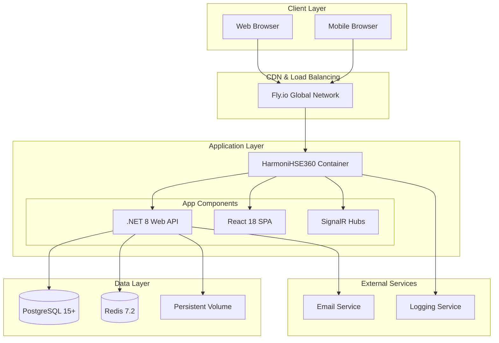
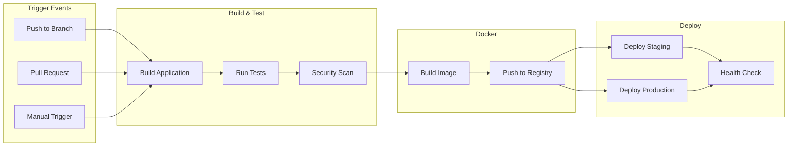

# HarmoniHSE360 Infrastructure Overview

## 📋 Executive Summary

This document provides a comprehensive overview of the HarmoniHSE360 deployment infrastructure, detailing the complete architecture, technology stack, and deployment strategy for Docker-based deployments to Fly.io.

## 🏗️ System Architecture

### High-Level Architecture



### Technology Stack

| Component | Technology | Version | Purpose |
|-----------|------------|---------|---------|
| **Backend Framework** | ASP.NET Core | 8.0 | Web API and application host |
| **Frontend Framework** | React | 18.x | Single Page Application |
| **Language** | TypeScript | 5.x | Frontend type safety |
| **Database** | PostgreSQL | 15+ | Primary data storage |
| **Cache** | Redis | 7.2 | Session and data caching |
| **Real-time** | SignalR | 8.0 | Live notifications |
| **ORM** | Entity Framework Core | 8.0 | Data access layer |
| **Containerization** | Docker | 24.x | Application packaging |
| **Deployment Platform** | Fly.io | Latest | Container orchestration |
| **CI/CD** | GitHub Actions | Latest | Automated deployment |

## 🐳 Docker Configuration

### Container Architecture

The application uses a multi-stage Docker build optimized for production deployment:

#### Build Stage (`Dockerfile.flyio`)
- **Base Image:** `mcr.microsoft.com/dotnet/sdk:8.0-alpine`
- **Node.js:** Installed for React build process
- **Build Process:**
  1. Restore .NET dependencies
  2. Install and build React application
  3. Publish .NET application

#### Runtime Stage
- **Base Image:** `mcr.microsoft.com/dotnet/aspnet:8.0-alpine`
- **Security:** Non-root user execution
- **Optimization:** Minimal attack surface with Alpine Linux
- **Globalization:** ICU libraries for international support

### Container Specifications

```yaml
# Production Container Specs
Resources:
  CPU: 1 vCPU (shared)
  Memory: 1GB RAM
  Storage: 1GB persistent volume
  
Network:
  Internal Port: 8080
  External Ports: 80 (HTTP), 443 (HTTPS)
  
Security:
  User: Non-root (appuser)
  TLS: Enforced HTTPS
  Secrets: Environment variables
```

## 🌐 Deployment Environments

### Environment Separation Strategy

| Environment | Purpose | Branch | URL | Resources |
|-------------|---------|--------|-----|-----------|
| **Development** | Local development | `feature/*` | `localhost:5000` | Docker Compose |
| **Staging** | Pre-production testing | `develop` | `harmonihse360-staging.fly.dev` | 1 CPU, 512MB |
| **Production** | Live application | `main` | `harmonihse360-app.fly.dev` | 1 CPU, 1GB |

### Configuration Management

#### Staging Environment (`fly.staging.toml`)
```toml
app = "harmonihse360-staging"
primary_region = "sjc"

[env]
  ASPNETCORE_ENVIRONMENT = "Staging"
  ASPNETCORE_URLS = "http://+:8080"

[vm]
  cpu_kind = "shared"
  cpus = 1
  memory_mb = 512
```

#### Production Environment (`fly.toml`)
```toml
app = "harmonihse360-app"
primary_region = "sjc"

[env]
  ASPNETCORE_ENVIRONMENT = "Production"
  ASPNETCORE_URLS = "http://+:8080"

[vm]
  cpu_kind = "shared"
  cpus = 1
  memory_mb = 1024
```

## 🔄 CI/CD Pipeline Architecture

### GitHub Actions Workflow



### Pipeline Stages

1. **Build & Test Stage**
   - .NET 8 application build
   - React TypeScript compilation
   - Unit and integration tests
   - Code coverage analysis

2. **Security Scanning**
   - Trivy vulnerability scanning
   - npm audit for frontend dependencies
   - Secret detection with TruffleHog
   - SARIF report generation

3. **Docker Build**
   - Multi-platform container build
   - Image optimization and caching
   - Push to GitHub Container Registry
   - Vulnerability scanning of images

4. **Deployment**
   - Automated staging deployment (develop branch)
   - Production deployment with approval (main branch)
   - Database migrations
   - Health checks and rollback capability

## 🔐 Security Architecture

### Security Layers

| Layer | Implementation | Details |
|-------|----------------|---------|
| **Transport** | TLS 1.3 | HTTPS enforced, automatic certificate management |
| **Authentication** | JWT Tokens | Secure token generation with configurable expiration |
| **Authorization** | Role-based | Fine-grained permissions system |
| **Data** | Encryption at rest | PostgreSQL and Redis encryption |
| **Container** | Non-root execution | Minimal attack surface, security scanning |
| **Network** | Private networking | Database and cache isolation |

### Secrets Management

#### GitHub Secrets
- `FLY_API_TOKEN`: Single token for both staging and production
- `SLACK_WEBHOOK_URL`: Deployment notifications (optional)

#### Fly.io Secrets
- `ConnectionStrings__DefaultConnection`: PostgreSQL connection
- `ConnectionStrings__Redis`: Redis connection string
- `Jwt__Key`: JWT signing key (32+ characters)

## 📊 Resource Requirements

### Minimum System Requirements

| Component | Staging | Production |
|-----------|---------|------------|
| **Application** | 1 CPU, 512MB RAM | 1 CPU, 1GB RAM |
| **Database** | PostgreSQL (shared) | PostgreSQL (dedicated) |
| **Cache** | Redis (shared) | Redis (dedicated) |
| **Storage** | 1GB persistent volume | 5GB persistent volume |
| **Bandwidth** | 100GB/month | 1TB/month |

### Scaling Considerations

#### Horizontal Scaling
- Multiple application instances
- Load balancing via Fly.io
- Database read replicas
- Redis clustering

#### Vertical Scaling
- CPU: Up to 8 vCPUs
- Memory: Up to 8GB RAM
- Storage: Expandable volumes
- Network: Dedicated IPv4/IPv6

## 🔧 Operational Procedures

### Deployment Process

1. **Automated Deployment**
   - Triggered by Git push to main/develop
   - Comprehensive testing and validation
   - Zero-downtime deployment strategy
   - Automatic rollback on failure

2. **Manual Deployment**
   - Emergency deployment capability
   - Direct Fly.io CLI deployment
   - Manual validation and testing
   - Controlled rollout process

### Monitoring & Observability

#### Health Monitoring
- Application health endpoint: `/health`
- Database connectivity checks
- Redis availability monitoring
- External service dependency checks

#### Logging Strategy
- Structured logging with Serilog
- Centralized log aggregation
- Real-time log streaming
- Log retention and archival

#### Performance Monitoring
- Response time tracking
- Resource utilization metrics
- Error rate monitoring
- User experience metrics

## 🚀 Deployment Strategies

### Zero-Downtime Deployment

1. **Blue-Green Deployment**
   - New version deployed alongside current
   - Traffic switched after validation
   - Instant rollback capability
   - Minimal service interruption

2. **Rolling Updates**
   - Gradual instance replacement
   - Continuous service availability
   - Progressive traffic migration
   - Health check validation

### Rollback Procedures

1. **Automatic Rollback**
   - Health check failures trigger rollback
   - Database migration rollback
   - Configuration restoration
   - Service recovery validation

2. **Manual Rollback**
   - Emergency rollback procedures
   - Version-specific rollback
   - Data consistency verification
   - Service restoration confirmation

---

**Document Version:** 1.0.0  
**Last Updated:** December 2024  
**Next Review:** March 2025
