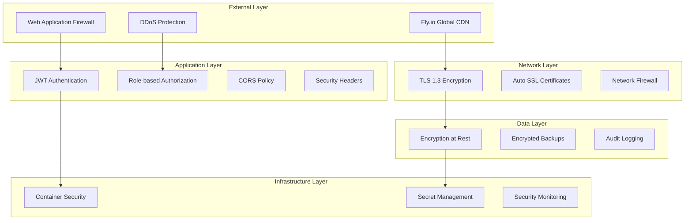

# Security and Best Practices Guide for Harmoni360

## 📋 Overview

This guide outlines comprehensive security measures, best practices, and compliance considerations for deploying and maintaining the Harmoni360 application in production environments.

## 🛡️ Security Architecture

### Defense in Depth Strategy



## 🔐 Authentication and Authorization

### JWT Token Security

#### Token Configuration
```json
{
  "Jwt": {
    "Key": "[256-bit-secure-key]",
    "Issuer": "Harmoni360",
    "Audience": "Harmoni360Users",
    "ExpirationMinutes": 60,
    "RefreshTokenExpirationDays": 7,
    "Algorithm": "HS256"
  }
}
```

#### Secure JWT Implementation
```csharp
// JWT key requirements
- Minimum 32 characters (256 bits)
- Cryptographically secure random generation
- Environment-specific keys
- Regular rotation schedule

// Token validation
- Validate issuer and audience
- Check expiration time
- Verify signature integrity
- Implement token blacklisting for logout
```

#### JWT Key Generation
```bash
# Generate secure JWT key for production
JWT_KEY="Harmoni360-Production-JWT-$(date +%s)-$(openssl rand -hex 32)"

# Verify key strength
echo "$JWT_KEY" | wc -c  # Should be 64+ characters

# Set in Fly.io secrets
fly secrets set Jwt__Key="$JWT_KEY" -a harmoni360-app
```

### Role-Based Access Control (RBAC)

#### User Roles and Permissions
| Role | Permissions | Access Level |
|------|-------------|--------------|
| **Admin** | Full system access | All modules |
| **HSE Manager** | HSE data management | HSE modules |
| **Supervisor** | Team oversight | Limited modules |
| **Employee** | Personal data only | Read-only |

#### Authorization Implementation
```csharp
[Authorize(Roles = "Admin,HSEManager")]
public class IncidentController : ControllerBase
{
    [Authorize(Policy = "CanViewIncidents")]
    public async Task<IActionResult> GetIncidents()
    {
        // Implementation
    }
}
```

## 🌐 Network Security

### TLS/SSL Configuration

#### TLS Settings
```toml
# fly.toml - Force HTTPS
[[services.ports]]
  handlers = ["http"]
  port = 80
  force_https = true

[[services.ports]]
  handlers = ["tls", "http"]
  port = 443
```

#### Security Headers
```csharp
// Startup.cs - Security headers middleware
app.UseSecurityHeaders(policies =>
{
    policies.AddFrameOptionsDeny()
           .AddXssProtectionBlock()
           .AddContentTypeOptionsNoSniff()
           .AddReferrerPolicyStrictOriginWhenCrossOrigin()
           .AddCrossOriginEmbedderPolicy(builder => builder.RequireCorp())
           .AddCrossOriginOpenerPolicy(builder => builder.SameOrigin())
           .AddCrossOriginResourcePolicy(builder => builder.CrossOrigin());
});
```

### CORS Configuration

#### Production CORS Policy
```csharp
services.AddCors(options =>
{
    options.AddPolicy("ProductionPolicy", builder =>
    {
        builder.WithOrigins("https://harmoni360-app.fly.dev")
               .AllowAnyMethod()
               .AllowAnyHeader()
               .AllowCredentials();
    });
});
```

## 🐳 Container Security

### Docker Security Best Practices

#### Secure Dockerfile Configuration
```dockerfile
# Use specific version tags
FROM mcr.microsoft.com/dotnet/aspnet:8.0-alpine AS final

# Create non-root user
RUN addgroup -S appgroup && adduser -S appuser -G appgroup

# Set file permissions
RUN mkdir -p uploads && chown -R appuser:appgroup uploads

# Switch to non-root user
USER appuser

# Expose only necessary ports
EXPOSE 8080
```

#### Container Security Scanning
```yaml
# GitHub Actions - Container security scan
- name: Run Trivy vulnerability scanner
  uses: aquasecurity/trivy-action@master
  with:
    image-ref: 'harmoni360:latest'
    format: 'sarif'
    output: 'trivy-results.sarif'
    severity: 'CRITICAL,HIGH'
```

### Runtime Security

#### Container Runtime Configuration
```toml
# fly.toml - Security constraints
[vm]
  cpu_kind = "shared"
  cpus = 1
  memory_mb = 1024

# Resource limits prevent DoS attacks
[services.concurrency]
  type = "connections"
  hard_limit = 25
  soft_limit = 20
```

## 🗄️ Data Security

### Database Security

#### Connection Security
```bash
# Secure PostgreSQL connection string
ConnectionStrings__DefaultConnection="Host=hostname;Port=5432;Database=dbname;Username=user;Password=password;SSL Mode=Require;Trust Server Certificate=false"
```

#### Database User Permissions
```sql
-- Create application-specific user with minimal permissions
CREATE USER harmoni360 WITH PASSWORD 'secure_random_password';

-- The Fly Postgres cluster should use the same database name and user

-- Grant only necessary permissions
GRANT CONNECT ON DATABASE Harmoni360_Prod TO harmoni360;
GRANT USAGE ON SCHEMA public TO harmoni360;
GRANT SELECT, INSERT, UPDATE, DELETE ON ALL TABLES IN SCHEMA public TO harmoni360;
GRANT USAGE, SELECT ON ALL SEQUENCES IN SCHEMA public TO harmoni360;

-- Revoke dangerous permissions
REVOKE CREATE ON SCHEMA public FROM harmoni360;
REVOKE ALL ON pg_catalog FROM harmoni360;
```

### Data Encryption

#### Encryption at Rest
- PostgreSQL: Transparent Data Encryption (TDE)
- Redis: Encryption enabled by default on Fly.io
- File uploads: Encrypted persistent volumes

#### Encryption in Transit
- TLS 1.3 for all external communications
- Internal service communication over encrypted channels
- Database connections with SSL/TLS

### Data Privacy and Compliance

#### GDPR Compliance
```csharp
// Data retention policies
public class DataRetentionService
{
    // Implement data anonymization
    public async Task AnonymizeUserData(int userId)
    {
        // Remove PII while preserving analytics
    }
    
    // Implement right to be forgotten
    public async Task DeleteUserData(int userId)
    {
        // Complete data removal
    }
}
```

## 🔑 Secrets Management

### Fly.io Secrets Security

#### Secret Storage Best Practices
```bash
# Use Fly.io secrets for sensitive data
fly secrets set ConnectionStrings__DefaultConnection="..." -a harmoni360-app
fly secrets set Jwt__Key="..." -a harmoni360-app

# Never store secrets in:
# - Source code
# - Configuration files
# - Environment variables in Dockerfile
# - Container images
```

#### Secret Rotation Strategy
```bash
#!/bin/bash
# rotate-secrets.sh

# Generate new JWT key
NEW_JWT_KEY="Harmoni360-Production-JWT-$(date +%s)-$(openssl rand -hex 32)"

# Update secret
fly secrets set Jwt__Key="$NEW_JWT_KEY" -a harmoni360-app

# Verify deployment
fly deploy -a harmoni360-app

# Test application
curl -f https://harmoni360-app.fly.dev/health
```

### GitHub Secrets Security

#### Repository Secrets Management
```bash
# Set GitHub secrets securely
gh secret set FLY_API_TOKEN --body "$(fly tokens create deploy -x 999999h --name github-actions --json | jq -r '.token')"

# Verify secrets are set
gh secret list
```

## 🔍 Security Monitoring

### Application Security Monitoring

#### Security Event Logging
```csharp
// Security event logging
public class SecurityEventLogger
{
    public void LogAuthenticationFailure(string email, string ipAddress)
    {
        _logger.LogWarning("Authentication failure for {Email} from {IpAddress}", 
                          email, ipAddress);
    }
    
    public void LogSuspiciousActivity(string userId, string activity)
    {
        _logger.LogWarning("Suspicious activity: {Activity} by user {UserId}", 
                          activity, userId);
    }
}
```

#### Health Check Security
```csharp
// Health check with security considerations
public class SecurityHealthCheck : IHealthCheck
{
    public async Task<HealthCheckResult> CheckHealthAsync(
        HealthCheckContext context, 
        CancellationToken cancellationToken = default)
    {
        // Check for security issues
        var issues = await DetectSecurityIssues();
        
        return issues.Any() 
            ? HealthCheckResult.Unhealthy("Security issues detected")
            : HealthCheckResult.Healthy();
    }
}
```

### Infrastructure Security Monitoring

#### Automated Security Scanning
```yaml
# .github/workflows/security-scan.yml
name: Security Scan

on:
  schedule:
    - cron: '0 2 * * *'  # Daily at 2 AM
  push:
    branches: [ main, develop ]

jobs:
  security-scan:
    runs-on: ubuntu-latest
    steps:
      - uses: actions/checkout@v4
      
      - name: Run Trivy vulnerability scanner
        uses: aquasecurity/trivy-action@master
        with:
          scan-type: 'fs'
          format: 'sarif'
          output: 'trivy-results.sarif'
      
      - name: Run npm audit
        run: npm audit --audit-level moderate
        
      - name: Run secret detection
        uses: trufflesecurity/trufflehog@main
        with:
          path: ./
          base: main
          head: HEAD
```

## 🚨 Incident Response

### Security Incident Response Plan

#### Immediate Response (0-1 hour)
1. **Identify and Contain**
   ```bash
   # Scale down application if under attack
   fly scale count 0 -a harmoni360-app
   
   # Check logs for attack patterns
   fly logs -a harmoni360-app | grep -i "error\|attack\|suspicious"
   ```

2. **Assess Impact**
   ```bash
   # Check database for unauthorized access
   fly postgres connect -a harmoni360-db
   SELECT * FROM audit_log WHERE created_at > NOW() - INTERVAL '1 hour';
   ```

#### Short-term Response (1-24 hours)
1. **Rotate Compromised Secrets**
   ```bash
   # Rotate JWT keys
   ./scripts/rotate-secrets.sh
   
   # Rotate database passwords
   fly postgres update --password -a harmoni360-db
   ```

2. **Apply Security Patches**
   ```bash
   # Deploy security updates
   fly deploy -a harmoni360-app
   ```

#### Long-term Response (1-7 days)
1. **Security Review and Hardening**
2. **Update Security Policies**
3. **Staff Security Training**
4. **Implement Additional Monitoring**

### Backup and Recovery

#### Automated Backup Strategy
```bash
# Database backups (automated by Fly.io)
fly postgres backup list -a harmoni360-db

# Application data backup
fly volumes list -a harmoni360-app
fly volumes snapshot create [volume-id]
```

#### Disaster Recovery Plan
```bash
# Emergency deployment from backup
fly postgres restore [backup-id] -a harmoni360-db-new
fly deploy --image [backup-image] -a harmoni360-app-new

# DNS failover
fly certs create yourdomain.com -a harmoni360-app-new
```

## 📋 Security Checklist

### Pre-Deployment Security Checklist

- [ ] **Authentication & Authorization**
  - [ ] JWT keys are cryptographically secure (256+ bits)
  - [ ] Role-based access control implemented
  - [ ] Session management configured properly
  - [ ] Password policies enforced

- [ ] **Network Security**
  - [ ] HTTPS enforced (force_https = true)
  - [ ] Security headers configured
  - [ ] CORS policy restrictive
  - [ ] Rate limiting implemented

- [ ] **Data Security**
  - [ ] Database connections encrypted
  - [ ] Sensitive data encrypted at rest
  - [ ] Data retention policies implemented
  - [ ] Backup encryption enabled

- [ ] **Container Security**
  - [ ] Non-root user execution
  - [ ] Minimal base image used
  - [ ] Security scanning passed
  - [ ] Resource limits configured

- [ ] **Secrets Management**
  - [ ] No secrets in source code
  - [ ] Fly.io secrets configured
  - [ ] GitHub secrets secured
  - [ ] Secret rotation plan in place

### Post-Deployment Security Verification

- [ ] **Security Testing**
  - [ ] Penetration testing completed
  - [ ] Vulnerability scanning passed
  - [ ] Security headers verified
  - [ ] SSL/TLS configuration tested

- [ ] **Monitoring Setup**
  - [ ] Security event logging enabled
  - [ ] Intrusion detection configured
  - [ ] Automated alerting setup
  - [ ] Log retention configured

- [ ] **Compliance Verification**
  - [ ] GDPR compliance verified
  - [ ] Data protection policies implemented
  - [ ] Audit trail configured
  - [ ] Privacy policy updated

## 🔄 Continuous Security

### Regular Security Maintenance

#### Weekly Tasks
- Review security logs and alerts
- Check for new vulnerability reports
- Verify backup integrity
- Monitor resource usage patterns

#### Monthly Tasks
- Rotate non-critical secrets
- Update security documentation
- Review access permissions
- Conduct security training

#### Quarterly Tasks
- Comprehensive security audit
- Penetration testing
- Disaster recovery testing
- Security policy review

---

**Document Version:** 1.0.0  
**Last Updated:** December 2024  
**Next Review:** March 2025
