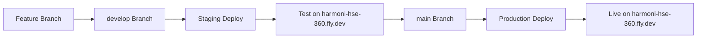

# Single Hostname Migration Summary

## 🎯 Migration Overview

Successfully migrated from a dual-app Fly.io configuration to a single-app strategy due to the constraint of having only one available hostname: `harmoni-hse-360.fly.dev`.

## ✅ Completed Changes

### **1. Configuration Architecture Changes**

#### **Removed Dual-App Setup**
- ❌ **Removed**: `fly.staging.toml` (separate staging app configuration)
- ❌ **Removed**: References to `harmoni360-staging` app
- ❌ **Removed**: References to `harmoni360-staging.fly.dev` hostname

#### **Implemented Single-App Strategy**
- ✅ **Single App**: `harmoni-hse-360` for both environments
- ✅ **Single Hostname**: `harmoni-hse-360.fly.dev`
- ✅ **Environment Control**: Via `ASPNETCORE_ENVIRONMENT` secret/variable
- ✅ **Branch-Based Deployment**: develop → staging, main → production

### **2. Updated fly.toml Configuration**

```toml
# Single app configuration supporting both environments
app = "harmoni-hse-360"
primary_region = "sjc"

[env]
  # Environment controlled via secrets during deployment
  ASPNETCORE_URLS = "http://+:8080"
  ASPNETCORE_FORWARDEDHEADERS_ENABLED = "true"

[[services]]
  internal_port = 8080
  protocol = "tcp"
  auto_stop_machines = false
  auto_start_machines = true
  min_machines_running = 1

[vm]
  cpu_kind = "shared"
  cpus = 1
  memory_mb = 1024
```

### **3. Updated GitHub Actions Workflow**

#### **Staging Deployment (develop branch)**
```yaml
- name: Deploy to Fly.io Staging Environment
  run: |
    flyctl deploy --config fly.toml --env ASPNETCORE_ENVIRONMENT=Staging

- name: Set staging environment secrets
  run: |
    flyctl secrets set ASPNETCORE_ENVIRONMENT="Staging" -a harmoni-hse-360
```

#### **Production Deployment (main branch)**
```yaml
- name: Deploy to Fly.io Production
  run: |
    flyctl deploy --config fly.toml --env ASPNETCORE_ENVIRONMENT=Production

- name: Set production environment secrets
  run: |
    flyctl secrets set ASPNETCORE_ENVIRONMENT="Production" -a harmoni-hse-360
```

### **4. Updated Validation and Documentation**

#### **Enhanced Validation Script**
- ✅ **16 total configuration checks** (updated from 18)
- ✅ **Validates single-app strategy** implementation
- ✅ **Checks for removal** of staging-specific configurations
- ✅ **Verifies environment-based** deployment configuration

#### **Updated Documentation**
- ✅ **[Single_Hostname_Deployment_Strategy.md](./Single_Hostname_Deployment_Strategy.md)** - Comprehensive deployment guide
- ✅ **[Flyio_Environment_Configuration_Comparison.md](./Flyio_Environment_Configuration_Comparison.md)** - Updated for single-app
- ✅ **Validation scripts** updated for new architecture

## 🚀 New Deployment Workflow

### **Development Process**


### **Environment Switching**
| Action | Command | Result |
|--------|---------|--------|
| **Deploy Staging** | `git push origin develop` | App runs with `ASPNETCORE_ENVIRONMENT=Staging` |
| **Deploy Production** | `git push origin main` | App runs with `ASPNETCORE_ENVIRONMENT=Production` |
| **Check Environment** | `flyctl ssh console -a harmoni-hse-360 -C 'echo $ASPNETCORE_ENVIRONMENT'` | Shows current environment |

## 🔍 Validation Results

### **Configuration Validation Summary**
```
🎉 All 16/16 configuration checks passed!

✅ Single app fly.toml exists
✅ fly.toml has correct app name  
✅ fly.staging.toml correctly removed
✅ Dockerfile.flyio uses .NET 8.0
✅ Project targets .NET 8.0
✅ GitHub Actions uses correct health check URL
✅ No references to old staging hostname
✅ Program.cs improvements applied
✅ Health checks endpoint mapped
✅ ASPNETCORE_URLS configured correctly
✅ Internal port configured correctly
✅ Forwarded headers enabled
✅ Staging environment deployment configured
✅ Production environment deployment configured
```

## 🛡️ Benefits of Single-App Strategy

### **Advantages**
1. **Simplified Management**: One app to monitor and maintain
2. **Cost Efficiency**: Single app reduces resource costs
3. **Hostname Compliance**: Works within single hostname constraint
4. **Easy Environment Switching**: Simple secret-based environment control
5. **Consistent Configuration**: Same infrastructure for both environments

### **Maintained Capabilities**
1. **Pre-Production Testing**: Still possible via develop branch deployment
2. **Environment Separation**: Via application-level environment detection
3. **Automated Deployment**: GitHub Actions workflow maintained
4. **Health Monitoring**: Same health check endpoint for both environments
5. **Database Migrations**: Automated for both environments

## ⚠️ Important Considerations

### **Deployment Timing**
- **Only one environment active at a time** on the single hostname
- **Plan deployments carefully** to minimize disruption
- **Use maintenance windows** for major changes
- **Monitor deployments closely** during environment switches

### **Environment Verification**
```bash
# Check current environment
flyctl ssh console -a harmoni-hse-360 -C "echo \$ASPNETCORE_ENVIRONMENT"

# Check application logs
flyctl logs -a harmoni-hse-360 | grep "Environment:"

# Health check
curl https://harmoni-hse-360.fly.dev/health
```

## 🔄 Migration Impact

### **What Changed**
- ❌ **Removed**: Separate staging app and hostname
- ❌ **Removed**: `fly.staging.toml` configuration file
- ✅ **Added**: Environment-based deployment strategy
- ✅ **Added**: Single-app configuration management
- ✅ **Updated**: GitHub Actions workflow for environment switching
- ✅ **Updated**: Documentation and validation scripts

### **What Stayed the Same**
- ✅ **Same hostname**: `harmoni-hse-360.fly.dev`
- ✅ **Same deployment triggers**: develop/main branch pushes
- ✅ **Same health check endpoint**: `/health`
- ✅ **Same application code**: No code changes required
- ✅ **Same Docker configuration**: .NET 8.0 images maintained

## 📋 Next Steps

### **Immediate Actions**
1. **Commit and push all changes** to repository
2. **Test staging deployment** via develop branch push
3. **Verify environment switching** works correctly
4. **Test production deployment** via main branch push
5. **Monitor application logs** for environment detection

### **Deployment Commands**
```bash
# Deploy to staging
git checkout develop
git push origin develop

# Verify staging
curl https://harmoni-hse-360.fly.dev/health
flyctl logs -a harmoni-hse-360 | grep "Staging"

# Deploy to production
git checkout main
git merge develop
git push origin main

# Verify production
curl https://harmoni-hse-360.fly.dev/health
flyctl logs -a harmoni-hse-360 | grep "Production"
```

## 📞 Support

### **Troubleshooting**
- **Environment Issues**: Check `ASPNETCORE_ENVIRONMENT` secret
- **Deployment Failures**: Monitor `flyctl logs -a harmoni-hse-360`
- **Health Check Issues**: Verify application startup logs
- **Configuration Problems**: Run `bash scripts/validate-flyio-config.sh`

### **Documentation References**
- [Single Hostname Deployment Strategy](./Single_Hostname_Deployment_Strategy.md)
- [Flyio Deployment Fix Analysis](./Flyio_Deployment_Fix_Analysis.md)
- [Environment Configuration Comparison](./Flyio_Environment_Configuration_Comparison.md)

The migration to a single-hostname strategy successfully maintains all testing and deployment capabilities while working within the constraint of one available Fly.io hostname.
