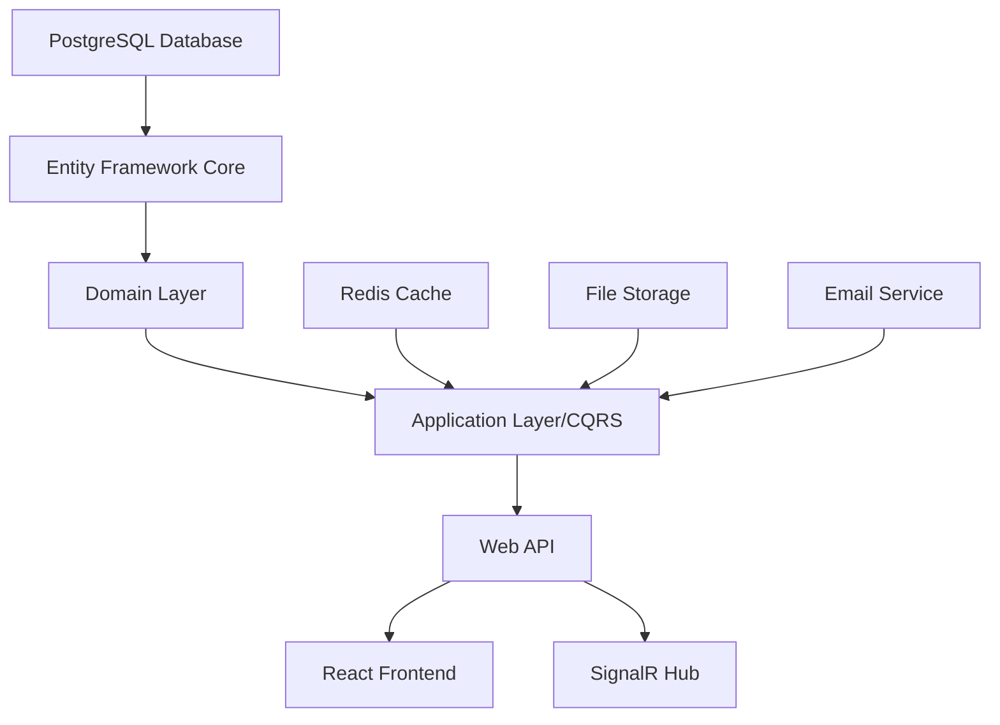
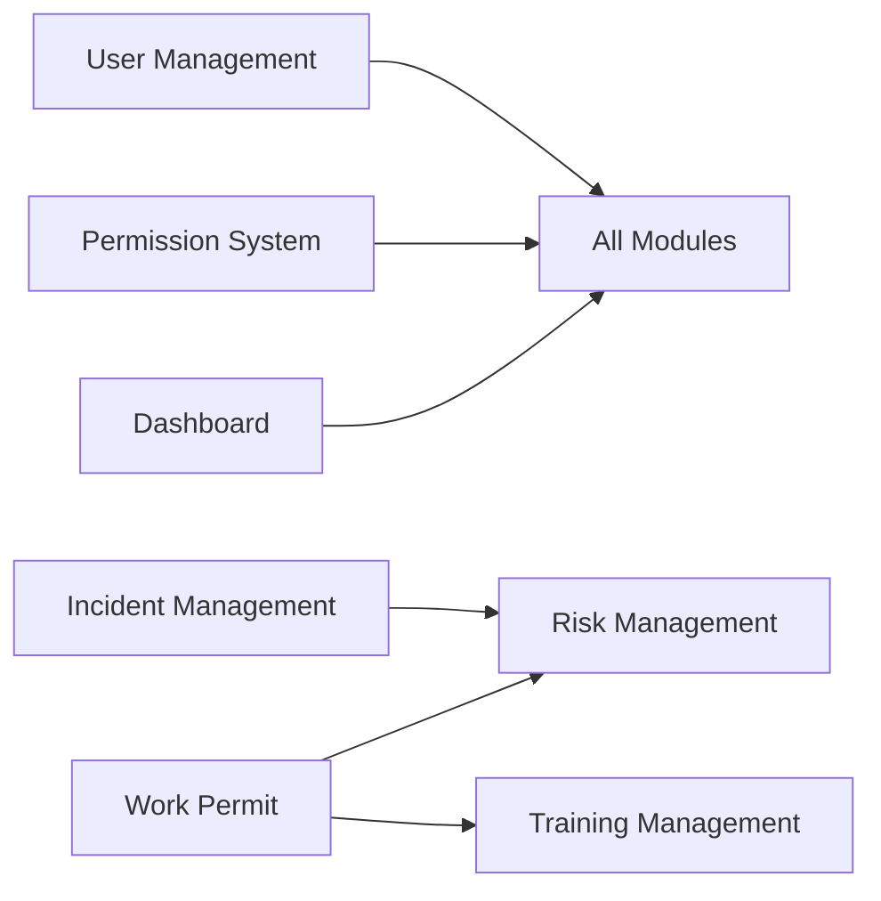

# Harmoni360 HSSE Implementation Roadmap
## Comprehensive Development and Progress Tracking Guide

### Executive Summary

This roadmap provides a comprehensive implementation strategy for the Harmoni360 HSSE application, prioritizing features based on business value, technical dependencies, and risk assessment. The plan incorporates the existing .NET 8 backend with CQRS pattern, React/TypeScript frontend, and PostgreSQL database architecture.

### Implementation Timeline Overview

**Total Duration:** 24 weeks (6 months)  
**Team Size:** 4-6 developers  
**Methodology:** Agile with 2-week sprints

## Phase 1: Foundation & Core Infrastructure (Weeks 1-8)

### 1.1 Enterprise User Management System
**Duration:** 8 weeks | **Priority:** Critical | **Effort:** 190 hours

#### Business Value
- Establishes secure user authentication and authorization foundation
- Enables role-based access control for all modules
- Provides audit trail for compliance requirements

#### Technical Dependencies
- PostgreSQL database setup
- Entity Framework Core 8.x configuration
- JWT authentication infrastructure
- Redis cache setup for performance

#### Deliverables
1. **Enhanced User Entity** (Week 1-2)
   - HSSE-specific fields (emergency contacts, supervisor hierarchy)
   - User status management (Active, Inactive, Suspended, Terminated)
   - Account security features (lockout, MFA preparation)

2. **User CRUD Operations** (Week 3-4)
   - Advanced search and filtering
   - Bulk import/export capabilities
   - User lifecycle management workflows

3. **Enhanced RBAC System** (Week 5-6)
   - Hierarchical role structure
   - Dynamic permission assignment
   - Context-aware permissions (location, project-based)

4. **Security & Performance** (Week 7-8)
   - Redis caching implementation
   - Security audit features
   - GDPR compliance capabilities

#### Acceptance Criteria
- [ ] All user CRUD operations functional
- [ ] Role hierarchy with permission inheritance
- [ ] Activity logging for all operations
- [ ] Support for 500+ concurrent users
- [ ] Response times < 2 seconds

### 1.2 Permission Management System Enhancement
**Duration:** 4 weeks (Parallel with User Management) | **Priority:** Critical | **Effort:** 80 hours

#### Integration Points
- ModulePermissionMap enhancement
- Dynamic route protection (DynamicRouteGuard.tsx)
- SignalR real-time permission updates

#### Deliverables
1. **Granular Permission Types** (Week 5-6)
   - Extended permission categories (CRUD, Workflow, Reporting, Security)
   - Field-level permissions
   - Temporary permission elevation system

2. **Permission Inheritance** (Week 7-8)
   - Role-based inheritance
   - Organizational hierarchy inheritance
   - Project team inheritance

## Phase 2: Core HSSE Modules (Weeks 9-16)

### 2.1 Incident Management Module
**Duration:** 4 weeks | **Priority:** High | **Effort:** 120 hours

#### Business Value
- Critical for safety compliance and reporting
- Reduces incident response time
- Provides analytics for safety improvements

#### Technical Dependencies
- User Management System
- File storage service (for attachments)
- Notification service

#### Deliverables
1. **Incident Reporting** (Week 9-10)
   - Multi-step incident form with validation
   - Photo/document attachment support
   - Real-time status updates via SignalR

2. **Workflow Management** (Week 11-12)
   - Investigation assignment and tracking
   - Corrective action management
   - Approval workflows with notifications

#### Risk Assessment
- **Risk:** Complex workflow requirements
- **Mitigation:** Iterative development with stakeholder feedback
- **Quality Gates:** Unit tests (>85%), Integration tests, UAT

### 2.2 Risk Management Module
**Duration:** 3 weeks | **Priority:** High | **Effort:** 90 hours

#### Integration Points
- Links with Incident Management for risk identification
- Integrates with Work Permit for hazard assessment

#### Deliverables
1. **Risk Register** (Week 13-14)
   - Hazard identification and assessment
   - Risk matrix visualization
   - Control measure tracking

2. **Risk Analytics** (Week 15)
   - Risk trending and analytics
   - Dashboard widgets integration
   - Automated risk scoring

### 2.3 Work Permit Management
**Duration:** 3 weeks | **Priority:** High | **Effort:** 90 hours

#### Business Value
- Ensures safe work practices
- Regulatory compliance
- Integration with safety induction videos

#### Deliverables
1. **Permit Workflow** (Week 14-15)
   - Multi-level approval system
   - Safety checklist integration
   - QR code generation for mobile access

2. **Safety Induction Integration** (Week 16)
   - Video playback tracking
   - Quiz/assessment integration
   - Certificate generation

## Phase 3: Operational Excellence Modules (Weeks 17-20)

### 3.1 Inspection Management
**Duration:** 2 weeks | **Priority:** Medium | **Effort:** 60 hours

#### Deliverables
- Inspection scheduling and assignment
- Mobile-friendly inspection forms
- Non-conformance tracking
- Analytics and reporting

### 3.2 Training Management
**Duration:** 2 weeks | **Priority:** Medium | **Effort:** 60 hours

#### Deliverables
- Training record management
- Certification tracking
- Competency matrix
- Training needs analysis

### 3.3 PPE Management
**Duration:** 2 weeks | **Priority:** Medium | **Effort:** 60 hours

#### Deliverables
- PPE inventory tracking
- Distribution management
- Compliance monitoring
- Replacement scheduling

## Phase 4: Advanced Features & Integration (Weeks 21-24)

### 4.1 Dashboard & Analytics
**Duration:** 2 weeks | **Priority:** High | **Effort:** 60 hours

#### Deliverables
- Configurable dashboard widgets
- Real-time KPI monitoring
- Trend analysis
- Executive reporting

### 4.2 Module Configuration System
**Duration:** 2 weeks | **Priority:** Medium | **Effort:** 60 hours

#### Deliverables
- Dynamic module enable/disable
- Module-specific settings
- Dependency management
- License-based feature control

## Progress Tracking Methodology

### 1. Task Management System

#### Task States
- **Not Started**: Task identified but work not begun
- **In Progress**: Active development
- **Code Review**: Implementation complete, pending review
- **Testing**: In QA/testing phase
- **Complete**: Deployed to production
- **Blocked**: Dependencies or issues preventing progress

#### Task Tracking Fields
```typescript
interface DevelopmentTask {
  id: string;
  title: string;
  description: string;
  module: ModuleType;
  priority: 'Critical' | 'High' | 'Medium' | 'Low';
  status: TaskStatus;
  assignee: Developer;
  estimatedHours: number;
  actualHours: number;
  dependencies: string[];
  blockers: Blocker[];
  completionPercentage: number;
  dueDate: Date;
  completedDate?: Date;
}
```

### 2. Sprint Management

#### Sprint Planning Template
- **Sprint Goal**: Clear objective for the sprint
- **Capacity Planning**: Available developer hours
- **Task Selection**: Based on priority and dependencies
- **Risk Assessment**: Identify potential blockers

#### Daily Standups
- Current task status
- Blockers identification
- Help needed
- Progress percentage update

### 3. Progress Metrics

#### Velocity Tracking
```typescript
interface SprintMetrics {
  sprintNumber: number;
  plannedStoryPoints: number;
  completedStoryPoints: number;
  velocity: number;
  burndownData: BurndownPoint[];
  blockerCount: number;
  defectCount: number;
}
```

#### Key Performance Indicators
1. **Sprint Velocity**: Story points completed per sprint
2. **Defect Density**: Bugs per story point
3. **Code Coverage**: Minimum 80% target
4. **Technical Debt Ratio**: Keep below 15%
5. **Deployment Frequency**: Aim for weekly releases

### 4. Quality Gates

#### Definition of Done
- [ ] Code complete with unit tests (>85% coverage)
- [ ] Code review approved by senior developer
- [ ] Integration tests passing
- [ ] Security scan completed
- [ ] Documentation updated
- [ ] Deployed to staging environment
- [ ] UAT sign-off received

#### Code Review Checklist
- [ ] Follows project coding standards
- [ ] No security vulnerabilities
- [ ] Performance optimized
- [ ] Error handling implemented
- [ ] Logging added appropriately

### 5. Risk Management

#### Risk Register Template
```typescript
interface ProjectRisk {
  id: string;
  description: string;
  impact: 'High' | 'Medium' | 'Low';
  probability: 'High' | 'Medium' | 'Low';
  mitigation: string;
  owner: string;
  status: 'Open' | 'Mitigated' | 'Closed';
}
```

#### High-Priority Risks
1. **Database Migration Complexity**
   - Mitigation: Incremental migrations with rollback scripts

2. **Third-party Integration Dependencies**
   - Mitigation: Abstract service interfaces, mock implementations

3. **Performance at Scale**
   - Mitigation: Early performance testing, caching strategy

## Dependency Mapping

### Technical Dependencies


### Module Dependencies


## Resource Allocation

### Team Structure
1. **Backend Team Lead** (1)
   - Architecture decisions
   - Code review
   - Performance optimization

2. **Backend Developers** (2)
   - Feature implementation
   - API development
   - Testing

3. **Frontend Developers** (2)
   - React component development
   - UI/UX implementation
   - Frontend testing

4. **DevOps Engineer** (1, part-time)
   - CI/CD pipeline
   - Deployment automation
   - Monitoring setup

### Time Allocation Guidelines
- **Development**: 60%
- **Testing**: 20%
- **Code Review**: 10%
- **Documentation**: 5%
- **Meetings/Planning**: 5%

## Data Seeding Considerations

### Existing Seeding Infrastructure Analysis

Based on the current implementation, the data seeding follows a structured approach:

1. **Essential Data** (Always seeded):
   - Roles: 19 roles including new Security and Work Permit roles
   - Module Permissions: All combinations of ModuleType × PermissionType
   - Essential Admin Users: superadmin, developer, admin

2. **Sample User Accounts** (Optional):
   - 18 demo users with specific role assignments
   - Includes specialized managers for each module
   - Security domain specialists
   - Work permit approval specialists

3. **Seeding Strategy**:
   - Uses `ForceReseed` flag for complete database reset
   - Maintains referential integrity during seeding
   - Supports incremental seeding for new features

### Enhanced User Entity Compatibility

**Current User Entity Fields:**
```csharp
- Email, PasswordHash, Name, EmployeeId
- Department, Position, IsActive
- UserRoles collection
- Audit properties (CreatedAt, CreatedBy, etc.)
```

**Required Enhancements for New System:**
- Add HSSE-specific fields (PhoneNumber, EmergencyContact, etc.)
- Add UserStatus enum (replacing IsActive boolean)
- Add security fields (LastLoginAt, FailedLoginAttempts, etc.)
- Add preference fields (PreferredLanguage, TimeZone)

### Data Migration Strategy

1. **Backward Compatibility**:
   - Preserve existing user data during migration
   - Map IsActive boolean to UserStatus.Active/Inactive
   - Set default values for new required fields

2. **Seeder Updates Required**:
   - Update UserDataSeeder to use enhanced User.Create() method
   - Add HSSE-specific field population in seeders
   - Update existing user records with new fields

3. **Permission System Integration**:
   - Existing ModulePermissionMap compatible with enhancements
   - Add new permission types to PermissionType enum
   - Update RoleModulePermissionDataSeeder for new permissions

## Actionable Next Steps

### Immediate Actions (Week 1)

1. **Database Migration Preparation**
   ```bash
   # Create backup of existing data
   pg_dump harmoni360_db > backup_before_user_enhancement.sql
   
   # Create migration for User entity enhancements
   cd src/Harmoni360.Infrastructure
   dotnet ef migrations add EnhanceUserEntityForHSSE --startup-project ../Harmoni360.Web
   
   # Review migration file before applying
   # Update existing user records with default values
   dotnet ef database update --startup-project ../Harmoni360.Web
   ```

2. **Update Data Seeders**
   ```bash
   # Update UserDataSeeder.cs to support new fields
   # Modify User.Create() calls to include new parameters
   # Add migration script for existing users
   ```

3. **Environment Setup**
   ```bash
   # Redis setup for permission caching
   docker run -d -p 6379:6379 redis:alpine
   
   # Configure Redis in appsettings.json
   # Test Redis connectivity
   
   # Frontend setup
   cd src/Harmoni360.Web/ClientApp
   npm install
   npm run dev
   ```

### Week 1 Development Tasks

**Backend Team:**
1. **User Entity Enhancement** (Day 1-2)
   - Create UserStatus enum
   - Update User entity with new fields
   - Create migration with data preservation
   - Update UserConfiguration for EF Core

2. **Update Seeders** (Day 2-3)
   - Modify UserDataSeeder for new fields
   - Add default values for existing users
   - Test seeding with ForceReseed option
   - Ensure backward compatibility

3. **UserActivityLog Implementation** (Day 3-4)
   - Create UserActivityLog entity
   - Add activity logging middleware
   - Configure EF Core relationships
   - Create activity tracking service

4. **Enhanced DTOs and Validation** (Day 4-5)
   - Create UserDto with new fields
   - Add validation rules for HSSE fields
   - Update existing API responses
   - Create migration documentation

**Frontend Team:**
1. **User Module Structure** (Day 1-2)
   - Create feature folder structure
   - Set up React Router for user management
   - Create TypeScript interfaces for new user fields
   - Set up API service layer

2. **Enhanced User List** (Day 2-3)
   - Update UserList component for new fields
   - Add department/location filters
   - Implement user status indicators
   - Add quick actions menu

3. **User Form Updates** (Day 3-4)
   - Create multi-section user form
   - Add HSSE field sections
   - Implement form validation
   - Add emergency contact management

4. **Search and Filters** (Day 4-5)
   - Implement advanced search
   - Add filter persistence
   - Create saved search feature
   - Add export functionality

**DevOps:**
1. **Database Backup Strategy**
   - Automated backup before migrations
   - Rollback procedures
   - Data integrity validation
   - Migration testing pipeline

2. **Redis Configuration**
   - Set up Redis cluster for production
   - Configure cache invalidation
   - Monitor cache performance
   - Set up Redis backup

### Success Metrics (First Sprint)

- [ ] All existing users migrated with new fields
- [ ] Data seeders updated and tested
- [ ] No data loss during migration
- [ ] User CRUD operations include new fields
- [ ] Frontend displays enhanced user information
- [ ] Redis caching operational
- [ ] Zero downtime during migration
- [ ] All existing functionality preserved
- [ ] Unit test coverage > 85%
- [ ] Performance benchmarks maintained

## Monitoring and Reporting

### Weekly Status Report Template
```markdown
## Week [X] Status Report

### Completed This Week
- [List of completed tasks]

### In Progress
- [Current tasks with % complete]

### Blockers
- [Any blocking issues]

### Next Week Plan
- [Planned tasks]

### Metrics
- Velocity: X story points
- Defects: X found, Y resolved
- Test Coverage: X%
```

### Monthly Steering Committee Report
- Overall progress percentage
- Budget utilization
- Risk status
- Major milestones achieved
- Upcoming milestones

## Conclusion

This comprehensive implementation roadmap provides a clear path to delivering the Harmoni360 HSSE application with enterprise-grade features. The phased approach ensures continuous delivery of value while maintaining quality and security standards. Regular monitoring and adjustment of the plan based on progress metrics will ensure successful project completion within the 24-week timeline.