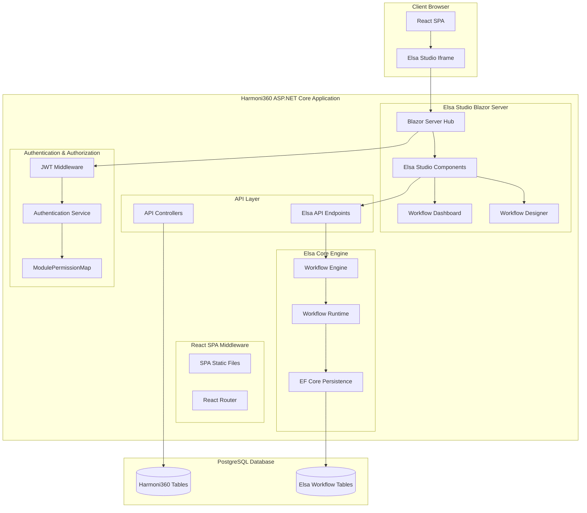
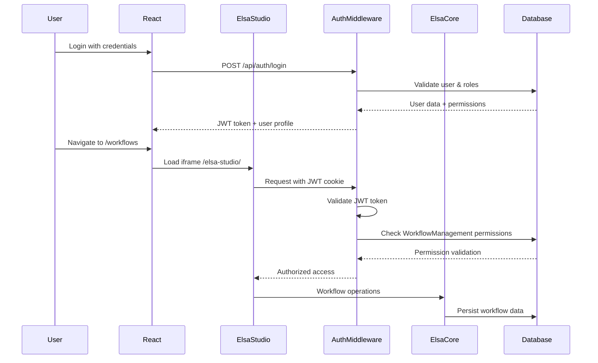

# Elsa Studio Integration Architecture
## Comprehensive Technical Design for Harmoni360 HSSE Integration

## Executive Summary

This document provides the definitive technical architecture for integrating Elsa Studio (workflow designer) into the Harmoni360 HSSE application. Based on extensive research of the current codebase and Elsa Studio capabilities, this design ensures seamless integration with our existing .NET 8 modular monolith architecture while maintaining compatibility with our React/TypeScript frontend and JWT-based authentication system.

## 1. Current State Analysis

### 1.1 Existing Harmoni360 Architecture
- **Backend**: .NET 8 modular monolith with Clean Architecture
- **Frontend**: React 18 + TypeScript SPA with CoreUI components
- **Authentication**: JWT-based with ModulePermissionMap authorization
- **Database**: PostgreSQL with Entity Framework Core
- **Hosting**: ASP.NET Core with SPA middleware
- **Deployment**: Fly.io cloud and Docker standalone options

### 1.2 Current Elsa Integration Status
✅ **Already Implemented:**
- Elsa Core 3.x workflow engine configured in `DependencyInjection.cs`
- PostgreSQL persistence for workflow data
- Elsa API endpoints exposed at `/elsa/api`
- `ElsaAuthenticationProvider` service for JWT validation
- Basic workflow management infrastructure

❌ **Missing Components:**
- Elsa Studio UI integration
- Seamless authentication flow between Harmoni360 and Elsa Studio
- Proper routing configuration for `/elsa-studio/` path
- Role-based access control for workflow management

## 2. Integration Architecture Design

### 2.1 Recommended Approach: Blazor Server Hosting

After analyzing multiple integration patterns, the **Blazor Server hosting approach** is recommended for the following reasons:

1. **Unified Authentication**: Shares the same ASP.NET Core authentication context
2. **Simplified Deployment**: Single application deployment
3. **Better Performance**: No separate application startup overhead
4. **Easier Maintenance**: Single codebase and configuration
5. **Security**: No cross-origin authentication complexity

### 2.2 Architecture Overview



### 2.3 Routing Strategy

The application will use a **path-based routing strategy** where:

- **React SPA**: Handles all routes except `/elsa-studio/*`
- **Elsa Studio**: Handles all routes under `/elsa-studio/*`
- **API Endpoints**: Continue to use `/api/*` and `/elsa/api/*`

## 3. Authentication & Authorization Flow

### 3.1 Unified Authentication Architecture



### 3.2 Role-Based Access Control

The integration will leverage the existing `ModulePermissionMap` system:

```csharp
// Workflow Management permissions in ModulePermissionMap
[ModuleType.WorkflowManagement] = new List<PermissionType>
{
    PermissionType.Read,    // View workflows and instances
    PermissionType.Create,  // Create new workflows
    PermissionType.Update,  // Edit existing workflows
    PermissionType.Delete,  // Delete workflows
    PermissionType.Execute, // Run/trigger workflows
    PermissionType.Configure // Advanced workflow settings
}
```

**Role Mapping:**
- **SuperAdmin/Developer**: Full access to all workflow features
- **WorkflowManager**: Create, edit, execute workflows
- **Admin**: View and execute workflows
- **Other roles**: Read-only access based on module permissions

## 4. Technical Implementation Strategy

### 4.1 Elsa Studio Package Integration

```csharp
// Add to Harmoni360.Web.csproj
<PackageReference Include="Elsa.Studio.Host.Server" Version="3.0.0" />
<PackageReference Include="Elsa.Studio.Dashboard" Version="3.0.0" />
<PackageReference Include="Elsa.Studio.Workflows" Version="3.0.0" />
```

### 4.2 Service Registration

```csharp
// In Program.cs - Add Elsa Studio services
builder.Services.AddElsaStudio(studio =>
{
    studio.AddDashboardModule();
    studio.AddWorkflowsModule();
    studio.UseAuthentication(); // Use existing JWT authentication
});
```

### 4.3 Routing Configuration

```csharp
// Configure routing to handle both React SPA and Elsa Studio
app.MapWhen(context => context.Request.Path.StartsWithSegments("/elsa-studio"), 
    elsaApp =>
    {
        elsaApp.UseRouting();
        elsaApp.UseAuthentication();
        elsaApp.UseAuthorization();
        elsaApp.MapElsaStudio(); // Map Elsa Studio Blazor components
    });

// Existing SPA configuration remains unchanged
app.MapWhen(context => !context.Request.Path.StartsWithSegments("/elsa-studio") &&
                      !context.Request.Path.StartsWithSegments("/elsa/api") &&
                      !context.Request.Path.StartsWithSegments("/api"),
    spaApp =>
    {
        spaApp.UseSpa(spa =>
        {
            spa.Options.SourcePath = "ClientApp";
            // ... existing SPA configuration
        });
    });
```

## 5. Database Integration Strategy

### 5.1 Shared Database Approach

The integration will use the **shared database approach** where:
- Elsa workflow tables coexist with Harmoni360 tables in the same PostgreSQL database
- Existing `ApplicationDbContext` is extended to include Elsa entities
- Foreign key relationships can be established between Harmoni360 entities and workflow instances

### 5.2 Database Schema Integration

```csharp
// Extend ApplicationDbContext for Elsa integration
public partial class ApplicationDbContext : DbContext, IApplicationDbContext
{
    // Existing Harmoni360 DbSets...
    
    // Elsa workflow entities (automatically added by Elsa)
    // These will be created via Elsa migrations
}
```

## 6. Security Considerations

### 6.1 Authentication Security
- JWT tokens are validated using the existing `ElsaAuthenticationProvider`
- Elsa Studio inherits the same security context as the main application
- No additional authentication mechanisms required

### 6.2 Authorization Security
- All Elsa Studio access is protected by the existing `ModulePermissionMap`
- Workflow operations are authorized based on user roles and permissions
- Audit trails are maintained for all workflow activities

### 6.3 Network Security
- No additional network ports required (single application)
- All communication happens within the same ASP.NET Core process
- Existing HTTPS and security headers apply to Elsa Studio

## 7. Performance Considerations

### 7.1 Resource Optimization
- Elsa Studio Blazor components are loaded on-demand
- SignalR connections are shared between React and Blazor components
- Static assets are served efficiently through ASP.NET Core

### 7.2 Scalability
- Blazor Server scales with the existing ASP.NET Core application
- Workflow execution is handled by the existing Elsa Core engine
- Database performance is optimized through existing EF Core configurations

## 8. Deployment Strategy

### 8.1 Development Environment
- Elsa Studio is accessible at `https://localhost:5000/elsa-studio/`
- React development server continues to run on port 5173
- No additional development setup required

### 8.2 Production Deployment
- Single Docker container includes both React SPA and Elsa Studio
- Existing Fly.io deployment configuration supports the integrated approach
- No changes required to existing CI/CD pipelines

## Next Steps

1. **Implementation Guide Creation**: Detailed step-by-step implementation instructions
2. **Development Execution Plan**: Task breakdown with effort estimates
3. **Testing Strategy**: Comprehensive testing approach for the integration
4. **Documentation Updates**: Update existing documentation to reflect the new architecture

This architecture provides a robust, secure, and maintainable foundation for integrating Elsa Studio into the Harmoni360 HSSE application while preserving all existing functionality and architectural patterns.
