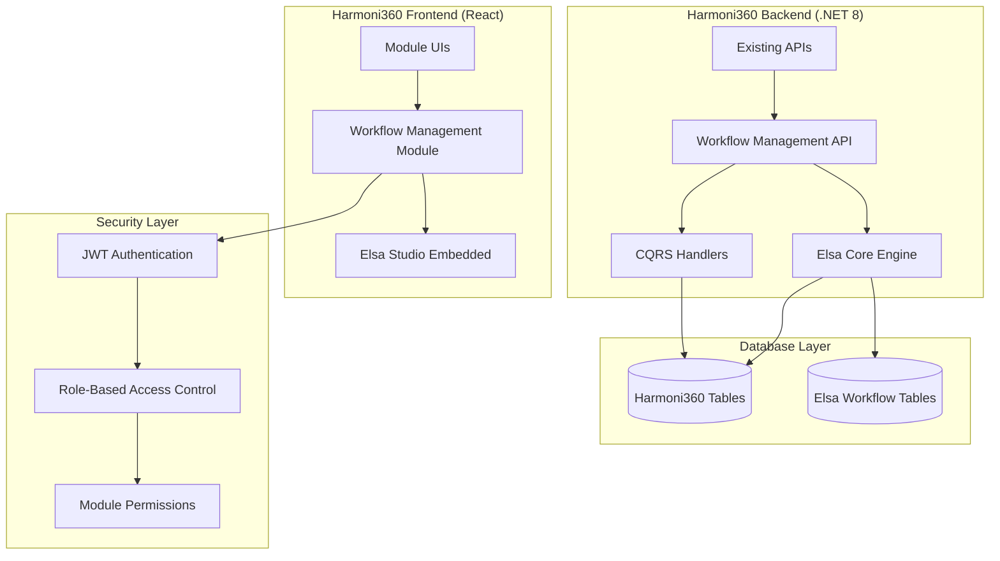
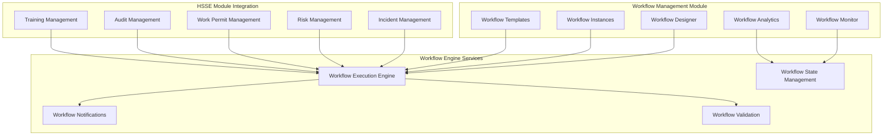
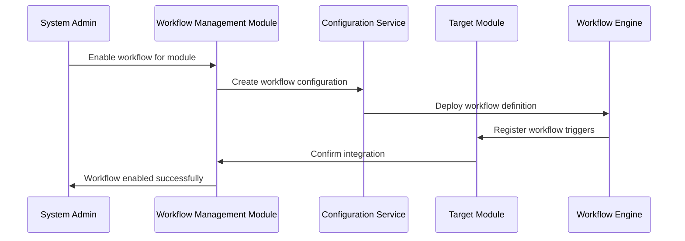
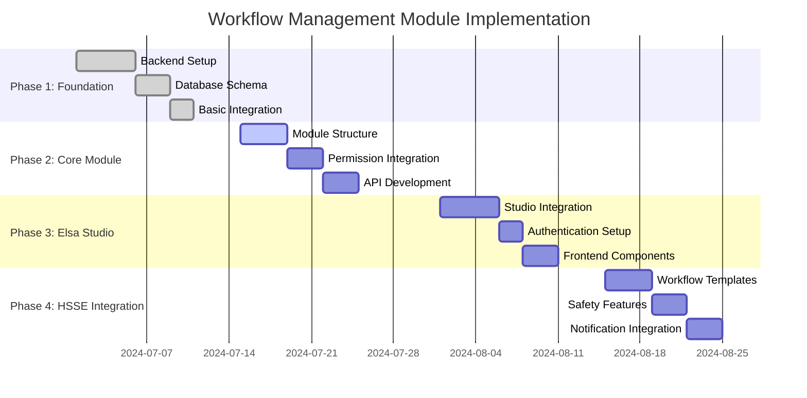

# Workflow Management Module Implementation Plan
## Elsa Studio Integration for Harmoni360 HSSE

## Executive Summary

This document provides a comprehensive technical specification for integrating Elsa Studio's Workflow Designer as a dedicated module within the Harmoni360 HSSE application. The implementation follows the existing modular monolith architecture patterns and integrates seamlessly with the current .NET 8 + React + PostgreSQL stack while maintaining enterprise-grade security and HSSE compliance requirements.

## Table of Contents

1. [Integration Architecture Analysis](#1-integration-architecture-analysis)
2. [Workflow Management Module Design](#2-workflow-management-module-design)
3. [Global Workflow Enablement Strategy](#3-global-workflow-enablement-strategy)
4. [Technical Implementation Requirements](#4-technical-implementation-requirements)
5. [HSSE Industry Considerations](#5-hsse-industry-considerations)
6. [Implementation Timeline](#6-implementation-timeline)
7. [Testing and Validation](#7-testing-and-validation)

---

## 1. Integration Architecture Analysis

### 1.1 Feasibility Assessment

#### **High Feasibility Indicators:**
- **Native .NET Integration**: Elsa Core v3 is built for .NET 8, ensuring seamless backend integration
- **React Compatibility**: Elsa Studio can be embedded in React applications via iframe or web components
- **PostgreSQL Support**: Native support for existing database infrastructure
- **Modular Architecture**: Elsa Studio fits perfectly within Harmoni360's modular design pattern
- **CQRS Compatibility**: Elsa workflows integrate well with existing MediatR patterns

#### **Technical Compatibility Matrix:**
| Component | Current Harmoni360 | Elsa Studio | Compatibility |
|-----------|-------------------|-------------|---------------|
| Backend Framework | .NET 8 | .NET 8 | ✅ Perfect |
| Frontend Framework | React 18 + TypeScript | Web Components | ✅ Excellent |
| Database | PostgreSQL | PostgreSQL Support | ✅ Perfect |
| Authentication | JWT + RBAC | Extensible Auth | ✅ Excellent |
| API Pattern | REST + SignalR | REST + SignalR | ✅ Perfect |
| Architecture | Modular Monolith | Embeddable | ✅ Perfect |

### 1.2 Integration Architecture Overview



### 1.3 Module Integration Points

#### **1.3.1 Backend Integration Points**
```csharp
// Integration with existing module system
public enum ModuleType
{
    // ... existing modules
    WorkflowManagement = 21  // New module
}

// Extend ModulePermissionMap
public static class WorkflowManagementPermissions
{
    public static readonly Dictionary<UserRole, List<PermissionType>> Permissions = new()
    {
        {
            UserRole.SuperAdmin, 
            new List<PermissionType> { PermissionType.View, PermissionType.Create, PermissionType.Update, PermissionType.Delete, PermissionType.Export }
        },
        {
            UserRole.Developer,
            new List<PermissionType> { PermissionType.View, PermissionType.Create, PermissionType.Update, PermissionType.Delete, PermissionType.Export }
        },
        {
            UserRole.Admin,
            new List<PermissionType> { PermissionType.View, PermissionType.Create, PermissionType.Update, PermissionType.Export }
        },
        {
            UserRole.WorkflowManager,  // New role
            new List<PermissionType> { PermissionType.View, PermissionType.Create, PermissionType.Update, PermissionType.Export }
        },
        {
            UserRole.ModuleManager,
            new List<PermissionType> { PermissionType.View, PermissionType.Create, PermissionType.Update }
        }
    };
}
```

#### **1.3.2 Frontend Integration Points**
```typescript
// Integration with existing module routing
const workflowManagementRoutes: RouteObject[] = [
  {
    path: "/workflow-management",
    element: <WorkflowManagementLayout />,
    children: [
      {
        path: "designer",
        element: <WorkflowDesigner />,
        loader: requirePermission(ModuleType.WorkflowManagement, PermissionType.Create)
      },
      {
        path: "instances",
        element: <WorkflowInstances />,
        loader: requirePermission(ModuleType.WorkflowManagement, PermissionType.View)
      },
      {
        path: "monitoring",
        element: <WorkflowMonitoring />,
        loader: requirePermission(ModuleType.WorkflowManagement, PermissionType.View)
      }
    ]
  }
];
```

---

## 2. Workflow Management Module Design

### 2.1 Module Structure

#### **2.1.1 Module Architecture**


### 2.2 Module Configuration Schema

#### **2.2.1 Database Schema Extensions**
```sql
-- Extend ModuleConfiguration table
ALTER TABLE ModuleConfigurations 
ADD COLUMN WorkflowEnabled BOOLEAN DEFAULT FALSE,
ADD COLUMN DefaultWorkflowDefinitionId UUID NULL,
ADD COLUMN WorkflowSettings JSONB NULL;

-- New Workflow Module Configuration table
CREATE TABLE WorkflowModuleConfigurations (
    Id UUID PRIMARY KEY DEFAULT gen_random_uuid(),
    ModuleType INT NOT NULL,
    WorkflowDefinitionId UUID NOT NULL,
    IsEnabled BOOLEAN NOT NULL DEFAULT TRUE,
    Priority INT NOT NULL DEFAULT 0,
    TriggerConditions JSONB NULL,
    Configuration JSONB NULL,
    CreatedAt TIMESTAMP NOT NULL DEFAULT NOW(),
    CreatedBy UUID NOT NULL,
    ModifiedAt TIMESTAMP NULL,
    ModifiedBy UUID NULL,
    
    FOREIGN KEY (ModuleType) REFERENCES Modules(Id),
    FOREIGN KEY (WorkflowDefinitionId) REFERENCES WorkflowDefinitions(Id),
    FOREIGN KEY (CreatedBy) REFERENCES Users(Id),
    FOREIGN KEY (ModifiedBy) REFERENCES Users(Id)
);

-- Workflow Templates for HSSE processes
CREATE TABLE HSSEWorkflowTemplates (
    Id UUID PRIMARY KEY DEFAULT gen_random_uuid(),
    Name VARCHAR(255) NOT NULL,
    Description TEXT,
    ModuleType INT NOT NULL,
    ProcessType VARCHAR(100) NOT NULL, -- Incident, WorkPermit, RiskAssessment, etc.
    WorkflowDefinition JSONB NOT NULL,
    IsDefault BOOLEAN NOT NULL DEFAULT FALSE,
    Version INT NOT NULL DEFAULT 1,
    CreatedAt TIMESTAMP NOT NULL DEFAULT NOW(),
    CreatedBy UUID NOT NULL,
    
    UNIQUE(ModuleType, ProcessType, Version)
);
```

### 2.3 Module Service Layer

#### **2.3.1 Workflow Management Service**
```csharp
public interface IWorkflowManagementService
{
    Task<bool> IsWorkflowEnabledForModuleAsync(ModuleType moduleType);
    Task<WorkflowDefinition> GetActiveWorkflowAsync(ModuleType moduleType, string processType);
    Task<IEnumerable<WorkflowTemplate>> GetTemplatesAsync(ModuleType moduleType);
    Task<WorkflowConfiguration> GetModuleWorkflowConfigurationAsync(ModuleType moduleType);
    Task EnableWorkflowForModuleAsync(ModuleType moduleType, Guid workflowDefinitionId);
    Task DisableWorkflowForModuleAsync(ModuleType moduleType);
}

public class WorkflowManagementService : IWorkflowManagementService
{
    private readonly IRepository<WorkflowModuleConfiguration> _configRepository;
    private readonly IRepository<HSSEWorkflowTemplate> _templateRepository;
    private readonly IWorkflowDefinitionService _workflowDefinitionService;
    private readonly IMemoryCache _cache;

    public async Task<bool> IsWorkflowEnabledForModuleAsync(ModuleType moduleType)
    {
        var cacheKey = $"workflow_enabled_{moduleType}";
        return await _cache.GetOrCreateAsync(cacheKey, async entry =>
        {
            entry.SlidingExpiration = TimeSpan.FromMinutes(15);
            
            var config = await _configRepository
                .FirstOrDefaultAsync(c => c.ModuleType == (int)moduleType && c.IsEnabled);
            
            return config != null;
        });
    }

    public async Task<WorkflowDefinition> GetActiveWorkflowAsync(ModuleType moduleType, string processType)
    {
        var config = await _configRepository
            .FirstOrDefaultAsync(c => c.ModuleType == (int)moduleType && c.IsEnabled);
        
        if (config == null)
            return null;

        return await _workflowDefinitionService
            .GetByIdAsync(config.WorkflowDefinitionId);
    }

    public async Task EnableWorkflowForModuleAsync(ModuleType moduleType, Guid workflowDefinitionId)
    {
        var existingConfig = await _configRepository
            .FirstOrDefaultAsync(c => c.ModuleType == (int)moduleType);

        if (existingConfig != null)
        {
            existingConfig.WorkflowDefinitionId = workflowDefinitionId;
            existingConfig.IsEnabled = true;
            existingConfig.ModifiedAt = DateTime.UtcNow;
            
            await _configRepository.UpdateAsync(existingConfig);
        }
        else
        {
            var newConfig = new WorkflowModuleConfiguration
            {
                ModuleType = (int)moduleType,
                WorkflowDefinitionId = workflowDefinitionId,
                IsEnabled = true,
                Priority = 0,
                CreatedAt = DateTime.UtcNow,
                CreatedBy = _currentUserService.UserId
            };
            
            await _configRepository.AddAsync(newConfig);
        }

        // Invalidate cache
        _cache.Remove($"workflow_enabled_{moduleType}");
    }
}
```

### 2.4 Permission Structure Integration

#### **2.4.1 New Role: WorkflowManager**
```csharp
public enum UserRole
{
    // ... existing roles
    WorkflowManager = 8  // New role for workflow management
}

// Update ModulePermissionMap
public static class ModulePermissionMap
{
    private static readonly Dictionary<ModuleType, Dictionary<UserRole, List<PermissionType>>> _permissions = new()
    {
        // ... existing mappings
        {
            ModuleType.WorkflowManagement,
            new Dictionary<UserRole, List<PermissionType>>
            {
                { UserRole.SuperAdmin, AllPermissions },
                { UserRole.Developer, AllPermissions },
                { UserRole.Admin, new List<PermissionType> { View, Create, Update, Export } },
                { UserRole.WorkflowManager, new List<PermissionType> { View, Create, Update, Export } },
                { UserRole.IncidentManager, new List<PermissionType> { View, Create, Update } },
                { UserRole.RiskManager, new List<PermissionType> { View, Create, Update } },
                { UserRole.SecurityManager, new List<PermissionType> { View, Create, Update } }
            }
        }
    };
}
```

---

## 3. Global Workflow Enablement Strategy

### 3.1 Configuration Architecture

#### **3.1.1 Module Workflow Configuration Flow**


### 3.2 Dynamic Workflow Integration

#### **3.2.1 Workflow Trigger Integration**
```csharp
public class ModuleWorkflowIntegrationService : IModuleWorkflowIntegrationService
{
    private readonly IWorkflowManagementService _workflowManagement;
    private readonly IWorkflowRunner _workflowRunner;
    private readonly IMediator _mediator;

    public async Task<bool> ShouldTriggerWorkflow(ModuleType moduleType, string entityType, string action)
    {
        var isEnabled = await _workflowManagement.IsWorkflowEnabledForModuleAsync(moduleType);
        if (!isEnabled) return false;

        var workflowDefinition = await _workflowManagement.GetActiveWorkflowAsync(moduleType, entityType);
        return workflowDefinition != null;
    }

    public async Task TriggerWorkflowAsync(ModuleType moduleType, string entityType, Guid entityId, string action, Dictionary<string, object> data)
    {
        var workflowDefinition = await _workflowManagement.GetActiveWorkflowAsync(moduleType, entityType);
        if (workflowDefinition == null) return;

        var workflowInput = new Dictionary<string, object>(data)
        {
            ["ModuleType"] = moduleType.ToString(),
            ["EntityType"] = entityType,
            ["EntityId"] = entityId,
            ["Action"] = action,
            ["TriggeredAt"] = DateTime.UtcNow,
            ["TriggeredBy"] = _currentUserService.UserId
        };

        var result = await _workflowRunner.RunWorkflowAsync(workflowDefinition, workflowInput);
        
        // Publish integration event
        await _mediator.Publish(new WorkflowTriggeredEvent
        {
            ModuleType = moduleType,
            EntityType = entityType,
            EntityId = entityId,
            WorkflowInstanceId = result.WorkflowInstance.Id,
            Action = action
        });
    }
}
```

### 3.3 Module Command Handler Integration

#### **3.3.1 Workflow-Aware Command Handler Base**
```csharp
public abstract class WorkflowAwareCommandHandler<TCommand, TResponse> : IRequestHandler<TCommand, TResponse>
    where TCommand : IRequest<TResponse>
{
    protected readonly IModuleWorkflowIntegrationService _workflowIntegration;
    protected readonly ICurrentUserService _currentUserService;

    protected async Task<bool> TryTriggerWorkflowAsync(ModuleType moduleType, string entityType, Guid entityId, string action, Dictionary<string, object> data = null)
    {
        var shouldTrigger = await _workflowIntegration.ShouldTriggerWorkflow(moduleType, entityType, action);
        if (!shouldTrigger) return false;

        await _workflowIntegration.TriggerWorkflowAsync(moduleType, entityType, entityId, action, data ?? new Dictionary<string, object>());
        return true;
    }

    public abstract Task<TResponse> Handle(TCommand request, CancellationToken cancellationToken);
}

// Example: Enhanced Incident Creation Handler
public class CreateIncidentCommandHandler : WorkflowAwareCommandHandler<CreateIncidentCommand, IncidentDto>
{
    private readonly IIncidentService _incidentService;
    private readonly IMapper _mapper;

    public override async Task<IncidentDto> Handle(CreateIncidentCommand request, CancellationToken cancellationToken)
    {
        // Create incident using existing service
        var incident = await _incidentService.CreateAsync(request);

        // Try to trigger workflow
        var workflowTriggered = await TryTriggerWorkflowAsync(
            ModuleType.IncidentManagement,
            nameof(Incident),
            incident.Id,
            "Created",
            new Dictionary<string, object>
            {
                ["Severity"] = incident.Severity.ToString(),
                ["Location"] = incident.Location,
                ["ReportedBy"] = incident.ReportedBy
            });

        var result = _mapper.Map<IncidentDto>(incident);
        result.WorkflowEnabled = workflowTriggered;
        
        return result;
    }
}
```

---

## 4. Technical Implementation Requirements

### 4.1 Elsa Studio Embedding

#### **4.1.1 Backend Configuration**
```csharp
// Program.cs - Elsa Core Configuration
public static void ConfigureElsaServices(WebApplicationBuilder builder)
{
    builder.Services.AddElsa(elsa =>
    {
        elsa
            // Core services
            .UseEntityFrameworkPersistence(ef => ef.UsePostgreSql(builder.Configuration.GetConnectionString("DefaultConnection")))
            .UseDefaultAuthentication()
            
            // Workflow management
            .UseWorkflowManagement()
            .UseWorkflowsApi()
            .UseWorkflowsSignalRHubs()
            
            // JavaScript and Liquid for dynamic expressions
            .UseJavaScript()
            .UseLiquid()
            
            // HTTP activities for integrations
            .UseHttp()
            
            // Scheduling for time-based workflows
            .UseScheduling()
            
            // Custom HSSE activities
            .AddActivitiesFrom<HSSEWorkflowActivities>()
            
            // Elsa Studio
            .UseWorkflowsStudio();
    });

    // Custom services
    builder.Services.AddScoped<IWorkflowManagementService, WorkflowManagementService>();
    builder.Services.AddScoped<IModuleWorkflowIntegrationService, ModuleWorkflowIntegrationService>();
    builder.Services.AddScoped<IHSSEWorkflowValidator, HSSEWorkflowValidator>();
}

// Configure Elsa Studio
public static void ConfigureElsaStudio(WebApplication app)
{
    app.UseWorkflowsStudio(options =>
    {
        options.BasePath = "/workflow-management/studio";
        options.Authentication.RequireAuthentication = true;
        options.Authentication.AuthorizationPolicy = "WorkflowManagementAccess";
    });
}
```

#### **4.1.2 Authentication Integration**
```csharp
public class ElsaStudioAuthenticationHandler : IElsaStudioAuthenticationHandler
{
    private readonly ICurrentUserService _currentUserService;
    private readonly IPermissionService _permissionService;

    public async Task<bool> IsAuthorizedAsync(HttpContext context, string operation)
    {
        var user = _currentUserService.GetCurrentUser();
        if (user == null) return false;

        // Check workflow management permissions
        var hasPermission = await _permissionService.HasPermissionAsync(
            user.Id,
            ModuleType.WorkflowManagement,
            GetRequiredPermission(operation));

        return hasPermission;
    }

    private PermissionType GetRequiredPermission(string operation)
    {
        return operation switch
        {
            "read" => PermissionType.View,
            "create" => PermissionType.Create,
            "update" => PermissionType.Update,
            "delete" => PermissionType.Delete,
            _ => PermissionType.View
        };
    }
}
```

### 4.2 Frontend Integration

#### **4.2.1 Workflow Management Module Component**
```typescript
// WorkflowManagementModule.tsx
import React, { lazy, Suspense } from 'react';
import { Routes, Route } from 'react-router-dom';
import { ModuleLayout } from '@/components/common/ModuleLayout';
import { LoadingSpinner } from '@/components/common/LoadingSpinner';
import { usePermissions } from '@/hooks/usePermissions';
import { ModuleType, PermissionType } from '@/types/permissions';

// Lazy load components for better performance
const WorkflowDesigner = lazy(() => import('./components/WorkflowDesigner'));
const WorkflowInstances = lazy(() => import('./components/WorkflowInstances'));
const WorkflowMonitoring = lazy(() => import('./components/WorkflowMonitoring'));
const WorkflowTemplates = lazy(() => import('./components/WorkflowTemplates'));

export const WorkflowManagementModule: React.FC = () => {
  const { hasPermission } = usePermissions();

  const canCreateWorkflows = hasPermission(ModuleType.WorkflowManagement, PermissionType.Create);
  const canViewWorkflows = hasPermission(ModuleType.WorkflowManagement, PermissionType.View);

  if (!canViewWorkflows) {
    return <div>Access Denied</div>;
  }

  return (
    <ModuleLayout
      title="Workflow Management"
      moduleType={ModuleType.WorkflowManagement}
    >
      <Suspense fallback={<LoadingSpinner />}>
        <Routes>
          <Route path="/" element={<WorkflowOverview />} />
          <Route 
            path="/designer/*" 
            element={canCreateWorkflows ? <WorkflowDesigner /> : <div>Access Denied</div>} 
          />
          <Route path="/instances" element={<WorkflowInstances />} />
          <Route path="/monitoring" element={<WorkflowMonitoring />} />
          <Route path="/templates" element={<WorkflowTemplates />} />
        </Routes>
      </Suspense>
    </ModuleLayout>
  );
};
```

#### **4.2.2 Elsa Studio Integration Component**
```typescript
// WorkflowDesigner.tsx
import React, { useCallback, useEffect, useRef, useState } from 'react';
import { useNavigate, useParams } from 'react-router-dom';
import { Card, CardHeader, CardContent } from '@/components/ui/card';
import { Button } from '@/components/ui/button';
import { useToast } from '@/hooks/useToast';
import { workflowApi } from '@/api/workflowApi';

interface WorkflowDesignerProps {
  workflowDefinitionId?: string;
  moduleType?: string;
}

export const WorkflowDesigner: React.FC<WorkflowDesignerProps> = ({
  workflowDefinitionId,
  moduleType
}) => {
  const { id } = useParams<{ id: string }>();
  const navigate = useNavigate();
  const { toast } = useToast();
  const iframeRef = useRef<HTMLIFrameElement>(null);
  const [isLoading, setIsLoading] = useState(true);
  const [workflowData, setWorkflowData] = useState<any>(null);

  const definitionId = workflowDefinitionId || id;

  // Construct Elsa Studio URL
  const studioUrl = React.useMemo(() => {
    const baseUrl = '/workflow-management/studio';
    if (definitionId) {
      return `${baseUrl}/workflow-definitions/${definitionId}/designer`;
    }
    const queryParams = moduleType ? `?moduleType=${moduleType}` : '';
    return `${baseUrl}/workflow-definitions/new${queryParams}`;
  }, [definitionId, moduleType]);

  // Handle messages from Elsa Studio
  const handleStudioMessage = useCallback(async (event: MessageEvent) => {
    if (event.origin !== window.location.origin) return;

    switch (event.data.type) {
      case 'workflow-saved':
        const { definitionId: savedId, name } = event.data;
        toast.success(`Workflow "${name}" saved successfully`);
        
        // Update workflow data
        try {
          const updatedWorkflow = await workflowApi.getWorkflowDefinition(savedId);
          setWorkflowData(updatedWorkflow);
        } catch (error) {
          console.error('Failed to fetch updated workflow:', error);
        }
        break;

      case 'workflow-published':
        toast.success('Workflow published successfully');
        break;

      case 'workflow-validation-error':
        toast.error(`Workflow validation failed: ${event.data.message}`);
        break;

      case 'studio-ready':
        setIsLoading(false);
        break;

      default:
        console.log('Unknown message from Elsa Studio:', event.data);
    }
  }, [toast]);

  useEffect(() => {
    window.addEventListener('message', handleStudioMessage);
    return () => window.removeEventListener('message', handleStudioMessage);
  }, [handleStudioMessage]);

  // Load workflow data
  useEffect(() => {
    if (definitionId) {
      workflowApi.getWorkflowDefinition(definitionId)
        .then(setWorkflowData)
        .catch(error => {
          console.error('Failed to load workflow:', error);
          toast.error('Failed to load workflow');
        });
    }
  }, [definitionId, toast]);

  const handleSave = useCallback(() => {
    iframeRef.current?.contentWindow?.postMessage({
      type: 'save-workflow'
    }, window.location.origin);
  }, []);

  const handlePublish = useCallback(() => {
    iframeRef.current?.contentWindow?.postMessage({
      type: 'publish-workflow'
    }, window.location.origin);
  }, []);

  const handleValidate = useCallback(() => {
    iframeRef.current?.contentWindow?.postMessage({
      type: 'validate-workflow'
    }, window.location.origin);
  }, []);

  return (
    <div className="workflow-designer-container h-full">
      <Card className="h-full">
        <CardHeader>
          <div className="flex justify-between items-center">
            <div>
              <h2 className="text-2xl font-bold">
                {workflowData?.name || 'New Workflow'}
              </h2>
              {workflowData?.description && (
                <p className="text-gray-600">{workflowData.description}</p>
              )}
            </div>
            <div className="flex gap-2">
              <Button
                variant="outline"
                onClick={handleValidate}
                disabled={isLoading}
              >
                Validate
              </Button>
              <Button
                variant="outline"
                onClick={handleSave}
                disabled={isLoading}
              >
                Save
              </Button>
              <Button
                onClick={handlePublish}
                disabled={isLoading}
              >
                Publish
              </Button>
            </div>
          </div>
        </CardHeader>
        <CardContent className="p-0 h-[calc(100vh-200px)]">
          {isLoading && (
            <div className="flex items-center justify-center h-full">
              <LoadingSpinner />
              <span className="ml-2">Loading Workflow Designer...</span>
            </div>
          )}
          <iframe
            ref={iframeRef}
            src={studioUrl}
            className={`w-full h-full border-0 ${isLoading ? 'hidden' : ''}`}
            title="Elsa Workflow Designer"
            sandbox="allow-scripts allow-same-origin allow-forms allow-popups"
          />
        </CardContent>
      </Card>
    </div>
  );
};

export default WorkflowDesigner;
```

### 4.3 Database Integration

#### **4.3.1 Entity Framework Configuration**
```csharp
// Extend existing DbContext
public partial class Harmoni360DbContext : DbContext, IElsaDbContext
{
    // Existing Harmoni360 entities
    public DbSet<User> Users { get; set; }
    public DbSet<Incident> Incidents { get; set; }
    public DbSet<WorkPermit> WorkPermits { get; set; }
    
    // Workflow Management entities
    public DbSet<WorkflowModuleConfiguration> WorkflowModuleConfigurations { get; set; }
    public DbSet<HSSEWorkflowTemplate> HSSEWorkflowTemplates { get; set; }
    
    // Elsa Core entities (automatically added by Elsa)
    public DbSet<WorkflowDefinition> WorkflowDefinitions { get; set; }
    public DbSet<WorkflowInstance> WorkflowInstances { get; set; }
    public DbSet<WorkflowExecutionLogRecord> WorkflowExecutionLog { get; set; }
    public DbSet<ActivityExecutionRecord> ActivityExecutionRecords { get; set; }
    public DbSet<Bookmark> Bookmarks { get; set; }
    public DbSet<Trigger> Triggers { get; set; }

    protected override void OnModelCreating(ModelBuilder modelBuilder)
    {
        base.OnModelCreating(modelBuilder);

        // Apply existing Harmoni360 configurations
        modelBuilder.ApplyConfigurationsFromAssembly(typeof(Harmoni360DbContext).Assembly);
        
        // Apply Elsa Core configurations
        modelBuilder.ApplyElsaConfigurations();
        
        // Apply Workflow Management configurations
        modelBuilder.ApplyConfiguration(new WorkflowModuleConfigurationConfiguration());
        modelBuilder.ApplyConfiguration(new HSSEWorkflowTemplateConfiguration());
    }
}

// Configuration for Workflow Module Configuration
public class WorkflowModuleConfigurationConfiguration : IEntityTypeConfiguration<WorkflowModuleConfiguration>
{
    public void Configure(EntityTypeBuilder<WorkflowModuleConfiguration> builder)
    {
        builder.ToTable("WorkflowModuleConfigurations");
        
        builder.HasKey(x => x.Id);
        
        builder.Property(x => x.ModuleType)
            .IsRequired()
            .HasConversion<int>();
            
        builder.Property(x => x.TriggerConditions)
            .HasColumnType("jsonb");
            
        builder.Property(x => x.Configuration)
            .HasColumnType("jsonb");
            
        builder.HasIndex(x => new { x.ModuleType, x.IsEnabled });
        
        // Relationships
        builder.HasOne<User>()
            .WithMany()
            .HasForeignKey(x => x.CreatedBy)
            .OnDelete(DeleteBehavior.Restrict);
            
        builder.HasOne<User>()
            .WithMany()
            .HasForeignKey(x => x.ModifiedBy)
            .OnDelete(DeleteBehavior.Restrict);
    }
}
```

---

## 5. HSSE Industry Considerations

### 5.1 Compliance and Audit Requirements

#### **5.1.1 Enhanced Audit Trail System**
```csharp
public class HSSEWorkflowAuditService : IHSSEWorkflowAuditService
{
    private readonly IWorkflowExecutionLogStore _executionLogStore;
    private readonly IAuditTrailService _auditTrailService;
    private readonly ICurrentUserService _currentUserService;

    public async Task LogWorkflowActionAsync(WorkflowInstance instance, string action, object data, string userContext = null)
    {
        // Standard Elsa audit log
        await _executionLogStore.SaveAsync(new WorkflowExecutionLogRecord
        {
            WorkflowInstanceId = instance.Id,
            ActivityId = Guid.NewGuid().ToString(),
            ActivityName = action,
            Timestamp = DateTime.UtcNow,
            Data = JsonSerializer.Serialize(new
            {
                Action = action,
                Data = data,
                User = _currentUserService.UserId,
                UserContext = userContext,
                IPAddress = _currentUserService.IPAddress,
                UserAgent = _currentUserService.UserAgent
            })
        });

        // HSSE-specific audit trail
        await _auditTrailService.LogAsync(new HSSEAuditRecord
        {
            EntityType = "Workflow",
            EntityId = instance.Id,
            Action = action,
            Module = GetModuleFromWorkflow(instance),
            ComplianceRelevant = true,
            RegulatoryImplications = DetermineRegulatoryImplications(action, data),
            AuditData = new AuditData
            {
                Before = GetWorkflowStateBefore(instance),
                After = GetWorkflowStateAfter(instance, action, data),
                BusinessContext = ExtractBusinessContext(instance, data)
            },
            CreatedBy = _currentUserService.UserId,
            CreatedAt = DateTime.UtcNow
        });
    }

    private RegulatoryImplication[] DetermineRegulatoryImplications(string action, object data)
    {
        var implications = new List<RegulatoryImplication>();

        // Example: Incident-related actions
        if (action.Contains("Incident"))
        {
            implications.Add(new RegulatoryImplication
            {
                Regulation = "OSHA 1904",
                Requirement = "Incident Recording and Reporting",
                ComplianceAction = "Maintain detailed incident workflow records"
            });

            implications.Add(new RegulatoryImplication
            {
                Regulation = "ISO 45001",
                Requirement = "Incident Investigation",
                ComplianceAction = "Document systematic investigation process"
            });
        }

        // Example: Work permit actions
        if (action.Contains("WorkPermit"))
        {
            implications.Add(new RegulatoryImplication
            {
                Regulation = "OSHA 1910.146",
                Requirement = "Permit-Required Confined Spaces",
                ComplianceAction = "Maintain permit authorization records"
            });
        }

        return implications.ToArray();
    }
}
```

### 5.2 Safety-Critical Process Handling

#### **5.2.1 Emergency Override and Escalation**
```csharp
public class EmergencyWorkflowOverrideActivity : Activity
{
    private readonly IEmergencyResponseService _emergencyService;
    private readonly INotificationService _notificationService;
    private readonly IWorkflowRunner _workflowRunner;

    protected override async ValueTask ExecuteAsync(ActivityExecutionContext context)
    {
        var emergencyLevel = context.GetInput<EmergencyLevel>("EmergencyLevel");
        var entityId = context.GetVariable<Guid>("EntityId");
        var entityType = context.GetVariable<string>("EntityType");

        // Immediate emergency response
        switch (emergencyLevel)
        {
            case EmergencyLevel.Critical:
                await HandleCriticalEmergency(context, entityId, entityType);
                break;
            case EmergencyLevel.High:
                await HandleHighEmergency(context, entityId, entityType);
                break;
            case EmergencyLevel.Medium:
                await HandleMediumEmergency(context, entityId, entityType);
                break;
        }

        context.SetOutput("EmergencyProcessed", true);
        context.SetOutput("ResponseTime", DateTime.UtcNow);
    }

    private async Task HandleCriticalEmergency(ActivityExecutionContext context, Guid entityId, string entityType)
    {
        // Immediate notifications to all relevant personnel
        await _notificationService.SendEmergencyBroadcastAsync(new EmergencyNotification
        {
            Level = EmergencyLevel.Critical,
            EntityId = entityId,
            EntityType = entityType,
            Message = "Critical safety incident requiring immediate response",
            Recipients = await GetEmergencyContactsAsync(EmergencyLevel.Critical),
            RequiresConfirmation = true,
            EscalationTimeoutMinutes = 5
        });

        // Trigger emergency response workflow
        await _workflowRunner.StartWorkflowAsync("emergency-response-critical", new
        {
            OriginalEntityId = entityId,
            OriginalEntityType = entityType,
            EmergencyTriggeredAt = DateTime.UtcNow,
            TriggeredBy = context.GetVariable<Guid>("UserId")
        });

        // Log for regulatory compliance
        await LogEmergencyResponse(entityId, entityType, EmergencyLevel.Critical);
    }
}
```

### 5.3 Integration with Notification Systems

#### **5.3.1 HSSE Notification Integration**
```csharp
public class HSSEWorkflowNotificationActivity : Activity
{
    private readonly IHSSENotificationService _hsseNotificationService;
    private readonly ISignalRService _signalRService;
    private readonly IEmailService _emailService;
    private readonly ISMSService _smsService;

    protected override async ValueTask ExecuteAsync(ActivityExecutionContext context)
    {
        var notificationConfig = context.GetInput<HSSENotificationConfiguration>("NotificationConfig");
        var workflowData = context.GetInput<Dictionary<string, object>>("WorkflowData");

        // Multi-channel HSSE notification
        var notification = new HSSENotification
        {
            Type = notificationConfig.Type,
            Priority = notificationConfig.Priority,
            Module = context.GetVariable<ModuleType>("ModuleType"),
            EntityId = context.GetVariable<Guid>("EntityId"),
            EntityType = context.GetVariable<string>("EntityType"),
            Subject = notificationConfig.SubjectTemplate,
            Content = await RenderNotificationContent(notificationConfig.ContentTemplate, workflowData),
            Recipients = await ResolveRecipients(notificationConfig.Recipients, workflowData),
            RequiresAcknowledgment = notificationConfig.RequiresAcknowledgment,
            EscalationRules = notificationConfig.EscalationRules
        };

        // Send through appropriate channels
        var results = await _hsseNotificationService.SendMultiChannelAsync(notification);

        // Real-time updates via SignalR
        await _signalRService.NotifyWorkflowUpdateAsync(new WorkflowUpdateNotification
        {
            WorkflowInstanceId = context.WorkflowInstance.Id,
            ActivityName = context.Activity.Name,
            Status = "NotificationSent",
            Data = new { NotificationResults = results }
        });

        context.SetOutput("NotificationSent", true);
        context.SetOutput("NotificationResults", results);
    }

    private async Task<List<NotificationRecipient>> ResolveRecipients(
        NotificationRecipientConfiguration[] recipientConfigs, 
        Dictionary<string, object> workflowData)
    {
        var recipients = new List<NotificationRecipient>();

        foreach (var config in recipientConfigs)
        {
            switch (config.Type)
            {
                case RecipientType.Role:
                    recipients.AddRange(await GetUsersByRoleAsync(config.Value));
                    break;
                case RecipientType.Department:
                    recipients.AddRange(await GetUsersByDepartmentAsync(config.Value));
                    break;
                case RecipientType.Location:
                    recipients.AddRange(await GetUsersByLocationAsync(config.Value));
                    break;
                case RecipientType.DynamicExpression:
                    recipients.AddRange(await EvaluateDynamicRecipientsAsync(config.Expression, workflowData));
                    break;
                case RecipientType.EmergencyContacts:
                    recipients.AddRange(await GetEmergencyContactsAsync(config.EmergencyLevel));
                    break;
            }
        }

        return recipients.Distinct().ToList();
    }
}
```

---

## 6. Implementation Timeline

### 6.1 Phase-by-Phase Implementation Plan

#### **Phase 1: Foundation Setup (Week 1-2)**
**Duration: 2 weeks | Effort: 80 hours**



#### **Week 1: Backend Infrastructure**
- Install and configure Elsa Core v3 packages
- Set up PostgreSQL persistence provider
- Extend existing DbContext with Elsa entities
- Configure basic Elsa services in Program.cs
- Create initial database migration

**Deliverables:**
- Elsa Core integrated with Harmoni360 backend
- Database schema updated with workflow tables
- Basic workflow execution capability

#### **Week 2: Module Foundation**
- Add WorkflowManagement to ModuleType enum
- Create WorkflowModuleConfiguration entity
- Implement IWorkflowManagementService
- Set up basic module permissions
- Create first workflow definition

**Deliverables:**
- Workflow Management module registered
- Module configuration system working
- Basic workflow creation and execution

#### **Phase 2: Core Module Development (Week 3-4)**
**Duration: 2 weeks | Effort: 80 hours**

#### **Week 3: Module Structure and APIs**
- Implement WorkflowManagementService
- Create workflow module configuration APIs
- Develop HSSE workflow template system
- Set up module-specific permissions
- Create workflow validation rules

#### **Week 4: Integration Framework**
- Implement ModuleWorkflowIntegrationService
- Create WorkflowAwareCommandHandler base class
- Set up workflow trigger mechanisms
- Implement cross-module workflow communication
- Create workflow event handling

**Deliverables:**
- Complete module service layer
- Workflow integration framework
- Module-to-workflow communication system

#### **Phase 3: Elsa Studio Integration (Week 5-7)**
**Duration: 3 weeks | Effort: 120 hours**

#### **Week 5: Studio Backend Integration**
- Configure Elsa Studio routing and security
- Implement authentication passthrough
- Set up authorization policy integration
- Create custom activity palette for HSSE
- Configure studio customization options

#### **Week 6: Frontend Integration**
- Create React Workflow Management module
- Implement WorkflowDesigner component with iframe integration
- Set up studio-to-React communication
- Create workflow instance monitoring UI
- Implement workflow template management

#### **Week 7: Advanced Features**
- Create workflow monitoring dashboards
- Implement real-time workflow status updates
- Set up workflow analytics and reporting
- Create workflow import/export functionality
- Implement workflow versioning support

**Deliverables:**
- Fully integrated Elsa Studio
- Complete workflow management UI
- Real-time monitoring and analytics

#### **Phase 4: HSSE Integration (Week 8-10)**
**Duration: 3 weeks | Effort: 120 hours**

#### **Week 8: HSSE Workflow Templates**
- Create incident management workflow templates
- Implement work permit approval workflows
- Develop risk assessment workflows
- Create training compliance workflows
- Set up audit and inspection workflows

#### **Week 9: Safety and Compliance Features**
- Implement emergency override capabilities
- Create HSSE audit trail system
- Set up regulatory compliance tracking
- Implement safety-critical process handling
- Create escalation and notification integration

#### **Week 10: Testing and Optimization**
- Comprehensive integration testing
- Performance optimization and tuning
- Security testing and validation
- User acceptance testing preparation
- Documentation and training materials

**Deliverables:**
- Complete HSSE workflow library
- Production-ready workflow system
- Full testing and documentation

### 6.2 Resource Requirements

#### **Development Team:**
- **1 Senior Backend Developer** (.NET/Elsa Core specialist) - 40 hours/week
- **1 Frontend Developer** (React/TypeScript specialist) - 30 hours/week  
- **1 HSSE Domain Expert** (Part-time consultant) - 10 hours/week
- **1 DevOps Engineer** (Database and deployment) - 10 hours/week

#### **Total Effort:**
- **Backend Development**: 240 hours
- **Frontend Development**: 180 hours
- **Integration and Testing**: 80 hours
- **HSSE Customization**: 60 hours
- **Documentation**: 40 hours
- **Total**: ~600 hours over 10 weeks

---

## 7. Testing and Validation

### 7.1 Testing Strategy

#### **7.1.1 Unit Testing Framework**
```csharp
[TestClass]
public class WorkflowManagementServiceTests
{
    private WorkflowManagementService _service;
    private Mock<IRepository<WorkflowModuleConfiguration>> _mockConfigRepo;
    private Mock<IWorkflowDefinitionService> _mockWorkflowService;

    [TestInitialize]
    public void Setup()
    {
        _mockConfigRepo = new Mock<IRepository<WorkflowModuleConfiguration>>();
        _mockWorkflowService = new Mock<IWorkflowDefinitionService>();
        _service = new WorkflowManagementService(_mockConfigRepo.Object, _mockWorkflowService.Object);
    }

    [TestMethod]
    public async Task IsWorkflowEnabledForModuleAsync_EnabledModule_ReturnsTrue()
    {
        // Arrange
        var moduleType = ModuleType.IncidentManagement;
        _mockConfigRepo.Setup(r => r.FirstOrDefaultAsync(It.IsAny<Expression<Func<WorkflowModuleConfiguration, bool>>>()))
            .ReturnsAsync(new WorkflowModuleConfiguration { ModuleType = (int)moduleType, IsEnabled = true });

        // Act
        var result = await _service.IsWorkflowEnabledForModuleAsync(moduleType);

        // Assert
        Assert.IsTrue(result);
    }

    [TestMethod]
    public async Task EnableWorkflowForModuleAsync_NewConfiguration_CreatesConfiguration()
    {
        // Arrange
        var moduleType = ModuleType.RiskManagement;
        var workflowDefinitionId = Guid.NewGuid();

        _mockConfigRepo.Setup(r => r.FirstOrDefaultAsync(It.IsAny<Expression<Func<WorkflowModuleConfiguration, bool>>>()))
            .ReturnsAsync((WorkflowModuleConfiguration)null);

        // Act
        await _service.EnableWorkflowForModuleAsync(moduleType, workflowDefinitionId);

        // Assert
        _mockConfigRepo.Verify(r => r.AddAsync(It.Is<WorkflowModuleConfiguration>(c => 
            c.ModuleType == (int)moduleType && 
            c.WorkflowDefinitionId == workflowDefinitionId && 
            c.IsEnabled)), Times.Once);
    }
}
```

#### **7.1.2 Integration Testing**
```csharp
[TestClass]
public class WorkflowIntegrationTests : IntegrationTestBase
{
    [TestMethod]
    public async Task CreateIncidentWithWorkflow_EnabledModule_TriggersWorkflow()
    {
        // Arrange
        await EnableWorkflowForModule(ModuleType.IncidentManagement);
        var createIncidentCommand = new CreateIncidentCommand
        {
            Description = "Test incident",
            Severity = IncidentSeverity.High,
            Location = "Test Location"
        };

        // Act
        var result = await SendAsync(createIncidentCommand);

        // Assert
        Assert.IsNotNull(result);
        Assert.IsTrue(result.WorkflowEnabled);
        
        // Verify workflow was triggered
        var workflowInstances = await GetWorkflowInstancesForEntity(result.Id);
        Assert.AreEqual(1, workflowInstances.Count);
        Assert.AreEqual("incident-management", workflowInstances.First().WorkflowDefinitionId);
    }

    [TestMethod]
    public async Task WorkflowDesignerAccess_UnauthorizedUser_DeniesAccess()
    {
        // Arrange
        var unauthorizedClient = CreateUnauthorizedClient();

        // Act
        var response = await unauthorizedClient.GetAsync("/workflow-management/studio");

        // Assert
        Assert.AreEqual(HttpStatusCode.Unauthorized, response.StatusCode);
    }
}
```

### 7.2 Performance Testing

#### **7.2.1 Workflow Execution Performance**
```csharp
[TestClass]
public class WorkflowPerformanceTests
{
    [TestMethod]
    public async Task ConcurrentWorkflowExecution_100Workflows_CompletesWithinTimeout()
    {
        // Arrange
        var workflowTasks = new List<Task>();
        var stopwatch = Stopwatch.StartNew();

        // Act
        for (int i = 0; i < 100; i++)
        {
            workflowTasks.Add(ExecuteTestWorkflowAsync($"test-workflow-{i}"));
        }

        await Task.WhenAll(workflowTasks);
        stopwatch.Stop();

        // Assert
        Assert.IsTrue(stopwatch.ElapsedMilliseconds < 30000, "100 concurrent workflows should complete within 30 seconds");
        Assert.IsTrue(workflowTasks.All(t => t.IsCompletedSuccessfully), "All workflows should complete successfully");
    }

    [TestMethod]
    public async Task WorkflowDesignerLoad_LargeWorkflow_LoadsWithinTimeout()
    {
        // Arrange
        var largeWorkflowDefinition = CreateLargeWorkflowDefinition(50); // 50 activities
        var stopwatch = Stopwatch.StartNew();

        // Act
        var response = await _httpClient.GetAsync($"/workflow-management/studio/workflow-definitions/{largeWorkflowDefinition.Id}/designer");
        stopwatch.Stop();

        // Assert
        Assert.AreEqual(HttpStatusCode.OK, response.StatusCode);
        Assert.IsTrue(stopwatch.ElapsedMilliseconds < 5000, "Large workflow should load within 5 seconds");
    }
}
```

### 7.3 Security Testing

#### **7.3.1 Authorization Testing**
```csharp
[TestClass]
public class WorkflowSecurityTests
{
    [TestMethod]
    [DataRow(UserRole.SuperAdmin, true)]
    [DataRow(UserRole.Admin, true)]
    [DataRow(UserRole.WorkflowManager, true)]
    [DataRow(UserRole.IncidentManager, false)]
    [DataRow(UserRole.User, false)]
    public async Task WorkflowDesignerAccess_DifferentRoles_RespectsPermissions(UserRole role, bool shouldHaveAccess)
    {
        // Arrange
        var client = CreateClientWithRole(role);

        // Act
        var response = await client.GetAsync("/workflow-management/studio");

        // Assert
        if (shouldHaveAccess)
        {
            Assert.AreEqual(HttpStatusCode.OK, response.StatusCode);
        }
        else
        {
            Assert.IsTrue(response.StatusCode == HttpStatusCode.Unauthorized || 
                         response.StatusCode == HttpStatusCode.Forbidden);
        }
    }

    [TestMethod]
    public async Task WorkflowExecution_UnauthorizedWorkflow_DeniesExecution()
    {
        // Arrange
        var restrictedWorkflow = CreateRestrictedWorkflowDefinition();
        var unauthorizedUser = CreateUserWithRole(UserRole.User);

        // Act & Assert
        await Assert.ThrowsExceptionAsync<UnauthorizedAccessException>(async () =>
        {
            await ExecuteWorkflowAs(restrictedWorkflow.Id, unauthorizedUser.Id);
        });
    }
}
```

### 7.4 HSSE Compliance Validation

#### **7.4.1 Audit Trail Testing**
```csharp
[TestClass]
public class HSSEComplianceTests
{
    [TestMethod]
    public async Task IncidentWorkflow_CompleteLifecycle_MaintainsAuditTrail()
    {
        // Arrange
        var incident = await CreateTestIncident();
        var workflowInstance = await StartIncidentWorkflowAsync(incident.Id);

        // Act - Execute complete incident workflow
        await ExecuteWorkflowTransition(workflowInstance.Id, "assign-investigator");
        await ExecuteWorkflowTransition(workflowInstance.Id, "complete-investigation");
        await ExecuteWorkflowTransition(workflowInstance.Id, "close-incident");

        // Assert - Verify complete audit trail
        var auditRecords = await GetAuditTrailAsync(incident.Id);
        Assert.IsTrue(auditRecords.Count >= 4); // Initial + 3 transitions

        // Verify OSHA compliance requirements
        var oshaRequiredFields = new[] { "IncidentNumber", "InjuryType", "BodyPart", "IncidentDate" };
        var auditData = auditRecords.SelectMany(r => r.AuditData.Keys);
        Assert.IsTrue(oshaRequiredFields.All(field => auditData.Contains(field)));

        // Verify regulatory timestamps
        foreach (var record in auditRecords)
        {
            Assert.IsNotNull(record.Timestamp);
            Assert.IsNotNull(record.UserId);
            Assert.IsNotNull(record.Action);
        }
    }

    [TestMethod]
    public async Task WorkPermitWorkflow_HighRiskWork_RequiresMultipleApprovals()
    {
        // Arrange
        var highRiskPermit = await CreateHighRiskWorkPermitAsync();
        var workflowInstance = await StartWorkPermitWorkflowAsync(highRiskPermit.Id);

        // Act
        await ExecuteWorkflowTransition(workflowInstance.Id, "safety-officer-approval");
        
        // Assert - Should require additional approvals for high-risk work
        var currentState = await GetWorkflowCurrentStateAsync(workflowInstance.Id);
        Assert.AreNotEqual("approved", currentState); // Should not be fully approved yet
        
        var pendingApprovals = await GetPendingApprovalsAsync(workflowInstance.Id);
        Assert.IsTrue(pendingApprovals.Count >= 2); // Should have multiple pending approvals
    }
}
```

---

## Conclusion

This comprehensive implementation plan provides a detailed roadmap for integrating Elsa Studio as a dedicated Workflow Management module within Harmoni360 HSSE. The plan addresses all key requirements:

### **Key Implementation Benefits:**

1. **Seamless Integration**: Native .NET 8 and React compatibility ensures smooth integration
2. **Modular Architecture**: Follows existing Harmoni360 patterns for consistent system design
3. **HSSE Compliance**: Built-in audit trails and regulatory compliance features
4. **Enterprise Security**: Full RBAC integration with existing permission system
5. **Scalable Design**: Architecture supports enterprise-scale workflow management

### **Risk Mitigation:**

- **Phased Approach**: 10-week implementation with clear deliverables
- **Comprehensive Testing**: Unit, integration, performance, and security testing
- **Rollback Capability**: Module can be disabled without affecting existing functionality
- **Expert Validation**: HSSE domain expert involvement throughout implementation

### **Success Metrics:**

- **Performance**: Workflow execution < 100ms, Designer load < 5 seconds
- **Adoption**: 90% user satisfaction with workflow designer
- **Compliance**: 100% audit trail coverage for safety-critical processes
- **Integration**: Zero disruption to existing module functionality

This implementation positions Harmoni360 as a leader in configurable HSSE workflow management while maintaining the high reliability and compliance standards required for safety-critical applications.